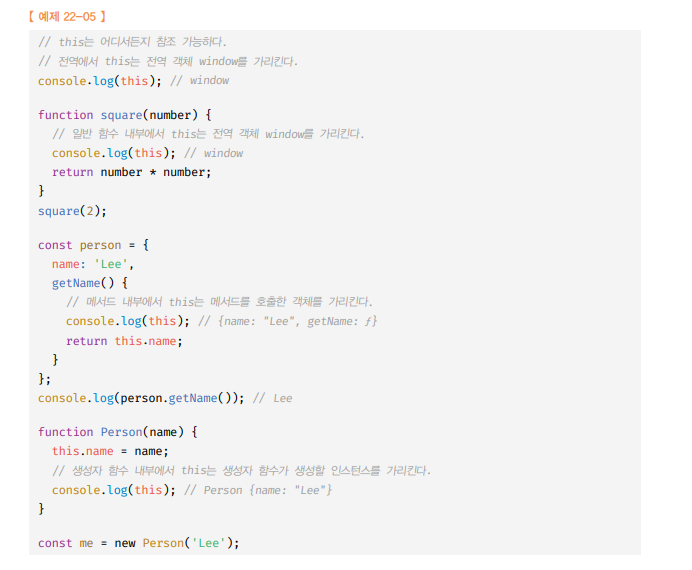
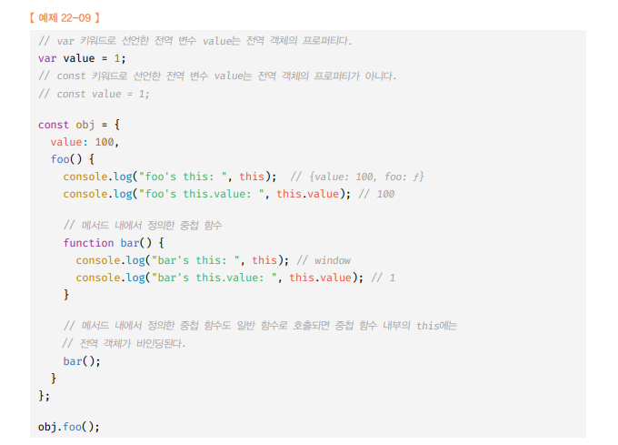
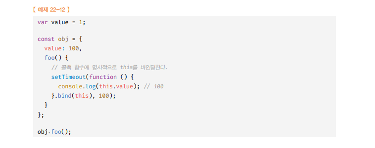
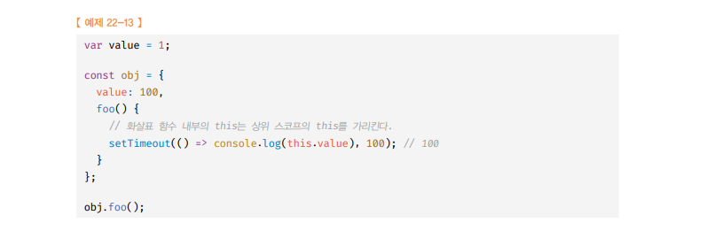
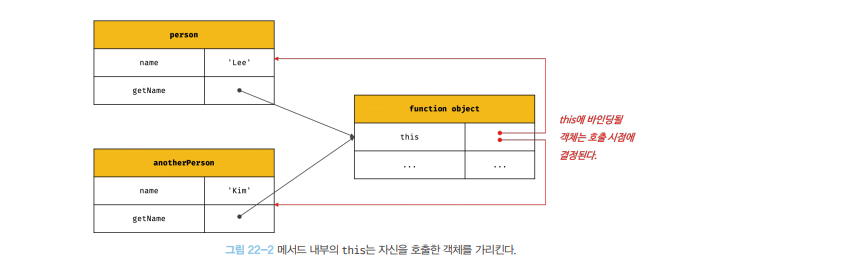
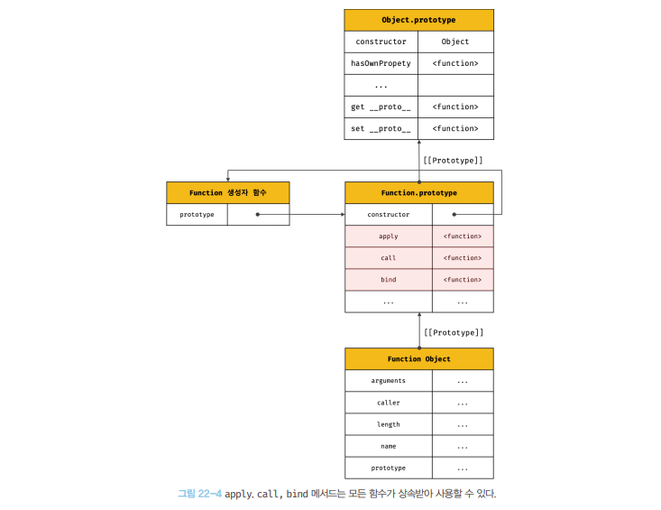
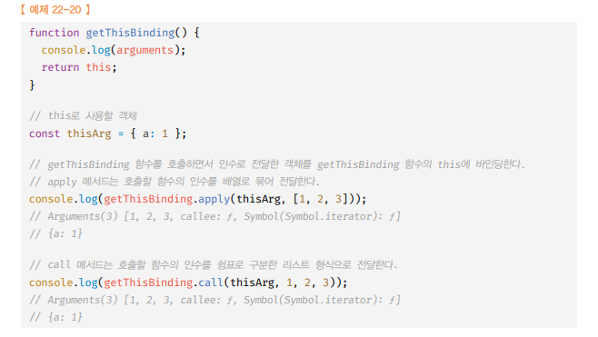

# This🎯💡🔥📌✅

```
🔥 this : 자신이 속한 객체를 가리키는 참조 변수
🔥 바인딩 : 식별자와 값을 연결하는 과정
🔥 this 바인딩 : this와 this가 가리킬 객체를 바인딩하는 것
```


<br />

<br />

- `어느 상황에 this를 사용하냐에 따라 this값은 달라진다.`
- this는 자신이 속한 `객체` 또는 자신이 생성 할 `인스턴스`를` 가리키는 참조 변수` 이다.
- this를 통해 자신이 속한 `객체` 또는 자신이 생성할 인스턴스의 `프로퍼티`나 `메소드`를 `참조`할 수 있다.
- this는 코드 `어디에서도 참조가 가능`하다.
- this의 `본질`은 `객체의 프로퍼티`나 `메서드`를 참조하기 위한 `자기 참조 변수`의 개념이다.

<br />

```
💡 함수를 호출하면 arguments 객체와 this가 암묵적으로 함수 내부에 전달됨
💡 함수내부에서 arguement와 this는 지역변수 처럼 사용이 가능하다.
```

<br />

<br />

---

# 객체 리터럴과 생성자 함수의 this

<br />

- 호출한 `객체`가 this

> 객체 리터럴에서 this는 `메서드`를 `호출`한 `객체` 이다.

```js
// 객체 리터럴
const circle = {
  radius: 5,

  getDiameter() {
    // 여기서 this 는 메서드를 호출한 객체
    return 2 * this.radius;
  },
};

console.log(circle.getDiameter()); // 10
```

<br />

- 생성할 `인스턴스`가 this

> 생성자 함수 내부의 this는 `생성자 함수`가 생성할 `인스턴스`를 가르킨다.

```js
// 생성자 함수
function Circle(radius) {
  // 여기서 this는 생성자 함수 Circle이 생성할 인스턴스
  this.radius = radius;
}

Circle.prototype.getDiameter = function () {
  // 여기서 this는 생성자 함수가 생성할 인스턴스
  return 2 * this.radius;
};

// 인스턴스 생성
const circle = new Circle(5);
console.log(circle.getDiameter()); // 10
```

<br />
<br />

> this 사용 예시 <br />

<br />

```
💡  이처럼 자바스크립트는 `this함수`가 호출되는 방식에 따라 `this에 바인딩될 값` , this 인딩이 `동적`으로 `결정`된다.
```

<br />

<br />

---

# 함수 호출 방식과 this 바인딩

- this 바인딩은 `함수 호출 시점에 결정`

- this에 바인딩 될 값은 `함수 호출 방식`(함수가 어떻게 호출되었는 지)에 따라 `동적`으로 결정된다.

- 함수의 호출 방식 (4가지)

  - `일반 함수 호출`
  - `메서드 호출`
  - `생성자 함수 호출`
  - `Function.prototype.apply/call/bind 메서드에 의한 간접 호출`

<br />

<br />
<br />

<br />

---

## 1. 일반 함수 호출 (전역 객체 바인딩) 3가지 예제

- 기본적으로 `전역 객체`가 바인딩 된다.
- `sirict mode`에서 일반 함수 내에서 this는 `undefined`가 `바인딩`

<br />

> (1) 일반 함수 호출 this 예제

```js
function foo() {
  console.log(`전역 함수 foo의 this : ${this}`); // 전역 함수 foo의 this : [object global] == window

  function bar() {
    console.log(`중첩 함수 bar의 this : ${this}`); // 중첩 함수 bar의 this : [object global] == window
  }

  bar();
}
foo();
```

<br />

> (2) strict mode 일반 함수 호출 this 예제

```js
// strict mode 적용
function foo() {
  ("use strict");

  console.log(`전역 함수 foo의 this : ${this}`); // 전역 함수 foo의 this : undefined

  function bar() {
    console.log(`중첩 함수 bar의 this : ${this}`); // 중첩 함수 bar의 this : undefined
  }

  bar();
}
foo();
```

<br />
<br />

- `메서드 내 중첩함수, 콜백함수 this !== 메서드 this`

> (3) 객체안 함수안 함수 (메서드 내에서 정의한 중첩 함수this는 window 전역 객체를 가르킴)



<br />

```
💡 일반 함수로 호출 : window
💡 일반 함수로 호출된 [중첩 함수 , 콜백 함수] 내부의 this에는 전역 객체가 바인딩 된다.
```

- `중첩 함`수 나 `콜백 함수` 의 경우, 용도가 일반적으로 `외부 함수를 돕는 헬퍼 함수`의 역할 을 하므로, `this` 가 가리키는 객체가 `전역 객체` 일 경우는 `헬퍼 함수의 역할`을 하기 `힘들다`.

- 메서드 내부의 `중첩 함수`나 `콜백 함수`의 `this 바인딩` 을 `메서드의 this 바인딩`과 일치시키기 위한 방법은 다음과 같다.

1. 메서드의 this 바인딩할 객체를 변수에 할당하는 방법
2. `Function.prototype.apply` or `[Function.prototype.call]` , `[Function.prototype.bind]` 에 의한 바인딩

<br />
<br />

## 메서드 내부의 중첩함수,콜백 함수 this 바인딩과 메서드의 this 바인딩 일치시키는 두가지 방법(bind, 화살표 함수)

<br />
<br />

- 바인딩함수 사용
  

- 화살표 함수 사용 하기



<br />

<br />
<br />

<br />

---

## 2. 메서드 호출 (this == 메서드를 호출한 객체) , 3가지 예제

- 메서드를 호출할 때 메서드 이름 앞의 `마침표(.)` 연산자 앞에 기술한 `객체`가 `바인딩`된다.
- 메서드 내부의 this는 메서드를 소유한 객체가 아닌 `메서드를 호출한 객체`에 `바인딩`된다.

<br />
<br />

> (1) 메서드 호출한 객체 == this

```js
const person = {
  name: "kim",
  getName() {
    // 메서드 내부의 this는 메서드를 호출한 객체에 바인딩
    // getName 메서드는 person 객체에 포함된 것이 아닌, 독립적으로 존재하는 별도의 객체 개념
    return this.name;
  },
};

console.log(person.getName()); // kim
```

<br />
<br />

- 메서드는 특정 객체에 포함된 것이 아닌, `독립적으로 존재하난 별도의 객체`

  - `A객체의 메서드`를 다른 B객체의 `프로퍼티`에 `할당` 가능
  - `A객체의 메서드`를 일반 `변수`에 `할당`하여 일반 함수로 호출 가능

- 위 예시
  
  

<br />

> (2) A객체의 메서드를 B객체의 프로퍼티에 할당 , 변수에 할당 예시

```js
const person = {
  name: "kim2",
  getName() {
    // 메서드 내부의 this는 메서드를 호출한 객체에 바인딩
    // getName 메서드는 person 객체에 포함된 것이 아닌, 독립적으로 존재하는 별도의 객체 개념
    return this.name;
  },
};

const anotherPerson = {
  name: "KIM",
};

// getName 메서드를 anotherPerson 객체의 메서드로 할당 (getName 메서드는 독립적인 객체이기 때문)
anotherPerson.getName = person.getName;

// getName을 호출한 객체는 이 시점에선 person이 아닌 anotherPerson이다.
console.log(anotherPerson.getName()); // KIM

// getName을 getName 변수에 할당 (getName 메서드는 독립적인 객체이기 때문)
const getName = person.getName;

// getName을 호출한 객체는 이 시점에서는 전역 객체다.
// 전역 객체에 프로퍼티에는 name 이라는 프로퍼티가 존재하지 않다.
// 참조 시, 자바스크립트 엔진이 암묵적으로 undefined 로 초기화한다.
console.log(getName()); // undefined
```

<br />
<br />

> (3) 프로토타입 메서드 내부에서 사용된 this도 일반 메서드와 마찬가지로 해당 메서드를 호출한 객체에 바인딩

```JS
// 생성자 함수
function Person(name) {
  this.name = name;
}

// 프로토타입에 getName 메서드 할당
Person.prototype.getName = function () {
  return this.name;
};

// me 인스턴스 생성
const me = new Person("WI");

// 이 시점에서 getName 메서드를 호출한 주체는 me 객체
console.log(me.getName()); // WI

Person.prototype.name = "KIM";

// 이 시점에서 getName 메서드를 호출한 주체는 Person.prototype 객체
console.log(Person.prototype.getName()); // KIM

```

<br />

<br />
<br />

<br />

---

## 3. 생성자 함수 호출 (this == 생성자 함수가 생성할 인스턴스)

- 생성자 함수 내부의 this에는 생성자 함수가 미래에 생`성할 인스턴스`가 `바인딩` 된다.
- new 연산자를 붙이면 생성자 함수로 동작
- new 연산자를 붙이지 않으면 일반 함수로 동작한다.

```js
// 생성자 함수
function Person(name) {
  this.name = name;
  this.getName = function () {
    return `안녕하세요. 저는 ${this.name}입니다.`;
  };
}

const person1 = new Person("kim");
const person2 = new Person("kim2");

console.log(person1.getName()); // 안녕하세요. 저는 kim 입니다.
console.log(person2.getName()); // 안녕하세요. 저는 kim2 입니다.
```

<br />

<br />
<br />

<br />

---

## 4. Function.prototype.apply / call / bind 메서드에 의한 간접 호출(Function.prototype 에 apply, call, bind 메서드에 첫 번째 인수로 전달한 객체)

- apply, call, bind는 `Function.prototype`이다.

  - `Function.prototype.apply`(this로 사용할 객체, arguments 리스트(배열 or 유사배열객체))
  - `Function.prototype.call`(this로 사용할 객체, arguments 인수 리스트(,로 구분하여 전달))
  - `Function.prototype.bind`(this로 사용할 객체)

  <br />

- 따라서 `모든 함수`가 상속 받아 `사용할 수 있다`.

  

<br />

```
✅ apply와 call 메서드의 본질적인 기능은 함수를 호출하는 것이다.
✅ apply와 call 메서드는 함수를 호출하면서 첫 번째 인수로 전달한 특정 객체를 호출한 함수의 this에 바인딩 한다.
✅ apply와 call 메서드는 두 번째 인수를 함수에 전달하는 방식만 다를 뿐 동일하게 작동
```

<br />
<br />

- `apply` , `call`

> apply , call의 사용 방법 예시(1)

```js
function getThisBinding() {
  return this;
}

const thisArg = { a: 1 };

// window
console.log(getThisBinding());

console.log(getThisBinding.apply(thisArg)); // { a : 1}
console.log(getThisBinding.call(thisArg)); // { a : 1}
```

> apply , call의 사용 방법 예시(2)<br />

<br />
<br />

```
🎯 apply와 call 메서드의 대표적 용도는  arguments 객체와 같은 유사 배열 객체에 배열 메서드를 사용하는 경우 이다.
🎯 arguments 객체는 배열이 아니기 때문에 Array.prototype.slice 같으 배열의 메소드를 사용할 수 없다.
```

> arguments(유사객체)에서 call함수 이용해서 배열 메서드 사용 예시 (1)

```js
function convertArgsToArray() {
  console.log(arguments); // [Arguments] { '0': 1, '1': 2, '2': 3 }

  // 유사 배열 객체인 arguments 객체는 배열이 아니다.
  // 그런 arguments 객체에 대해, 배열 메서드인 Array.prototype.slice 메서드를 Function.prototype.call 메서드로 arguments 객체에 바인딩한다.
  // 유사 배열 객체 arguments 객체임에도 배열 메서드인 slice 메서드를 적용하여 반환된 새로운 배열 객체를 반환할 수 있게 된다.
  const arr = Array.prototype.slice.call(arguments);

  console.log(arr); // [ 1, 2, 3 ]

  return arr;
}

convertArgsToArray(1, 2, 3);
```

<br />
<br />

- `bind`
  - 메서드의 this와 메서드 내부의 중첩 함수 또는 콜백 함수의 this가 불일치하는 문제를 해결하기 위해 유용하게 사용된다.
  - `apply` , `call` 메서드와 달리 `함수를 호출하지 않는다`.
  - `첫 번째 인수`로 전달한 값으로 `this 바인딩`이 교체된 함수를 `생성 후 return`

<br />
<br />

> bind 사용 예시(1)

```js
const person = {
  name: "kim",
  foo(callback) {
    // bind 를 적용하지 않는다면, foo 메서드 내부에 콜백 함수에 정의된 this는 전역 객체(window 또는 global)를 가리킨다.
    // 전역 객체에는 name 프로퍼티가 없기 때문에, 원래는 undefined 를 출력하는 것이 맞다.
    // 하지만, Function.prototype.bind 메서드로 콜백 함수의 주체를 person 객체로 동적 바인딩 해주었다.
    // 때문에 person 객체의 name 프로퍼티에 접근할 수 있게 되었다.
    setTimeout(callback.bind(this), 100);
  },
};

person.foo(function () {
  console.log(`안녕하세요. ${this.name}입니다.`); // 안녕하세요. kim입니다.
});
```

<br />
<br />

> bind 사용 예시(2)<br />
