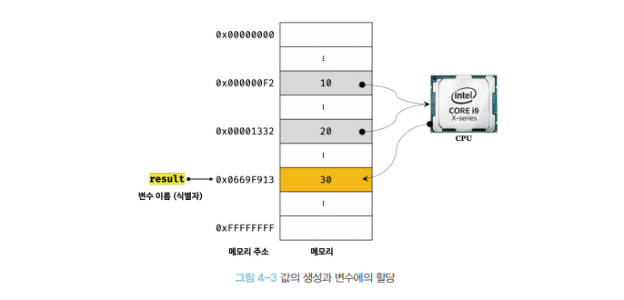
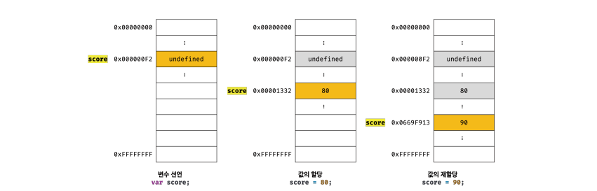

# 변수

- > 변수는 하나의 값을 저장하기 위해 확보한 `메모리 공간` OR `메모리 공간을 식별하기 위해 붙인 이름` (= 값의 위치를 가리키는 상징적인 이름)

- > 변수에 값을 재할당할 때 기존에 사용하고 있는 메모리 공간을 지우고 재할당하는 게 아니라 새로운 메모리 공간을 확보해서 저장한다.

- > 변수이름을 사용해 참조를 요청하면 자바스크립트 엔진은 `변수이름과 매핑괸 메모리 주소` 를 통해 `메모리 공간의 저장된 값을 return`

```
[ 💡 Note ]
사람이 이해할 수 있는 언어로 명명한 변수 이름을 통해 변수에 저장된 값의 의미를 명확히 할 수 있다.
즉, "변수에 저장된 값의 의미를 파악할 수 있는 변수 이름은 가독성을 높이는 부수적인 효과도 있다."
코드는 컴퓨터에게 내리는 명령이지만 개발자를 위한 문서이기도 하다.
의도가 명확한 네이밍은 코드를 이해하기 쉽게 만들며, 이는 협업과 품질 향상에 도움을 준다.
```

## 메모리

<div style={display:flex}>

> 변수 할당 과정


> 메모리


</div>
- 데이터를 저장할 수 있는 메모리 셀의 집합체, 메모리 셀의 하나의 크기 : `1byte(8bit)`
- 메모리 주소를 통해 값에 직접 접근 하는 것은 오류 발생 가능성 높음 , 자바스크립트는 `메모리 직접적인 제어`를 허용하지 않는다.

## 메모리 생존 주기

> `메모리 할당` -> 메모리 사용 (변수를 사용한 읽기와 쓰기) -> `메모리 해제`

- 메모리 할당, 메모리 해제는 자바스크립트에서 알아서 수행

<br />
<br />
<br />

---

## 식별자(값이 아니라 메모리 주소를 기억 하고 있다.)

> 💡 식별자 (함수이름,변수이름,클래스이름 ... )
> 

- 어떤 값을 구별해서 식별할 수 있는 `고유한 이름`
- 값은 메모리 공간에 저장되어 있다. 따라서 식별자는 메모리 공간에 저장되어 있는 `어떤 값`을 구별해서 `식별` 해낼 수 있어야 한다. -즉 식별자는 `메모리 주소에 붙인 이름`
- 메모리 상에 존재하는 어떤 값을 식별할 수 있는 이름은 모두 식별자

<br />
<br />

---

## 변수 선언

- 값을 저장하기 위한 `메모리의 공간 확보` , 확보된 메모리 공간의 `주소를 연결`해서 값을 저장 할 수 있게 `준비`
  > var 변수 선언
  > 

```js
var score;
```

```
💡 자바스크립트 엔진의 변수 선언
1. 선언 단계 : 자바스크립트엔진에 변수의 존재를 알린다. (실행 컨텍스트에서 모든 식별자가 등록된다.)
2. 초기화 단계 : 메모리 공간을 확보하고 값에 undefined(원시 값)를 할당해 초기화 한다.
```

<br />
<br />
<br />

## 변수 호이스팅

- `변수 선언문`이 `코드의 선두`로 끌어 올려진 것 처럼 동작하는 자바스크립트 고유 특징
- `var` , `function` , `class` , `function*` 모두 런타임 이전 단계에서 실행 된다.

```js
변수는 아직 선언되지 않았지만, 호이스팅으로 코드 실행전에 선언문 먼저 다 실행됨
console.log(변수);

var 변수;
```

---

## 값의 재할당

> 값의 재할당
> 

```
💡 위 사진은 값의 재할당 메모리 사진이다.
1. var score; 변수 호이스팅(메모리 공간 확보 , undefined)
2. score = 80; 변수에 새로운 주소 값 할당 (메모리의 새로운 주소값)
3. score = 90; 변수에 새로운 주소 값 할당 (메모리의 새로운 주소값)
4.undefined, 80은 더 이상 필요하지 않고, 이 값은 가비지 콜렉터에 의해 메모리에서 자동 해제된다.(메모리에서 언제 해제되는지는 알 수 없음)
```
