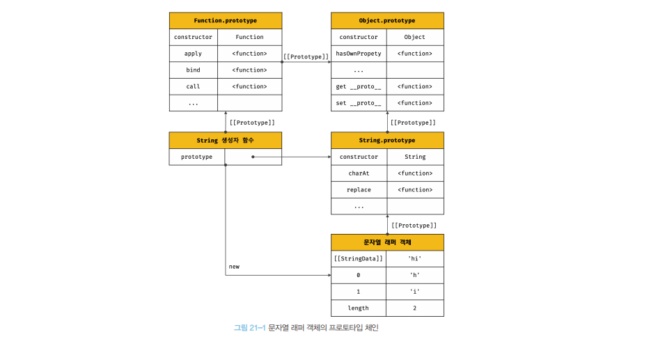
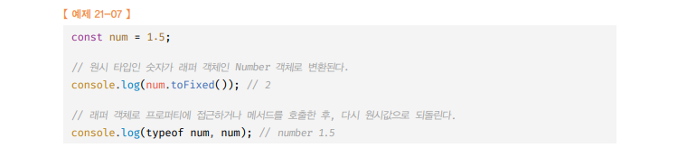
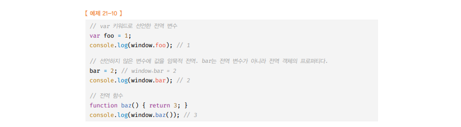
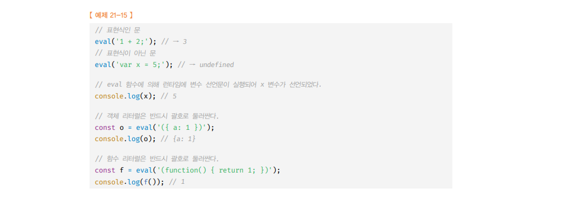
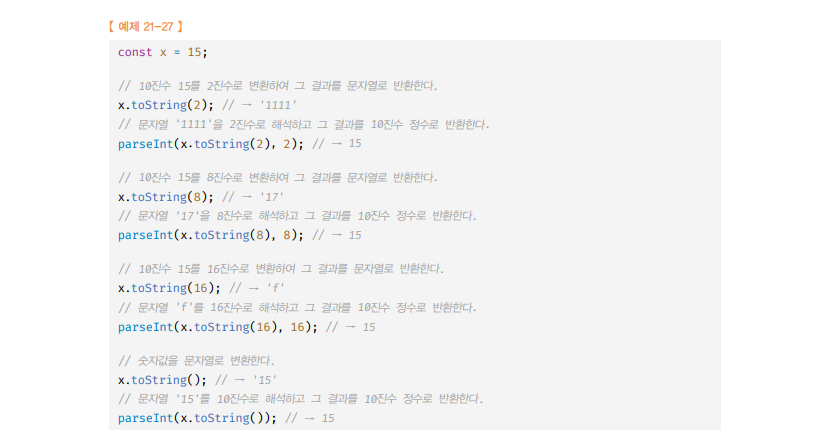
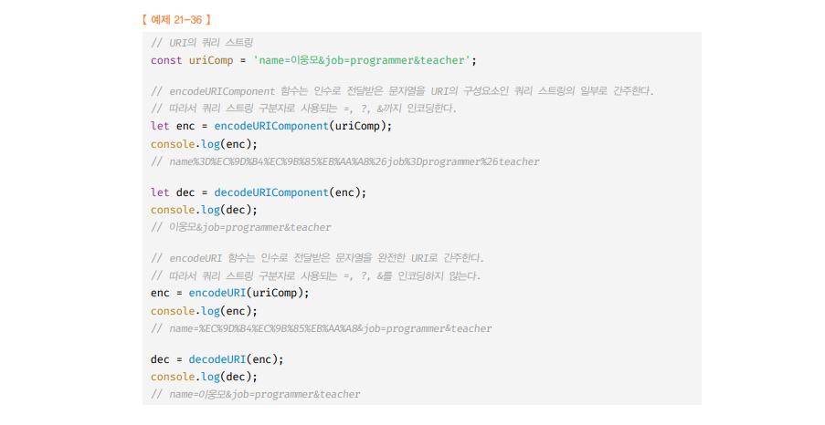

# 빌트인 객체 (3가지) 🎯💡🔥📌✅

- `표준 빌트인 객체` - ECMAScript 사양에 정의된 객체를 의미, 애플리케이션 전역에 공통 기능을 제공, 전역 객체의 프로퍼티로 제공되므로 별도의 선언 없이 전역 변수처럼 언제나 참조가능

- `호스트 객체` - ECMAScript 사양에 정의되어 있지는 않지만, 브라우저 환경 or Node.js 환경에서 추가로 제공하는 객체를 의미

- `사용자 정의 객체` - 사용자가 직접 정의한 객체를 의미

<br />
<br />

# 표준 빌트인 객체 (인스턴스 생성 가능 생성자 함수 객체)

```
🔥표준 빌트인 객체를 이용해 인스턴스를 생성하면, 인스턴스에서  빌트인 `객체의 매서드` or `빌트인 객체의 정적 메서드`를 사용할 수 있다🔥
```

- 프로토타입 `메서드`와 `정적 메서드`를 제공한다.

- 자바스크립트는 `Object`, `String`, `Number`, `Boolean`, `Symbol`, `Array`, `Map/Set`, `Function` ... 등 40개의 `표준 빌트인 객체`를 제공한다.

- `Math`, `Reflect`, `JSON`은 정적 메서드만 제공함
  - Math객체의 메서드를 사용하려면 Math.floor().. 처럼 직접 선언 해야

<br />
<br />

> 생성자 함수인 표준 빌트인 객체가 생성한 인스턴스의 프로토타입은 `표준 빌트인 객체의 prototype 프로퍼티에 바인딩

```js
const strObj = new String("kim");

console.log(Object.getPrototypeOf(strObj) === String.prototype); // true
```

<br />

> 표준 빌트인 객체의 prototype 프로퍼티에 바인딩된 객체는 다양한 기능의 빌트인 프로토타입 메서드를 제공 또한, 인스턴스 생성 없이도 호출 가능한 빌트인 정적 메서드 제공

```js
// Number 생성자 함수에 의한 Number 객체 생성
const numObj = new Number(1.5);

// Number.prototype 에 프로토타입 메서드인 toFixed
console.log(numObj.toFixed()); // 2

// Number 빌트인 객체의 정적 메서드
console.log(Number.isInteger(0.5)); // false
```

<br />
<br />

# 원시값과 래퍼 객체

> 문자열을 객체처럼 사용했을때 임시적으로 생성되는 래퍼 객체의 프로토타입 체인 <br />

```
🔥문자열이나 숫자열 값에 객체처럼 접근했을때 생성되는 임시 객체 : 래퍼 객체🔥
ex) const a ="hi"
    console.log(a.length) // 2

🔥래퍼 객체의 쓰임이 다하면, 원시값은 식별자에 연결되고 래퍼 객체는 가비지 컬렉션의 대상이 된다.🔥
```

- 원시값(문자열, 숫자)에 `마침표(.)` 나 `대괄호 표기법`으로 접근하면 `메서드`를 호출할 수 있다.

  - 자바스크립트 엔진이 문자열을 임시적으로 `원시값을 연관된 객체로 변환`시킴
  - 암묵적으로 엔진이 연관된 객체를 생성하여 생성된 객체로 프로퍼티에 접근하거나 메서드를 호출하고 `다시 원시값`으로 되돌림

- `문자열 원시값에 대해, 마침표 표기법으로 접근하면`, 그 순간 래퍼 객체인 String 생성자 함수의 `인스턴스`가 `생성`되고, 문자열은 래퍼 객체의 `[[StringData]]` `내부 슬롯`에 할당

```js
const str = "Hello";

// 원시 타입인 문자열 -> 래퍼 객체인 String 인스턴스로 변환
console.log(str.length); // 5
console.log(str.toUpperCase()); // HELLO

// 래퍼 객체로 프로퍼티에 접근하거나 메서드를 호출한 후, 다시 원시값으로 되돌린다.
// 생성되었던 래퍼 객체는 "가비지 컬렉션"의 대상이 된다.
console.log(typeof str); // string  <<  String 표준 빌트인 생성자 함수 타입이 아니다.
```

<br />
<br />

> 래퍼 객체의 이해 활용

```js
// 식별자(변수) str은 'Hello' 문자열 원시값을 가진다.
const str = "Hello";

// 식별자 str은 암묵적으로 생성된 "래퍼 객체"를 가리킨다.
// 식별자 str의 값 'Hello' 는 래퍼 객체의 [[StringData]] 내부 슬롯에 할당된다.
// 래퍼 객체의 "name 프로퍼티가 동적 추가"된다.
str.name = "kim";

// 래퍼 객체의 역할이 끝나고, 식별자 str은 다시 래퍼 객체의 [[StringData]] 내부 슬롯에 할당된 원시값을 갖는다.
// 생성되었던 래퍼 객체는 아무도 참조하지 않게 되고, 가비지 컬렉션의 대상이 된다.

// 식별자 str 은 더 이상 래퍼 객체를 가리키고 있지 않다.
// 그러므로, 래퍼 객체에 추가된 name 프로퍼티는 더 이상 str 식별자로 접근할 수 없다. 즉 undefined 를 반환한다.
console.log(str.name); // undefined

// 실제로 식별자 str이 가리키는 데이터를 참조해보면 타입이 string 문자열이다.
console.log(typeof str, str); // string Hello
```

<br />

- 문자열도 동일하게 래퍼 객체 사용 후 바로 원시값을 되돌린다.
  

```
✅정리
- 문자열, 숫자,불리언은 암묵적으로 생성되는 래퍼 객체에 의해 객체 처럼 사용 가능
- 래퍼 객체가 생성되는 원시값들은 암묵적으로 표준 빌트인 객체의 프로토타입에서 제공하는 메서드 or 프로퍼티를 참조할 수 있다.


- new 연산자를 함께 호출해서 인스턴스를 생성하는 방법은 좋지않다잉
```

<br />
<br />

---

# 전역 객체

- `전역 객체란?` : 코드가 실행되기 이전 자바스크립트 엔진에 의해 `가장 먼저 생성되는 특수한 객체`이고, 어떤 객체에도 속하지 않는 `최상위 객체`이다.

<br />

- `전역객체`는 이름이 환경에 따라 다름

  - `window`
  - `self`
  - `this`
  - `frames`
  - `global`

<br />

- `전역 객체`

  - `표준 빌트인 객체` , `호스트 객체`, `var` 키워드로 선언한 전역 변수나 전역 함수 를 `프로퍼티`로 가짐
  - 프로토타입 상속 관계상에서 최상위 객체라는 의미가 아닌, 어떤 객체의 프로퍼티도 아니며, 객체의 `계층적 구조상 표준 빌트인 객체와 호스트 객체를 프로퍼티로 소유한다는 의미`
  - 전역 객체는 개발자가 `의도적으로 생성 할 수 없다.`
  - 전역 객체의 프로퍼티를 참조할 때 `window,global`를 `생략`할 수 있다.
  - 전역 객체는 `표준 빌트인 객체`(String,Number,Boolean...)를 `프로퍼티`로 가진다.
  - var 키워드로 선언한 전역 변수와 선언하지 않은 변수에 값을 할당한 암묵적 전역, 전역 함수는 전역 객체의 프로퍼티가 된다.
  - 모든 자바스크립트 코드는 하나의 전역 객체를 공유한다.

<br />

> window , global 생략 예시

```js
//window 객체는 생략 가능OO
window.parseInt("F", 16); // 15
parseInt("F", 16); // 15

window.parseInt === parseInt;
```

<br />

> var키워드로 선언, 함수는 전역 객체의 프로퍼티가 된다 예시 <br> 

```
✅ let, const 키워드로 선언한 전역 변수는 전역 객체의 프로퍼티가 아니다. ( 즉, window(또는, global) 로 접근할 수 없다.)
```

<br />
<br />
<br />

---

# 전역 객체의 프로퍼티 (== 빌트인 전역 프로퍼티) 3가지

- 주로 애플리케이션 전역에서 사용하는 값을 제공한다.

## (1) Infinity

- 무한대를 나타내는 숫자값

```js
console.log(window.Infinity === Infinity); // true

console.log(3 / 0); // Infinity
console.log(typeof Infinity); //Number
```

## (2) NaN

- 숫자가 아닌 값을 나타냄

```js
console.log(window.NaN); // NaN

console.log(Number("asdsa")); // NaN
console.log(typeof NaN); // NaN
```

## (3) undefined를

- Undefined 프로퍼티는 원시 타입 undefined를 값으로 갖는다.

```js
console.log(window.undefined); //undefined

var foo;
console.log(foo); // undefined
console.log(typeof undefined); // undefined
```

<br />
<br />
<br />

---

# 전역 객체의 메서드 (== 빌트인 전역 함수)

- 전역 객체의 메서드이다.

<br />
<br />

## (1) eval (eval함수를 사용하는 것은 금지 해야함)

- 자바스크립트 코드를 나타내는 `문자열`을 `인수`로 전달받는다.
- 전달받은(`인수`) 문자열 코드 --> `표현식`

  - 값을 생성

    <br />

- 전달받은(`인수`) 문자열 코드 --> `문`

  - 문자열 코드를 런타임에 실행

- `strict mode` 존재시, 기존 스코프를 수정하지 않고 eval 함수` 자신의 자체적인 스코프를 생성`

- `eval 함수를 통해 사용자로 부터 입력받은 콘텐츠를 실행하는 것`은 보안상 매우 `취약`하며, 자바스크립트 엔진에 의해 최적화가 수행되지 않는 코드 특성 상, `처리 속도도 느림`



```js
여러 개의 문으로 이루어져 있다면 마지막 결과값을 반환한다.
eval("1 + 2; 3 + 4;"); // 7
```

   <br />
      <br />

## (2) isFinite 함수

- 전달받은 인수가 정상적인 `유한 수`이면 `true` , `무한수` 이면 `false`

> 예시

```js
isFinite(0); //true
isFinite(null); //true null은 숫자0이기 때문
isFinite(Infinity); //false
```

   <br />
   <br />

## (3) isNaN 함수

- 전달 받은 인수가 NaN인지 검사해서 Boolean 타입으로 return 한다.

```js
isNaN(NaN); // TRUE
isNaN(10); // FALSE
```

   <br />
   <br />

## (4) parseFloat 함수

- 전달 받은 문자를 실수로 변환해서 RETURN

```js
parseFloat("3.134"); // 3.134
// 공백으로 구분된 문자열은 첫번째 문자열만 RETURN 한다.
parseFloat("40 SDAD"); //40
```

## (4) parseInt 함수

- 전달 받은 문자를 정수로 변환해서 RETURN
- `두번째 인수`로 `진법`을 나타내는 `기수`를 `전달`할 수 있다.
  - 첫 번째 인수로 전달된 `문자열`을 두번째 인자로 전달한 숫자(`2진수`,`8진수`,`16진수`)로 해석해서 return(`리턴값은 10진수`)
  - `return값은` 언제나 `10진수`

```js
// '10' -> 10진수로 해석(parsing) -> 10진수 정수로 반환(10)
console.log(parseInt("10")); // 10

// '10' -> 2진수로 해석(parsing) -> 10진수 정수로 반환(2)
console.log(parseInt("10", 2)); // 2

// '10' -> 8진수로 해석(parsing) -> 10진수 정수로 반환(8)
console.log(parseInt("10", 8)); // 8

// '10' -> 16진수로 해석(parsing) -> 10진수 정수로 반환(16)
console.log(parseInt("10", 16)); // 16
```

   <br />

> 10진수를 toString() 메서드로 2,8,16 진수로 변환 후 해석 후 10진수로 반환 예제

   <br />

- 첫 번째 문자열 내에, `두 번째 인수`로 전달한 radix 로 나타내는 숫자가 아닌 문자와 `마주치면 전부 무시되고 해석된 정수값만 반환`

```js
// A은 10진법에서 벗어남 -> '10' 만 변환 -> 5
console.log(parseInt("1A0")); // 1

// 2은 2진법에서 벗어남 -> '10' 만 변환 -> 2
console.log(parseInt("102", 2)); // 2

// 8은 8진법에서 벗어남 -> '5' 만 변환 -> 5
console.log(parseInt("58", 8)); // 5

// G는 16진법에서 벗어남 -> 'F' 만 변환 -> 15
console.log(parseInt("FG", 16)); // 15
```

   <br />
      <br />

## (5) encodeURI / decodeURI 함수

- `encodeURI` : `어떤 시스템에서도 읽을 수 있도록` url를 `아스키 문자셋`으로 변환하는 작업 (`쿼리 스트링 구분자`(=, ? , &)은 인코딩 하지 않음)

- `decodeURI` : 인코딩 된 URL를 `원래 상태`로 `복구`하는 것


- 완전한 `URL`를 문자열로 전달받아 `이스케이프 처리`를 위해 `인코딩`해주는 메소드

```
✅ 인코딩이란 :  URL 문자들을 이스케이프 처리하는 것을 의미한다.
✅ 이스케이프 처리란 : 정보를 공유할 때 어떤 시스템에서도 읽을 수 있는 아스키 문자 셋으로 변환 하는 것

✅ 디코딩(decoding) : 인코딩된 URI를 이스케이프 이전 상태로 복원하는 것을 의미
```

- URL은 `아스키 문자 셋`으로 `구성`되어야 하며 한글을 포함한 대부분의 외국어나 아스키 문자 셋에 정의되지 않은 `특수 문자를 포함하지 않아야 한다`.
  - 특수 문자 : 1~3BYTE , 한글 표현 1문자 : 3BYTE
  - URL 내부에서 `의미를 갖고 있는 문자( %, ?, # )` 나 `한글`, `공백` 등 또는 시스템에 의해 `해석될 수 있는 문자( <, > )` 를 `이스케이프` 처리하여 야기될 수 있는 문제를 예방함
- `알파벳`, `0~9의` 숫자, `-, _, ., !, ~, *, ', (, )` 문자는 이스케이프 처리에서 `제외`

```js
// 완전한 URI
const uri = "http://example.com?name=jehyun&job=programmer&teacher";

// 원래 URI 형태 -> 이스케이프 처리된 URI 형태로
const enc = encodeURI(uri);
// http://example.com?name=%EC%9C%84%EC%98%81%EB%AF%BC&job=programmer&teacher
console.log(enc);

// 이스케이프 처리된 URI -> 원래 URI 형태로
const dec = decodeURI(enc);
// http://example.com?name=jehyun&job=programmer&teacher
console.log(dec);
```

   <br />
      <br />

## (6) encodeURIComponent / decodeURIComponent 함수

- `encodeURIComponent` : url 전체가 아닌 쿼리 스트링만 인코딩 (`쿼리 스트링 구분자`로 사용되는 ( `=, ? , &`) 까지 `인코딩`)
- `decodeURIComponent` : `encodeURIComponent`에 의해 인코딩 된 부분 `복구`


