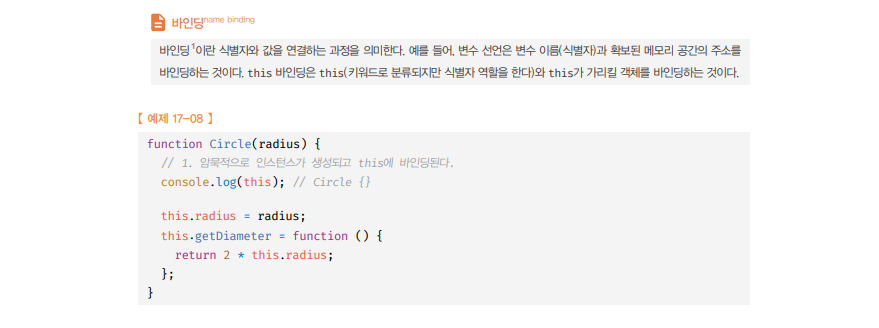
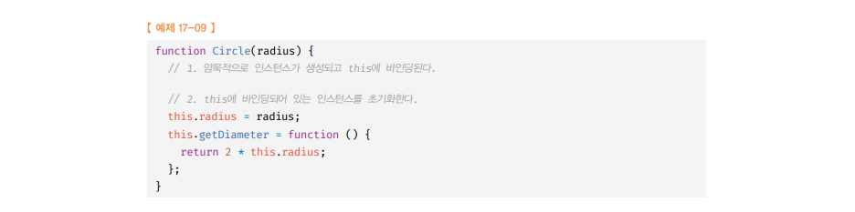
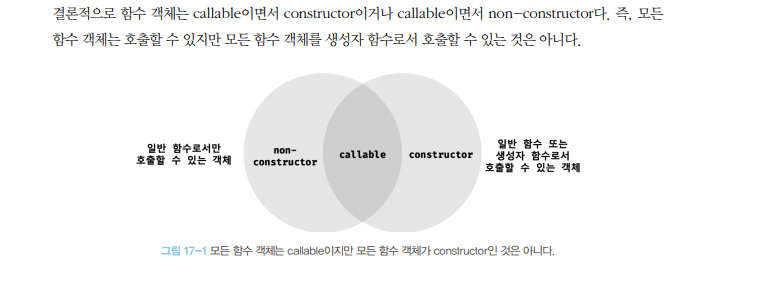

# Object 생성자 함수🎯💡🔥📌✅

- new 연산자와 함계 `object` 생성자 함수를 호출하면 `객체를 생성 후 반환`한다.
- 자바스크립트에서는 Object 생성자 함수 이외에도 `String`, `Number`, `Boolean`, `Function`, `Array`, `Date`, `RegExp`, `Promise` 등의 빌드인(built-in) 생성자 함수를 제공

<br />
<br />

# 객체 리터럴 {}에 의한 생성 방식의 문제점

- 자바스크립트에서 객체를 생성하는 방법 중, 객체 리터럴({ ... }) 에 의한 객체 생성 방식은 `직관적이고` `간편하다`.
- 객체 리터럴에 의한 객체 생성 방식은 `단 하나의 객체만 생성`

```js
const person1 = {
  name: "kim",
  getPersonName() {
    return `Hi, My Name is ${this.name}`;
  },
};

console.log(person1.getPersonName()); // Hi, My Name is kim

const person2 = {
  name: "kim2",
  getPersonName() {
    return `Hi, My Name is ${this.name}`;
  },
};

console.log(person2.getPersonName()); // Hi, My Name is kim2
```

- 객체는 다음 2가지로 표현할 수 있다.
  - `프로퍼티`를 통해 → 객체 고유의 `상태`(state)
  - `메서드`를 통해 프로퍼티를 참조하고 조작하는 → `객체의 동작`(behavior)
- 상태(state)의 경우는 객체마다 각기 다른 값을 가질 수 있으나
- 메서드(behavior)의 경우는 내용이 동일한 경우가 일반적이다. → `재활용성이 필요`
- 객체 리터럴로 객체를 표현하는 경우, 프로퍼티의 구조가 동일함에도 불구하고, `매번 같은 프로퍼티와 메서드를 기술해야한다.`

# 생성자 함수에 의한 객체 생성 방식의 장점

- 객체(인스턴스)를 생성하기 위한 클래스 처럼 생성자 함수를 사용해서` 프로퍼티 구조`가 `동일한` 객체 `여러 개`를 간편하게 `생성`할 수 있다.

```
✅한마디로 구조가 동일하지만 다른 상태를 가진 객체를 손 쉽게 생성 가능✅
```

```js
// 생성자 함수 Person 선언
function Person(name) {
  this.name = name;
  this.getPersonName = function () {
    return `Hi, My Name is ${this.name}`;
  };
}

// new 연산자와 함께 Person 객체(인스턴스) 생성
const person1 = new Person("one");
const person2 = new Person("two");

// 각 Person 객체의 메서드 호출
console.log(person1.getPersonName()); // Hi, My Name is one
console.log(person2.getPersonName()); // Hi, My Name is two
```

<br />
<br />

---

# 자바스크립트에서 생성자 함수

- 일반적인 클래스 기반 객체지향언어에서 생성자와는 다르게, 자바스크립트에서 `생성자는` `형식이 정해져 있지 않다`.
  - 일반 함수와 동일한 방법으로 `생성자 함수`를 정의하고
  - `new 연산자와 함께 호출`하면 해당 함수는 `생성자 함수`로 `동작`하는 것
- `new 연산자 와 함께 생성자 함수를 호출하지 않으면 생성자 함수가 아니라, 일반 함수로 동작한다.`

> 생성자 함수 예시<br />

<br /><br />

```js
// 생성자 함수 Person 선언
function Person(name) {
  this.name = name;
  this.getPersonName = function () {
    return `Hi, My Name is ${this.name}`;
  };
}

// 생성자 함수 Person 이지만, new 연산자와 함께 호출되지 않았으므로, Person 생성자함수는 일반함수로 호출된다.
// 일반 함수 관점에서 봤을 때, 함수 몸체 내부에서 반환하는 값은 없으므로, 암묵적으로 undefined 를 반환
const person1 = Person("one");

console.log(person1); // undefined
console.log(name); // one << 🔍
```

- 위에 예제에서 name 프로퍼티는, `전역 객체의 프로퍼티`로 등록된다.

<br /><br />

---

# 생성자 함수의 인스턴스 생성 과정

```
🔥 인스턴스를 생성 → 필수 작업
🔥 생성된 인스턴스를 초기화(인스턴스 프로퍼티 추가 및 초기값 할당) → 옵션 작업
```

`new 연산자` 와 함께 `생성자 함수`를 호출하면, 자바스크립트 엔진은 다음과 같은 과정을 거쳐 암묵적으로 인스턴스를 생성하고 인스턴스를 초기화한 후 암묵적으로 인스턴스를 반환한다.

## 1. 인스턴스 생성과 this 바인딩

- 암묵적으로 빈 객체가 생성
- 이 빈 객체가 아직은 미완성된 생성자 함수가 생성한 인스턴스
- 이 빈 객체(인스턴스)는 this에 바인딩된다.
  - 바인딩(binding) : 식별자(identifier) 와 값(value) 을 연결하는 과정
  - this 바인딩 은 this 와 this가 가리킬 객체를 바인딩하는 것

> 인스턴스 생성과 바인딩<br />

<br /><br />

---

## 2. 인스턴스 초기화

- 생성자 함수 몸체에 기술되어 있는 코드가 한 줄씩 실행되면서 `this에 바인딩되어 있는 인스턴스를 초기화`
- 인스턴스에 `프로퍼티나 메서드`를 추가하고 생성자 함수가 인수로 전달받은 `초기값을 인스턴스 프로퍼티에 할당하여 초기화하거나 고정값을 할당`

> 인스턴스 초기화 <br />

<br /><br />
<br />

---

## 3. 인스턴스 반환

- 생성자 함수 몸체의 모든 처리가 끝나면 완성된 인스턴스가 바인딩된 생성자 함수에 의해 생성된 인스턴스가 `암묵적으로 반환`

> 생성자 함수에 return 값이 없을 때 this를 반환한다.<br />

> 생성자 함수에 return 값이 있을때 return값을 반환한다.<br />
> 2 \* this.readius 반환<br />

- 여기서, 바인딩 된 this를 암묵적으로 반환하는 것 대신, 다른 객체를 명시적으로 반환할 경우, `return 문에 명시한 객체`가 `반환`된다.
- 명시적으로 `원시값` 을 반환할 경우, 원시 값은 무시되고, `암묵적으로 this 가 반환`된다.

<br />
<br />

```
🔥생성자 함수 내부에서 명시적으로 this 가 아닌 다른 값을 반환 하는 것은, 생성자 함수의 기본 동작을 훼손하는 것이므로, 반드시 생성자 함수 내부에서는 return 문을 생략할 것🔥
```

```js
// case 3-1 : 생성자 함수 내부에서, 명시적인 다른 객체를 반환할 경우
function Person(name) {
  // 1. 암묵적으로 빈 객체(인스턴스)가 생성되고 this에 바인딩

  // 2. this 에 바인딩되어 있는 인스턴스를 초기화
  this.name = name;
  this.getPersonName = function () {
    return `Hi, My Name is ${this.name}`;
  };

  return {};
}

const person = new Person("kim");
console.log(person); // {}

// ===============++++++++++++++==================

// case 3-2 : 생성자 함수 내부에서, 명시적인 원시값을 반환할 경우
function Person(name) {
  // 1. 암묵적으로 빈 객체(인스턴스)가 생성되고 this에 바인딩

  // 2. this 에 바인딩되어 있는 인스턴스를 초기화
  this.name = name;
  this.getPersonName = function () {
    return `Hi, My Name is ${this.name}`;
  };

  return 10000;
}

const person = new Person("kim");
console.log(person); // Person { name: 'kim', getPersonName: [Function (anonymous)] }
```

<br />
<br />
<br />
<br />

# 내부 메서드 [[CALL]] , [[construct]]

- 일반 `객체는 호출할 수 없다` , 하지만 `함수는 호출할 수 있다`.
- 함수 객체는 일반 객체가 가지고 있는` 내부 슬롯` , `내부 메서드`를 가진다.
- 추가로 함수객체는 `[[Environment]]`, `[[FormalParameters]]` 등의 내부 슬롯 , `[[ Call ]]`, `[[ Construct ]]` 같은 내부 메서드 를 가지고 있다.

<br />
<br />

```
🎯 `일반 함수가 호출`되면 함수 객체 내부에서 내부 메서드 `[[ Call ]]` 호출됨
🎯 new 연산자와 함께 `생성자 함수로 호출`되면  내부 메서드 `[[ Construct ]]` 호출
```

```js
function foo() {}

// [[ Call ]] 호출됨
foo();
// [[ Construct ]] 호출됨
new foo();
```

- `[[Call]]` : [[Call]]를 가진 함수 객체를 `callable` , `일반 함수`
- `[[construct]]` : `생성자 함수`로서 호출할 수 있는 함수
- ` non-constructor` : `객체를 생성자 함수`로서 호출할 수 없는 함수

> 위 3가지 내용 정리<br />

- 모든 함수 객체는 반드시 내부 메서드 [[Call]] 을 가지고 있다.
- 모든 함수 객체가 [[Construct]] 을 가지고 있는 것은 아니다.

```
🎯 함수 객체는 callable 이면서 constructor 이거나, callable 이면서 non-constructor 다. 모든 함수 객체는 호출할 수 있지만, 모든 함수 객체가 생성자 함수로써 호출할 수 있는 것은 아니다.
```

# new 연산자

`new 연산자`와 함께 함수를 호출하면 `해당 함수가 생성자 함수로 동작`

- 함수 객체의 내부 메서드 중 [[Construct]] 가 호출된다는 것
- 이 때 호출되는 함수는 non-constructor 가 아닌 constructor 여야한다는 것

```js
// 생성자 함수 Person 선언
function Person(name) {
  this.name = name;
  this.getPersonName = function () {
    return `Hi, My Name is ${this.name}`;
  };
}

// 일반 함수가 new 연산자와 함께, 생성자 함수로 호출
const person = new Person("kim");
console.log(person); // Person { name: 'kim', getPersonName: [Function (anonymous)] }
```

<br />
<br />

`new 연산자 없이 생성자 함수`를 호출하면 [[call]]이 호출되어서 `일반함수`로 동작한다.

> 예시

```js
// 생성자 함수 Person 선언
function Person(name) {
  this.name = name;
  this.getPersonName = function () {
    return `Hi, My Name is ${this.name}`;
  };
}

// 생성자 함수가 new 연산자 없이, 일반 함수로 호출
const person = Person("kim");
console.log(person); // undefined << 🔍 반환 값이 없으므로 결과는 undefined
```

```
[ 💡 PascalCase ]

- 자바스크립트에서 일반 함수와 생성자 함수같이 형식적으로 차이가 없는 것에 구분을 짖기 위해 사용된다.
- 자바스크립트에서 일반적으로 생성자 함수는 PascalCase로 선언하여 일반 함수와 구분한다.
- 즉, 함수명의 첫 문자를 대문자로 표현한다.
```

<br />
<br />

---

# new.target(메타 프로퍼티) - 생성자로 호출 안 되었을 때 생성자로 호출한 것 처럼 만들어줌

```
🔥🔥 new 연산자 없이도 생성자 함수를 호출하여도 new.target을 통해 생성자 함수로서 호출된다🔥🔥
```

- new 연산자 와 함깨 `생성자 함수로 호출되었는지 확인`하는 문법
  - new 연산자와 함께 생성자 함수로서 호출되면 함수 내부의 `new.target 은 함수 자신`을 가리킨다.
  - new 연산자 없이 일반 함수로서 호출된 함수 내부의 `new.target `은 `undefined` 를 가리킨다.

```js
// 생성자 함수 Person 선언
function Person(name) {
  // Person 생성자 함수가 호출되면, 가장 먼저 new 연산자와 함께 호출된 것인지 확인
  if (!new.target) {
    // new 키워드와 함께 호출된 것이 아니면, 함수 내부에서 재귀로 new 연산자와 함께 Person 생성자 함수를 호출
    return new Person(name);
  }

  this.name = name;
  this.getPersonName = function () {
    return `Hi, My Name is ${this.name}`;
  };
}

// 🔥🔥 new 연산자 없이도 생성자 함수를 호출하여도 new.target을 통해 생성자 함수로서 호출된다🔥🔥
const person = Person("kim");

// 그럼에도 불구하고, Person 인스터스가 정상적으로 생성되었고, 내부 메서드 호출됨
console.log(person.getPersonName()); // Hi, My Name is kim
```
