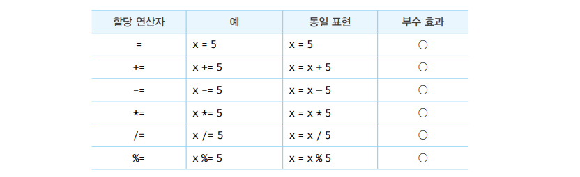

## 연산자

- > 💡 암묵적 타입변환 , 타입 강제 변환<br />
- > 개발자의 의도와는 상관없이 자바스크립트 엔진에 의해 암묵적으로 타입이 변환되는 현상

```js
// number + string 연산 경우
"1" + 2; // '12'
1 + "2"; // '12'

// boolean + number 연산 경우
1 + true; // 2
1 + false; // 1

// number + null 연산 경우
1 + null; // 1

// number + undefined 연산 경우
1 + undefined; // NaN ( 연산 불가능 )
```

> 기본적인 할당 연산자<br /> 

<br />
<br />
<br />

---

## 비교 연산자 [좌항과 우항의 피연산자를 비교 후 boolean값 return]

```
💡 `동등비교`(loose equailty) 와 `일치비교`(strict equality) 연산자는 엄현히 다르다 !
```

`동등 비교`

- ==
- `느슨한 비교` : 좌항과 우항의 피연산자를 비교할 때 `암묵적 타입 변환` 통해 타입을 `일치`시킨후 같은 값인지 비교

```js
// EX) 동등비교
5 == 5; // true

// 타입은 number 와 string 으로 다르지만, "암묵적 타입 변환"을 통해 먼저 타입이 일치시키고 비교
5 == "5"; // true
```

<br />

`일치비교`

- ===
- `완벽한 비교` : 좌항과 우항의 피연산자가 `타입`도 같고, `값`도 같은지 비교 , 즉, `암묵적 타입 변환을 하지 않고 값을 비교`

```js
// EX) 일치비교
5 === 5; // true

// 값 & 타입을 비교하기 때문에, 암묵적 타입을 하지 않은 두 값은 같지 않다.
5 === "5"; // false
```

```
💡 동등비교(==) 연산자는 `예측하기 어려운 결과` 를 만들어낸다. 일치비교(===) 연산자를 사용해라.
```

<br />
<br />

---

## NaN, +0 & -0, Object.is( ) 함수

- > NaN은 자신과 일치하지 않는 유일한 값이다.
- > NaN 인지 조사가 필요 시 Number.isNaN() 을 사용 해야 한다.

```js
NaN === NaNl; // false 일치 비교 대신 Number.isNaN()를 사용 해야 함

isNaN(NaN); // true
isNaN(10); // false
```

```
💡 +0 과 -0 이 존재한다. 이 둘을 비교하면 true return
```

```js
// 양의 0과 음의 0의 비교, 일치비교/동등비교 모두 결과는 true
0 === -0; // true
0 == -0; // true
```

<br />
<br />

---

## 삼항 조건 연산자

- 조건에 따라 어떤 값을 결정해야 한다. → `삼항 연산자 표현식`을 사용하는 편이 유리
- 조건에 따라 수행해야 할 문이 하나가 아니라 여러개다. → `if ~ else 문` 이 더 가독성 측면에서 유리

> 삼항 연산자 예시 <br /> 

<br />
<br />

## typeof 연산자

> typeof 연산자는 피연산자의 데이터 타입을 `문자열로` 반환 한다.

- `string`
- `number`
- `boolean`
- `undefined`
- `symbol`
- `object`
- `function`

```js
// 예시
typeof ""; // "string"
typeof 1; // "number"
typeof NaN; // "number"
typeof true; // "boolean"
typeof undefined; // "undefined"
typeof Symbol(); // "symbol"
typeof null; // "object" << null은 object를 return(javascript 첫번째 버전 오류)
typeof []; // "object"
typeof {}; // "object"
typeof new Date(); // "object"
typeof /test/gi; // "object" << 🔎 ( 정규표현식 )
typeof function () {}; // "function"
```

```js
💡 null 을 반환하는 경우는 없다 !
typeof null; ---> object를 반환함


💡 null 타입인지 확인할 때는 "===" 연산자를 사용한다 !
typeof FOO === null; // false
FOO === null; // true
```

```js
// 💡 선언하지 않은(undeclared) 식별자(= 변수)에 대해서 typeof 연산시, ReferenceError가 아닌 "undefined 를 반환"한다.
typeof undeclared; // undefined
```

<br />
<br />

---

## 지수 연산자

- `ES7`에 도입된 지주연산자
- `좌항`을 밑으로 , `우항`을 지수로 거듭 제곱하여 숫자 값을 반환한다.

> 예제

```JS
2 ** 2; // 2²
2 ** 1; // 2¹
2 ** n; // 2ⁿ
```

> 지수 연산자 도입 전

```js
Math.pow(2, 2); // 2²
Math.pow(2, 1); // 2¹
Math.pow(2, n); // 2ⁿ
```

---

## 다른 연산자 간단 소개 (뒷 장에서 더 자세히 설명)

| 연산자     | 개요                                                        |
| ---------- | ----------------------------------------------------------- |
| ?.         | 옵셔널 체이닝 연산자                                        |
| ??         | null 병합 연산자                                            |
| delete     | 프로퍼티 삭제                                               |
| new        | 생성자 함수를 호출할 때 사용하여 인스턴스 생성              |
| instanceof | 좌변의 객체가 우변의 생성자 함수와 연결된 인스턴스인지 판별 |
| in         | 프로퍼티 존재 확인                                          |
