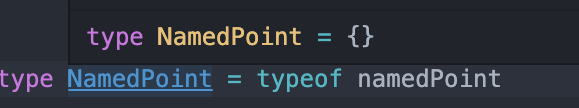
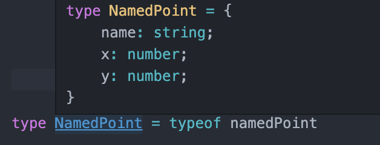
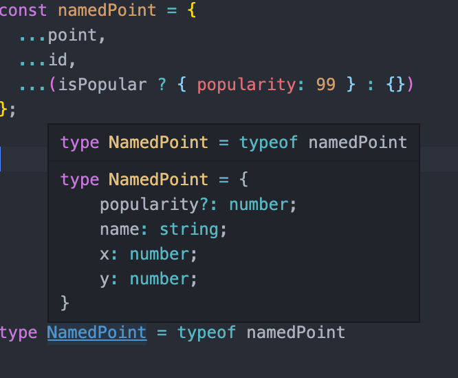
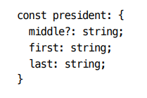
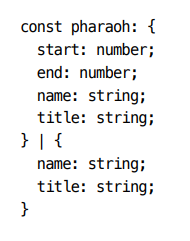

🎯💡🔥📌✅✔

# 아이템 23 `한꺼번에 객체 생성하기`

```
🔥요약🔥

✅ 속성을 제각각 추가하지 말고 한꺼번에 객체로 만들어야 한다.

✅ 안전하게 타입으로 속성을 추가하려면 객체 전개 ({...a , ...b})를 사용 해야 한다

✅ 객체에 조건부로 속성을 추가하는 방법은 ...(isPopular ? { popularity: 99 } : {}) 아래 예시 참고
```

<BR />
<BR />

> 변수값은 변경될 수 있지만, 타입스크립트의 `타입`은 변경되지 않는다.<BR />
> 객체를 생성할 때는 `속성을 하나씩 추가하기 보단`, 여러 속성을 포함해서 `한번에` 생성해야 터압 추론에 유리하다.

<BR />

- 객체 생성 잘못된 예시 / 옳은 예시

```ts
// 잟못된 예시 (1)
const PT = {}; // 타입이 {}
PT.x = 1; // '{}' 형식에 'x' 속성이 없습니다.

// PT 타입은 {} 기준으로 추론되기 때문에 존재 하지 않는 속성을 추가 할 수 없다.

// 잘못된 예시 (2)
interface Point {
  x: number;
  y: number;
}
const pt: Point = {};
// ~ '{}'형식에 'Point' 형식의 x,y 속성이 없습니다.
const pt = {
  x: 3,
  y: 4,
};

//위 두가지 문제는 한번에 정의하면 해결할 수 있다.
const pt = {
  x: 3,
  y: 4,
}; //정상
or;
const pt: Point = {
  x: 3,
  x: 4,
}; //정상
```

<BR />
<BR />

## 객체를 조립하여, 큰 객체를 만들 때에도 여러 단계를 거치지 않는 것이 좋다.

<br />

> 잘못된 예시

```ts
const point = {
  x: 1,
  y: 2,
};

const id = {
  name: "identifier",
};

const namedPoint = {};

Object.assign(namedPoint, point, id);

console.log(namedPoint); // { x: 1, y: 2, name: "identifier" }

console.log(namedPoint.name); // '{}' 형식에 'name' 속성이 없습니다.
```

- `Object.assign`를 이용해서 `namedPoint`객체에 `point`객체와 `id`객체가 잘 조립된 것처럼 보인다.
  - 자바스크립트에서는 문제 없이 작동되지만, `타입스크립트느 마지막 줄에서 에러를 발생 시킨다.`
    - 타입 공간에는 `namedPoint`라는 객체의 타입에는 `name`이라는 `propery`가 존재하지 않기 때문이다.
    - 
    - 컴파일러가 인식하는 namedPont 타입

<br />
<br />
<br />

## `객체를 한번에 조립`할 때는 객체 전개 연산자, 즉 스프레드 연산자를 이용해 만드는 것이 좋다.

- 스프레드 연산자를 이용해서 객체 한번에 생성하기

> 옳은 예시

```ts
const namedPoint = {
  ...id,
  ...point,
};

console.log(namePoint); // {x:2 , y:2 , name: 'identifier'}
console.log(namedPoint.name); // identifier

// 조건부 속성 추가하기
const namedPoint = {
  ...id,
  ...point,
  ...(isPopular ? { popularity: 99 } : {}),
};
```

- 객체의 타입이 개발자의 의도한 대로 잘 만들어짐
  - 
- 조건부 속성 추가하기
  - 

<br />
<br />
<br />

## 타입에 `안전한 방식`으로 `조건부 속성`을 `추가`하려면, 속성을 추가하지 않는 `null` or `{}`으로 `객체 전개`를 사용하면 된다.

> 사용 예시 1

```ts
declare let hasMiddle: boolean;
const firstLast = { first: "Harry", last: "Truman" };
const president = { ...firstLast, ...(hasMiddle ? { middle: "s" } : {}) };
```

- 위 예시 타입 추론
  - 

<br />

> 사용 예시 2

```ts
declare let pharaoh: boolean;
const nameTitle = { name: "Khufu", title: "pharaoh" };
const pharaoh = {
  ...nameTitle,
  ...(nameTitle ? { start: -259, end: -2566 } : {}),
};
```

- 위 예시 타입 추론 <`유니온 타입으로 타입 추론`>
- 

<br />
<br />

# 일관성 있는 별칭 사용하기

```
🔥요약🔥
✅별칭은 타입스크립트가 타입을 좁히는 것을 방해합니다. 따라서 변수에 별칭을 사용할 때는 일관되게 사용 해야 한다.

✅비구조화 문법을 사용해서 일관된 이름을 사용하는 것이 좋다.

✅함수 호출이 객체 속성의 타입 정제를 무효화할 수 있다는 점을 주의해야 한다. 속성보다 지역 변수를 사용하면, 타입 정제를 믿을 수 있다.
```

- 타입스크립트에서 별칭은 `신중하게 사용되어야 한다`.
  - 그래야 코드를 잘 이해할 수 있고, 오류도 쉽게 찾을 수 있다.

<br />

> 잘못된 예시

```ts
interface Coordinate {
  x: number;
  y: number;
}
interface BoundingBox {
  x: [number, number];
  y: [number, number];
}
interface Polygon {
  exterior: Coordinate[];
  holes: Coordinate[][];
  bbox?: BoundingBox;
}

function isPointInPolygon(polygon: Polygon, pt: Coordinate) {
  const box = polygon.bbox;
  if (polygon.bbox) {
    if (pt.x < box.x[0]) {
      // 객체가 'undefined'일 수 있습니다.
    }
  }
}
```

- polygon.bbox를 별도의 box라는 별칭을 만들었기 때문에 제어 흐름 분석을 방해

```ts
function isPointInPolygon(polygon: Polygon, pt: Coordinate) {
  const box = polygon.bbox;
  if (box) {
    if (pt.x < box.x[0]) {
      // 정상
    }
  }
}
```

- 에러는 해결했지만 box와 bbox는 같은 값인데 다른 이름을 사용하여 코드를 읽는 사람에게 문제가 될 수 있다.

<br />
<br />

---

<br />

## 객체 비구조화를 이용하면 보다 간결한 문법으로 일관된 이름을 사용할 수 있다.

<br />

> 옳바은 예시

```ts
function isPointInPolygon(polygon: Polygon, pt: Coordinate) {
  const { bbox } = polygon;
  if (bbox) {
    const { x, y } = bbox;
    if (pt.x < x[0]) {
      // 정상
    }
  }
}
```
