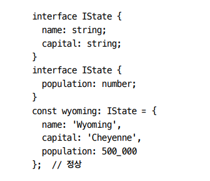

# 타입스크립트의 타입 시스템 🎯💡🔥📌✅✔

- 타입스크립트를 설치하면, `두가지를 실행할 수 있다.`
  - 타입스크립트 컴파일러 (tsc)
  - 단독으로 실행할 수 있는 타입스크립트 서버
    - 언어 서비스를 제공해준다.
    - 코드 자동 완성 지원
    - 명세 검사 지원
    - 리팩터링 지원

```
언어 서비스에서는 자동 완성, 명세 검사, 검색, 리팩터링 등의 기능을 제공한다.
그리고 편집기는 타입스크립트가 언제 타입 추론을 수행할 수 있는지에 대한 개념을 잡게 해 준다.
추론 정보는 디버깅하는 데에 큰 도움을 준다.
```

<br />
<br />
<br />

# `아이템 7 타입이 값들의 집합이라고 생각하기`

- 런타임에 모든 변수는 자바스크립트 세상의 값으로 부터 정해지는 각자의 고유한 값을 가짐
- 그러나 `코드가 실행되기전` 즉, 타입스크립트가 오류를 체크하는 순간에는 `타입`을 가진다. (`할당 가능한 값들의 집합이라고 말할 수 있다`.)

<br />
<br />

> 타입들의 예시

```ts
//never 타입 : 변수의 범위는 공집합이기 때문에 아무런 값 할당 할 수 없다.
const x: never = 12; //error

// 한 가지 값만 포함하는 타입 유닛 타입 or 리터럴 타입
type A = "A";
type B = "B";

//두개 혹은 세개로 묶으려면 유니온 타입
type AB = "A" | "B";
type AB12 = "A" | "B" | 12;

// 집합의 관점에서 타입 체커의 주요 역할은 하나의 집합이 다른 집합의 부분 집합인지 검사하는 것이라고 볼 수 있다.

//extends의 의미는 `~의 부분 집합`이라는 의미로 받아들일 수 있다.
//Vector3D은 Vector2D의 서브 타입 , Vector2D은 Vector1D의 서브 타입이다.
interface Vector1D {
  X: number;
}
interface Vector2D extends Vector1D {
  y: number;
}
interface Vector3D extends Vector2D {
  z: number;
}
```

- & 연산자는 두 타입의 인터섹션(교집합)을 계산한다.
- 언뜻 보기에는 공통 속성이 없기 때문에, PersonSpan 타입을 공집합으로 예상하기 쉽다.
- 그러나 타입 연산자는 인터페이스의 속성이 아닌, 값의 집합에 적용된다.
- 그리고 추가적인 속성을 가지는 값도 그 타입에 속하기에 Person과 Lifespan의 속성을 모두 - - 구현한 값은 인터섹션 타입에 속한다.

<br />
<br />

## 조금 더 일반적으로 PersonSpan 타입을 선언하는 방법은 extends 키워드를 쓰는 것이다.

```ts
//PersonSpanTYPE은 Person, Lifespan을 둘 다 가지는 인터섹션 타입에 속하게 된다.
interface Person {
  name: string;
}
interface Lifespan {
  birth: Date;
  death?: Date;
}
type PersonSpan = Person & Lifespan;
```

- 타입이 집합이라는 관점에서 extends의 의미는 `'...에 할당 가능한'`과 비슷하게, '`...의 부분집합'`이라는 의미로 받아들일 수 있다.
- extends 키워드는 제네릭 타입에서 한정자로도 쓰이며, 이 문맥에서는 `'...의 부분집합'`을 의미하기도 한다.

<br />
<br />

## 타입스크립트 용어와 집합 이론 용어 사이 대응 관계

- never -> 공집합
- 리터럴 타입 -> 원소가 1개인 집합
- 값이 T에 할당 가능 -> 값이 T의 원소
- T1이 T2에 할당 가능 -> T1이 T2의 부분 집합
- T1이 T2를 상속 -> T1이 T2의 부분 집합
- T1 | T2 -> T1과 T2의 합집합
- T1 & T2 -> T1과 T2의 교집합
- unknown -> 전체 집합

<br />

```
💡 아이템 7 요약 하기 💡
> 타입을 값의 집합으로 생각하면 이해하기 편함
> 타입스크립트는 상속관계가 아니라 집합으로 표현됨
> 한 객체의 추가적인 속성이 타입 선언에 언급되지 않더라도 그 타입에 속할 수 있음
> 객체 타입에서 A & B인 값이 A와B의 속성을 모두 가짐을 의미함
```

<br />
<br />
<br />

---

# 아이템 8 `타입 공간과 값 공간의 심벌 구분하기`

- 타입스크립트의 `심벌`은 `타입 공간`이나 `값 공간` 중의 한곳에 존재 한다.

<br />

✅ 심벌의 이름은 같더라도 속하는 공간에 따라 다른 것은 나타낼 수 있다.

```TS
// 이름은 같지만 하나는 타입, 하나는 값
interface Cylinder {
  radius: number;
  height: number;
}
const Cylinder = (radius: number, height: number) => ({ radius, height });

```

<br />
<br />

# 값과 타입으로 사용되는 Class,Enum

- `Class`, `enum`은 타입과 값 두가지 모두 가능한 `예약어`

<br />

## `타입, 값의 관점`

- 타입 관점
  - `typeof`는 값을 읽어서 타입스크립트 타입 반환
  - `typeof`는 큰 타입의 일부분으로 사용 가능
  - `type` 구문으로 이름을 붙일 수 있다.
- 값 관점
  - 자바스크립트 런타임의 `type값`이 된다.
  - 런타임에 가르키는 `심벌의 문자열을 반환`

<br />

## `Class`

- 타입으로 사용될 때는 형태로 사용
  - 타입 관점에서는 `typeof`로 값을 읽고 반환
- 값으로 사용될 때는 생성자가 사용됨
  - 값의 관점에서는 런타입의 `typeof` 연산자로 사용
  - 값 공간에서 런타임을 가르키는 `문자열`을 `반환`
    - 타입스크립트 타입과 다름
    - (string,number,boolean,undefined,object,function)

> 위 설명 예시

```ts
class Cylinder {
  radius = 1;
  height = 1;
}

function calculateVolume(shape: unknown) {
  if (shape instanceof Cylinder) {
    shape; // OK, 타입 Cylinder
    shape.radius; // OK, 타입 number
  }
}

const v = typeof Cylinder; // 값 Cylinder
type T = typeof Cylinder; // 타입 Cylinder
```

<br />
<br />
<br />

# 아이템 9 `타입 단언보다 타입 선언 사용하기`

- 타입스크립트에서 변수에 `값을 할당하고 타입을 부여`하는 방법은 `두가지`
  - 타입 선언
    - 값이 해당 인터페이스를 만족하는지 `검사`
    - 안전성 체크 가능
    - 화살표 함수 사용 시 직관적으로 사용 가능
  - 타입 단언 (`as`)
    - `타입 오류를 제대로 체크 할 수없음`
    - 잉여 속성 체크 불가능
    - 타입스크립트보다 `타입 정보를 더 잘 알고 있는 상황`에서는 타입 단언문과 null 아님 단언문을 사용하면 된다.
    - `강제로 타입을 지정`했으니 `타입 체커`에게 `오류를 무시`하라고 하는 것
    - 타입 단언은 보통 `DOM 엘리먼트를 가져올때` 적용한다. (개발자가 더 잘 알고 있는 경우)

<br />

> 위 코드 예제

```ts
interface Person {
  name: string;
}
//첫번째 타입 부여 방법 <타입 선언>
const alice: Person = { name: "Alice" };
//두번째 타입 부여 방법 <타입 단언>
const bob : {name:"Bob"} as Person
```

> 주의 사항!

```
💡 const bob = <Person>{} 와 같은 코드는 단언문의 원래 문법이며, {} as Person과 동일하다.
💡 <Person>와 같은 코드는 .tsx에서 컴포넌트 태그로 인식되어 현재는 잘 쓰이지 않는다.
```

<br />
<br />

## 타입 단언이 필요한 경우

- DOM 엘리먼트에 대해서는 TS보다 개발자가 더 정확히 알고 있다.
  - TS는 DOM에 접근할 수 없기 때문에 `#mybutton`이 버튼 엘리먼트인지 알지 못한다.
  - 이벤트의 `currentTarget`이 같은 버튼이어야 하는 것도 알지 못한다.

> 타입 단언이 필요한 경우 예시

```ts
document.querySelector("#myButton").addEventListener("click", (e) => {
  e.currentTarget; // 타입은 EventTarget
  const button = e.currentTarget as HTMLButtonElement;
  button; // 타입은 HTMLButtonElement
});
```

<br />
<br />
<br />

# `아이템10 객체 래퍼 타입 피하기`

- 자바스크립트는 객체 이외에 `기본형의 타입`을 가진다.

  - `string`,`number`,`boolean`,`null`,`undefined`,`symbol`,`bigint`
  - `기본형은 불변이며, 메서드를 가지지 않는다.`

<br />

- 타입스크립트는 `기본형(원시타입)`과 `객체 래퍼타입`을 `별도로 모델링`하기 때문에 값으로써 사용할 때와 타입으로 사용할 때를 구분하고, 타입으로 사용시 주의해야 한다!

<br />

## 기본형 객체 래퍼 타입

- 이 래퍼 타입 덕분에 기본형 값에 메서드 이용이 가능
- number => Number
- boolean => Boolean
- symbol => Symbol
- bigint => Bigint
- null, undefined => 존재 하지 않음

```ts
// 이렇게 쓰지 말고
const s: String = "primitive";
x;
// 이렇게 쓰자! (기본형으로)
const s: string = "prmitivie";
o;
```

<br />
<br />
<br />

# `아이템11 잉여 속성 체크의 한계 인지 하기`

- 타입이 명시된 변수에 객체 리터럴을 할당하거나 함수에 매개변수로 전달할 때, `타입스크립트는 해당 타입의 속성이 있는지, 그리고 그 외의 속성은 없는지를 확인한다.`

```ts
// 이 예제는 구조적 타입 시스템에서 발생할 수 있는 중요한 종류의 오류를 잡을 수 있도록 '잉여 속성 체크'라는 과정이 수행되었다.
interface Room {
  numDoors: number;
  ceilingHeightFt: number;
}

const r: Room = {
  numDoors: 1,
  ceilingHeightFt: 10,
  elephant: "present",
  // 오류 - 'Room' 형식에 'elephant'가 없습니다.
};
```

- 구조적 타이핑 관점으로 생각해보면 오류가 발생하지 않아야 한다.
- 임시 변수 obj를 선언하고 Room 타입에 할당하는 것은 가능하다.

```ts
const obj = {
  numDoors: 1,
  ceilingHeightFt: 10,
  elephant: "present",
};

const r: Room = obj;
// 정상
```

- 위 코드가 정상인 이유
  - obj 타입은 Room 타입의 `부분 집합`을 `포함`하므로, Room에 할당 가능하며 `타입 체커도 통과`한다.
  - 그러나 `잉여 속성 체크 역시 조건에 따라 동작하지 않는다는 한계`가 있고, 통상적인 할당 가능 검사와 함께 쓰이면 구조적 타이핑이 무엇인지 혼란스러워질 수 있다.
  - `잉여 속성 체크`가 `할당 가능 검사`와는 `별도의 과정`이라는 것을 알아야 타입스크립트 타입 시스템에 대한 개념을 정확히 잡을 수 있다.

<br />
<br />
<br />

# `아이템12` 함수 표현식에 타입 적용하기

- 타입스크립트는 `함수 표현식`을 사용하는 것이 좋다.
- 매개 변수나 반환 값에 타입을 명시하기 보다는 함수 표현식 전체에 타입구문을 적용하는 것이 좋다
- 다른 함수의 시그니처를 참조하려면 typeof fn를 사용하면 된다.

```ts
type DiceRollFn = (sides: number) => number;
const rollDice: DiceRollFn = (sides) => {
  /**/
};
```

- 타입스크립트가 `함수 표현식`을 사용하면 좋은 이유<br />

> 예제 코드

```ts
// 함수 타입의 선언은 불필요한 코드의 반복을 줄여준다.
// 안 좋은 함수 선언의 예
function add(a: number, b: number) {
  return a + b;
}
function sub(a: number, b: number) {
  return a - b;
}
function mul(a: number, b: number) {
  return a * b;
}

//반복되는 함수 시그너처를 하나의 함수로 통합 할 수 있다.
// 좋은 함수 선언의 예
type BinaryFn = (a: number, b: number) => number;
const add: BinaryFn = (a, b) => a + b;
const sub: BinaryFn = (a, b) => a - b;
const mul: BinaryFn = (a, b) => a * b;
```

<br />
<br />
<br />

# `아이템13` 타입과 인터페이스 차이점 알기

- 타입스크립트는 타입 정의 하는 두가지 방법이 있다.
  - `interface`
  - `type`

> 타입 정의 두가지 방법 예제

```ts
type Tstate = {
  name: string;
  captial: string;
};
interface IState {
  name: string;
  captial: string;
}

// IState , Tstate 를 추가 속성과 함께 할당한다면, 동일한 오류가 발생한다.
const wyoming : Tstate or IState ={
  name: kim,
  captial: seoul,
  popu : 500000  // Tstate형식에 popu가 없습니다 Error..
}
```

<br />

## (1\_비슷한점) 인덱스 시그니처는 interface , type에서 모두 사용할 수 있다.

> 인덱스 시그니처 예제

```ts
type TDict = { [key: string]: string };
interface IDict {
  [key: string]: string;
}
```

<br />

## (2\_비슷한점) 함수 타입도 interface , type에서 모두 사용할 수 있다.

> 함수 타입 정의 예제

```ts
type TFn = (x: number) => string;
interface IFn {
  (x: number): string;
}
const toStrT: TFn = (x) => "" + x;
const toStrT: IFn = (x) => "" + x;
```

<br />

## (3\_비슷한점) 타입 별칭과 인터페이즈는 모두 제너릭이 가능하다

> 위 예제

```ts
type Tpair<T> = {
  first: T;
  Second: T;
};
type IPair<T> = {
  first: T;
  Second: T;
};
```

<br />

## (4\_비슷한점) 인터페이스는 타입을 확장 할 수 있고, 타입은 인터페이스를 확장할 수 있습니다.

- `인터페이스`는 유니온 타입 같은 `복잡한 타입을 확장하지 못한다`.
- 복장한 타입을 확장하기 위해서 `타입`과 `&`를 사용 해야 한다.

> 위 예제

```ts
//인터페이스 타입 확장
interface ISateWithPop extends Tstate {
  population: number;
}
//타입의 인터페이스 확장
type TStateWithPop = Istate & { population: number };

//ISateWithPop , TStateWithPop은 동일하다.
```

<br />

## (5\_비슷한점) class 구현에서 인터페이스(Istate), 타입(Tstate) 둘 다 사용가능

> 위 예제

```ts
class StateT implements Tstate {
  name: string = "";
  capital: string = "";
}

class StateI implements Istate {
  name: string = "";
  capital: string = "";
}
```

<br />
<br />

# 인터페이스와 타입 다른 점

<br />

## (1\_다른점) 유니온 타입은 존재하지만, 유니온 인터페이스는 존재하지 않는다.

- 인터페이스는 타입 확장가능하지만, 유니온은 할 수 없다.
- `타입` 키워드는 일반적으로 인터페이스보다 `쓰임새가 많다.`
  - `type키워드`는 `유니온`이 될 수 있고, 매핑된 타입 or 조건부 타입 같은 `고급 기능에 활용되기도 한다.`

> 위 예시

```ts
//유니온 타입
type AorB = "a" || "b"
// 유니온 타입에 name 속성을 붙인 타입을 만들 수 도 있음. 이건 인터페이스로 표현할 수 없다.
type NameVariavle = (Input | Output) & {name : string};

//인터페이스
type Input = {}
type Output = {}
interface VariableMap {
  [name : string] : Input | Output;
}
```

> 튜플과 배열도 type 키워드르 통해 더 간결하게 표현 가능하다.

```ts
// 튜틀은 type으로 구현하는 것이 좋다.
type Pair = [number, number];
type StringList = string[];
type NamedNums = [string, ...number[]];
```

<br />

## (2\_다른점) 인터페이스에는 타입에 없는 몇가지 기능이 있다.

- 보강이 가능하다.
  - 
  - 위 처럼 선언 병합이 가능하다.
  - 선언 병합을 위해선 반드시 인터페이스를 사용 해야 한다.

<br />
<br />

```
✅정리
💡 복잡한 타입이라면, 타입 별칭을 사용한다.
💡 타입, 인터페이스 두가지로 표현 가능하다면, 일관되게 타입을 사용하거나 인터페이스를 사용하면 된다.
💡 어떤 API에 대한 타입 선언을 작성해야 한다면, 인터페이스를 사용하는 편이 좋다.
💡 프로젝트에서 어떤 문법을 사용할 지 결정할 때 한 가지 일관된 스타일을 확립하고, 보강 기업이 필요한지 고려해야한다.
```
