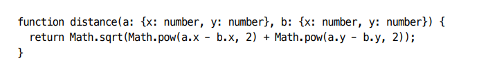
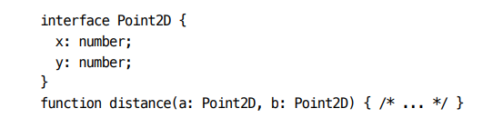
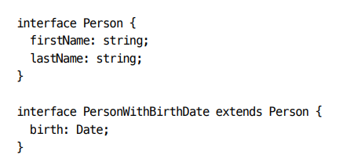
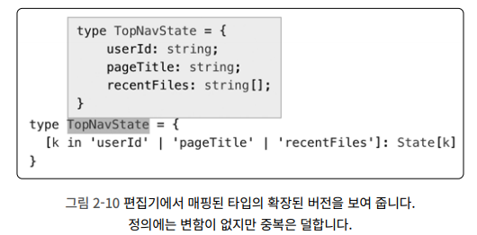
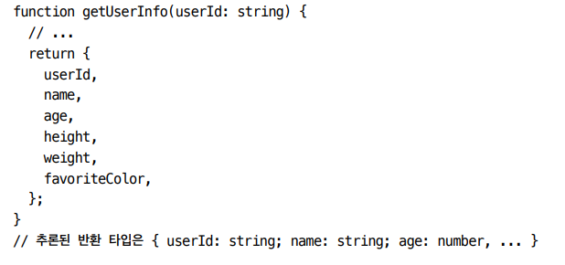

🎯💡🔥📌✅

# 아이템 14 `타입 연산과 제너릭 사용으로 반복 줄이기`

- 같은 코드를 반복하지는 말라
- `같은 타입을 반복`하는 것은 코드 중복만큼 많은 문제를 발생시킨다.
  - `DRY 원칙`

<br />

## 타입 간에 매핑하는 방법을 익히면, 타입 정의에서도 DRY의 장점을 적용할 수 있다.

- `반복을 줄이는 가장 간단한 방법은 타입에 이름을 붙이는 것이다.`
- 
  - 함수에 `타입`이 `반복적`으로 등장한다
- 
  - `타입에 이름을 붙이면`, 타입이 `반복적`으로 `등장`하는 것을 `막을 수 있다.`

<br />
<br />

## 몇몇 함수가 같은 타입 시그니처를 공유하고 있다면, 해당 시그니처를 명명된 타입으로 분리할 수 있다.

> 예제

```ts
function get(url: string, opts: Otions): Promise<Response>;
function post(url: string, opts: Otions): Promise<Response>;

//타입 분리
type HTTPFunction = (Url: string, opts: Options) => Promise<Response>;
const get: HTTPFunction = (url, opts) => {};
const post: HTTPFunction = (url, opts) => {};
```

<br />
<br />

## 한 인터페이스가 다른 인터페이스를 확장하게 해서 반복을 제거할 수 있다.

- 예시
  - 

<br />
<br />

## 이미 존재하는 타입을 확장하는 경우에 인터섹션 연산자(&)의 사용도 가능하다.

> 예시

```ts
// 이런 기법은 유니온 타입(확장할 수 없는)에 속성을 추가하려고 할 때 특히 유용하다.
type PersonWithBirthDate = Person & { birth: Date };
```

<br />
<br />

## 전체 애플리케이션 상태를 표현하는 `State 타입` , 단지 부분만 표현 하는 `TopNavState`가 있는 경우의 중복 피하기

- 
  - 아래 예제 코드 완성 시

> 예제 코드

```ts
// 전체 상태
interface State {
  userId: string;
  pageTitle: string;
  recentFiles: string[];
  pageContents: string;
}
// 부분만 표현하는 상태
interface TopNavState {
  userId: string;
  pageTitle: string;
  recentFiles: string[];
}

//  State의 부분 집합으로 TopNavState의 중복 정의 피하기
type TopNavState = {
  [k in "userId" | "pageTitle" | "recentFiles"]: State[k];
};
// 이 방식도 가능!
type TopNavState = Pick<State, "userId" | "pageTitle" | "recentFiles">;
```

<br />

- 위 `[ k in ] : T[K]` 방식은 배열의 필드를 루프 도는 것과 같은 방식이며, 표준 라이브러리에서 일반적으로 찾을 수 있다.
- `Pick`은 제네릭 타입이고, `Pick를 사용하는 것은 함수를 호출하는 것과 마찬가지이다`.
  - `Pick은 T와 K 두 가지 타입을 받아서 결과 타입을 반환한다.`

<br />

## 태그된 유니온에서도 다른 형태의 중복이 발생할 수 있다.

> 에제 코드

```ts
interface SaveAction {
  type: "save";
}
interface LoadAction {
  type: "load";
}
type Action = SaveAction | LoadAction;
//.
//..
//...
// 위 타입의 반복이 일어남 bad!
type ActionType = "save" | "load";

// 타입의 반복을 없애기(인덱싱),(pick) 둘이 차이점이 있음 good!
type ActionType = Action["type"]; // 타입은 "save" | "load"
type ActionType = Pick<Action, "type">; // 타입은 {type : "save" | "load"}
```

<br />
<br />

## 생성하고 난 다음 업데이트가 되는 클래스 정의 시, update 메서드 매개변수 타입은 생성자와 동일하면서 옵셔널이된다.

- 매핑된 타입과 `keyof`를 사용하면 `Options`으로 `OptionsUpdate`를 만들 수 있다.
- `keyof`
  - `타입`을 받아서 `속성 타입`의 `유니온`을 `반환`한다.
- `[k in keyof Options]`
  - 순회마여 Options 내 K값에 해당하는 속성이 있는지 찾는다.

> 예제 코드

```ts
interface Options {
  width: number;
  height: number;
  color: string;
  label: string;
}
//타입 중복이 발생한다.
interface OptionsUpdate {
  width?: number;
  height?: number;
  color?: string;
  label?: string;
}

//매핑된 타입과 `keyof`를 사용하면 `Options`으로 `OptionsUpdate`를 만들 수 있다.
// 위 OptionsUpdate와 동일한 타입
// 이코드로 위같은 코드의 중복을 피할 수 있다.
type OptionsUpdate = { [k in keyof Options]?: Options[k] };
```

> keyof

```ts
type OtionsKeys = keyof Options;
// 타입은 "width" | "height" | "color" | "label"
```

<br />
<br />

## 값의 형태에 해당하는 타입을 정의 하고 싶을 때

```TS
const INIT_OPTIONS = {
    width : 640,
    height : 480,
    color : '#00FF00',
    label : 'VGV'
}
//bad!!
interface Options {
    width : string,
    height : number,
    color : string,
    label : string
}


// typeof를 사용 한줄로 표현이 가능하다
// GOOD!!
type Options = typeof INIT_OPTIONS
```

<br />
<br />

## 함수 or 메서드의 반환 값에 명명된 타입을 만들고 싶을 때\

- `ReturnType`은 `값`이 아니라 `타입`에 적용된다.

- ex)
- 

```ts
// ReturnType를 사용
type UserInfo = ReturnType<typeof getUserInfo>;
```

<br />

```
✅ 제네릭 타입은 타입을 위한 함수와 같다.
✅ 또한 DRY 원칙을 지킬 때 유용하게 사용된다.
```

<br />

## 제네릭 타입에서 매개변수를 제한할 수 있는 방법은 `extends`사용

- `extends`를 이용하면, `제너릭 매개변수`가 `특정 타입`을 `확장`한다고 선언 할 수 있다.

> 위 예제

```ts
interface Name {
  first: string;
  last: string;
}
type DacingDuo<T extends Name> = [T, T];
//옳바른 사용
const Duo1: DacingDuo<Name> = [
  { first: "one", last: "two" },
  { first: "three", last: "four" },
]; // OK

// 잘못된 사용
const Duo2: DacingDuo<{ first: string }> = [
  //Error
  //{ first: string }은 Name을 확장하지 않기 때문에 오류가 발생한다.
];
```

<br />

<br />

<br />

```
📌 요약
- DRY 원칙을 타입에도 최대한 적용해야한다. (중복 코드 피하기)
- 타입에 이름을 붙여서 반복을 피하고, extends를 사용해서 인터페이스 중복 피하기
- keyof, typeod, 인덱싱, 매핑된 타입
- 제너릭 타입은 타입을 위한 함수와 같다. 제너릭 타입을 제한하려면 extends를 사용하면 된다.
- 표준 라이브러리에 정의된 Pick, ReturnType 같은 제너릭 타입에 익숙 해져야 한다.
```
