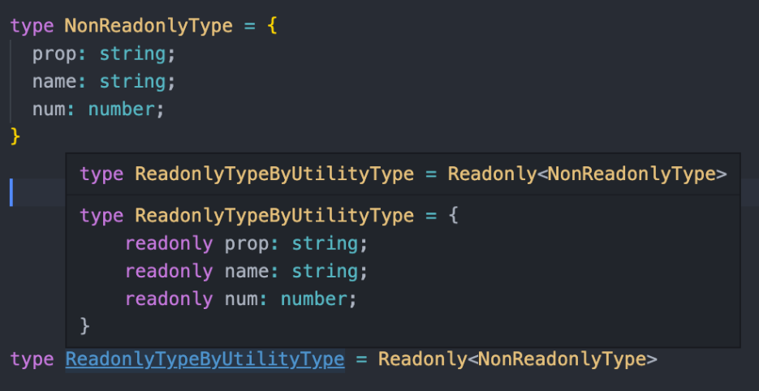

🎯💡🔥📌✅

# 아이템 17 변경 관련된 오류 방지를 위해 readonly 사용하기

<br />

```
📌 3줄 요약하기 📌
1. 객체 property 앞에 붙는 readonly와 array, 튜플 타입 앞에 붙는 readonly의 차이를 이해하자.
2. 객체의 readonly property는 얕게(shallow) 동작한다.
3. readonly number[] 타입은 number[] 타입의 상위 집합이다.
```

<br />

- `readonly number[]` , `number[]` 서로 구분되는 몇 가지 특징이 있다.
- `number[]`은 `readonly number[]`보다 기능이 많기 때문에 `readonly number[]`의 서브 타입이 된다.
  - `readonly number[]`은 배열의 요소를 읽을 수 있지만,쓸 수 는 없다.
  - `length`를 읽을 수는 있지만, 바꿀 수는 없다.
  - 배열의 변경하는 `pop`을 비롯한 `다른 메서드`를 호출할 수 없다.

> 예제

```ts
//- `number[]`은 `readonly number[]`보다 기능이 많기 때문에 `readonly number[]`의 서브 타입이 된다.
//예제

const a: number[] = [1, 2, 3]; //Ok
const b: readonly number[] = a; //Ok
const c: number[] = b; //Error...
```

<br />
<br />
<br />

> 매개변수를 readonly로 선언한다면 다음과 같은 일이 생긴다.

```
✅ 타입스크립트는 매개변수가 함수내에서 `변경이 일어나는지 체크한다`

✅호출하는 쪽에서 함수가 `매개변수를 변경하지 않는다는 보장`을 받게 된다.

✅`호출하는 쪽`에서 함수에 `readonly 배열`을 매개변수로 넣울 수도 있다.

✅함수가 매개변수를 변경하지 않는다면, readonly로 선언 해야 한다

✅readonly를 사용하면 지역 변수와 관련된 모든 종류의 변경 오류를 방지할 수 있다.
```

> readonly를 이용한 예제 (매개변수를 변경하지 않는다는 보장)

```ts
function arraySum(arr: readonly number[]) {
  let sum = 0;
  for (const num of arr) {
    sum += num;
  }
  return sum;
}
```

<br />
<br />

## 객체 타입 Property 앞에 붙는 readonly

- 자바스크립트에서 `const`는 재할당을 금지하는 키워드이다.
- `const`로 선언된 `객체의 속성`은 `변경`이 `가능`하다.
  - 타입스크립트에서 `readonly` 키워드를 통해 특정 `속성의 변경`을 `막을 수 있다`.

<br />

> 타입스크립트에서 readonly를 통해 특정 속성의 변경을 막기

```ts
// 타입스크립트에서 readonly를 통해 특정 속성의 변경을 막기

type ReadonlyType = {
  readonly prop: string;
};
const readonly: ReadonlyType = {
  prop: "a",
};
readonly.prop = "a"; //readonly 타입으로 객체 속성을 변경할 수 없다.
```

<br />

> readonly 접근제어자는 얕게 동작한다.

```ts
type ReadonlyType = {
  readonly prop: InnerType;
};

const readonlyType: ReadonlyType = {
  prop: {
    innerProp: "a",
  },
};
readonlyType.prop.innerProp = "b"; //에러가 나지 않는다.  readonlyType.prop.innerProp 속성은 변경 가능하다.
//얕게 동작하기 때문에
```

<br >

> 유틸리티 타입 Readonly은 기존 타입의 속성들 모두를 readonly로 만들어준다.

- 

<br />
<br />

## 아이템 18 `매핑된 타입`을 사용하여 값을 `동기화 하기`

- 리액트에서는 `props`가 변경될 때 해당 컴포넌트와 자식 컴포넌트가 리렌더링된다.
  - 이벤트 핸들러 같이 `눈에 보이는 요소가 아니라면`, 해당 부분이 바뀌어도 다시 `랜더링 될 필요가 없을 수 있다`.

<br />
<br />

- 아래는 최적화를 위해 다시 리렌더링이 필요한지 판단하는 함수이다.
  - 아래함수는 어떤 props가 추가되더라도 해당 `props에 대해서도 항상 판단하기 때문에 필요한 업데이트를 놓치는 에러를 허용하지 않는다.`
    - `보수적 접근법` , `실패에 닫힌 접근법`이라고 한다.

> 최적화를 위해 다시 리렌더링이 필요한지 판단하는 함수

```ts
// 보수적 접근법, 실패에 닫힌 접근법
function shouldUpdate(oldProps: ViewProps, newProps: ViewProps) {
  let k: keyof ViewProps;
  for (k in oldProps) {
    if (oldProps[k] !== newProps[k]) {
      if (k !== "onClick") return true;
    }
  }
}
```

<br />

> 실패의 열린 접근법 , 특정 props에 한해서만 리렌더링을 허용하여 너무 자주 업데이트 되는 것을 막는다.

```ts
//실패의 열린 접근법, 특정 props에 한해서만 리렌더링을 허용하여 너무 자주 업데이트 되는 것을 막는 방법이다.
// 정작 필요할 때 뷰가 바뀌지 않을 수 있으므로 최적화라고 보긴 어렵다.
function shouldUpdate(oldProps: ViewProps, newProps: ViewProps) {
  return (
    oldProps.xs !== newProps.xs ||
    oldProps.ys !== newProps.ys ||
    oldProps.xRange !== newProps.xRange ||
    oldProps.yRange !== newProps.yRange ||
    oldProps.color !== newProps.color
  );
}
```

## 타입체커가 위와 같은 역할들을 대신하도록 만들기

```ts
const REQUIRES_UPDATE: { [k in keyof ViewProps]: boolean } = {
  xs: true,
  ys: true,
  xRange: true,
  yRange: true,
  color: true,
  onClick: false,
};

function shouldUpdate(oldProps: ViewProps, newProps: ViewProps) {
  let k: keyof ViewProps;
  for (k in oldProps) {
    if (oldProps[k] !== newProps[k] && REQUIRES_UPDATE[k]) {
      return true;
    }
  }
}
```

<br />
<br />

> 위에 대한 설명

```
✅ [k in keyof ViewProps]는 타입 체커에게 ViewProps와 동일한 속성을 가져야 한다는 것을 알려준다.
✅ REQUIRES_UPDATE에 boolean 값을 가진 객체를 사용했다.
✅ 나중에 추가 속성이 더해질때 REQUIRES_UPDATE에서 에러가 발생할 것이다.
```
