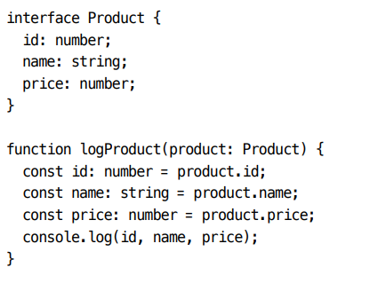
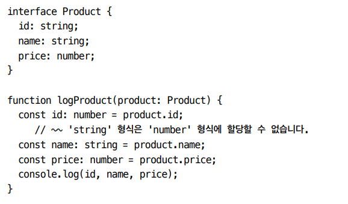
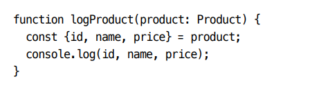
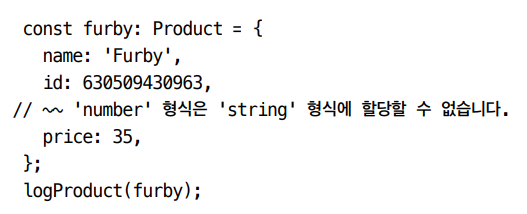
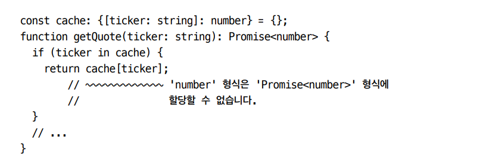
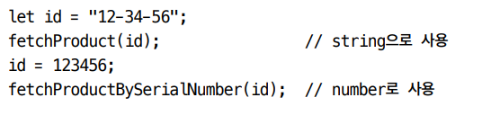
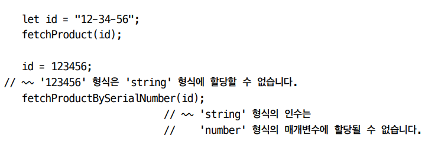
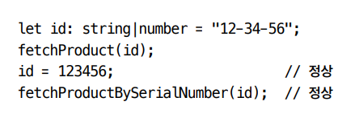

🎯💡🔥📌✅✔

# 아이템 19 `추론 가능한 타입을 사용해 장황한 코드 방지 하기`

```
아이템 19 요약하기
✅ 타입스크립트가 타입을 추론할 수 있다면 타입 구문을 작성하지 않는 게 좋다
✅ 이상적인 경우 (함수/메서드의 시그니처에는 타입 구문이 있지만, 함수 내의 지역 변수에는 타입 구문이 없다.)
✅ 추론될 수 잇는 경우라도 객체 리터럴과 함수 반환에는 타입 명시를 고려해야한다! (내부 구현의 오류가 사용자 코드 위치에 나타나는 것을 방지해줌)
```

- `모든 변수에 타입을 선언`하는 것은 비생산적이며, `형편없는 스타일`이다.
  - 타입 추론이 된다면 명시적 타입 구문은 필요하지 않다.

```ts
//bad! 형편없는 스타일
let x: number = 12;
//이렇게 해도 충분하다
let x = 12;

// 복잡한 객체도 추론이 가능하다
const person = {
  name: "kim",
  born: {
    where: "Seoul",
    when: "long time",
  },
};

//배열의 경우도 동일 하게 타입스크립트는 입력받아 연산을 하는 함수가 어떤 타입을 반환하는 지 추론할 수 있다.
function square(nums: number[]) {
  return nums.map((x) => x * x);
}
const squares = square([1, 2, 3]); // number[]타입 추론 가능
```

<br />
<br />

## 타입이 추론되면 리팩터링에 용의해진다.

> 예시

- 
  - 리팩터링 용의해짐
- 위 예시에서 id에 문자도 들어 있음을 나중에 알게 되었다고 가정 했을때,
  - 
  - `interface Product` 내의 id 타입을 변경해도 `logProduct` 내의 `id 변수 선언`에 있는 타입과 맞기 않기 때문에 `오류`가 `발생`한다.
  - 위 오류를 해결하기 위해서 비구조화 할당문을 사용해 구현하는 것이 좋다.
    - 
    - 비구조화 할당문은 `모든 지역 변수`의 `타입`이 `추론`되도록 한다.

<br />
<br />

- 이상적인 타입스크립트 코드는 `함수/메서드` `시그니처`에 `타입 구문`을 `포함`하지만, `함수 내`에서 생성된 `지역 변수에는 타입 구문을 넣지 않는다`.
  - 타입 구문을 생략해서 방해되는 것들을 최소화하고 코드를 읽는 사람이 구현 로직에 집중할 수 있게 해야한다.

<br />

> 위 예시

```ts
//함수내에 지역변수에는 타입 구문을 넣지 않아야 코드를 읽는 사람이 구현 로직에 집중할 수 있다.

//base 는 10이기때문에 base --> number로 추론된다.
function parseNumber(str: string, base = 10) {
  //...
}
```

<br />

- 정보가 부족해서 타입스크립트가 타입을 판단하기 어려운 상황이 발생하기도 한다.
  - 함수의 매개변수 타입이 그러하다
  - 라이브러리를 사용할 때 타입 정보가 기본적으로 제공된다면 콜백함수 매개변수 타입은 자동으로 추론된다.

<br />

> 보통 타입 정보가 있는 라이브러리에서, 콜백 함수의 매개변수 타입은 자동으로 추론된다.

> 타입 추론을 최대한 이용하는 편이 좋음

```ts
//BAD 이렇기 사용하면 안 좋음!!
app.get("/health", (request: express.Request, response: express.Response) => {
  response.send("OK");
});

//GOOD! ,
app.get("/health", (request, response) => {
  response.send("OK");
});
```

<br />

- 타입을 명시 해야하는 상황이 있다. `잉여 속성 체크가 필요할 때 이다`.
  - 타입 구문을 제대로 명시한다면, 실제로 실수가 발생한 부분에 오류를 표시해준다.
    - 
  - 함수의 반환에도 타입을 명시해서 오류를 방지할 수 있다.
    - 
- 타입 추론이 가능하지만, 함수의 반환에 타입을 명시한다면, `구현상의 오류가 함수를 호출한 곳까지 영향을 미치는 것을 막을 수 있다`.

```ts
const elmo: Product = {
  name: "something",
  id: "123123",
  price: 1000,
};
```

<br />
<br />
<br />

# 아이템20 `다른 타입에는 다른 변수 사용하기`

```
✅ 아이템20 요약

✅ 변수의 값은 바뀔 수 있지만, 타입은 일반적으로 바뀌지 않는다.

✅ 혼란을 막기 위해 타입이 다른 값을 다룰 때에는 변수를 재사용하지 않도록 한다.
```

<br />
<br />

- 자바스크립트는 `한 변수`를 `다른 목적`을 가지는 `다른 타입`으로 `재사용`해도 된다.
  - 
- 반면에 타입스크립트는 오류가 발생한다.

  - 

- 여기서, `변수의 값은 바뀌지만, 타입의 값은 보통 바뀌지 않는다는 것을 알 수 있다.`

<br />
<br />

- 타입을 바꿀 수 있는 한가지 방법은 범위를 좁히는 것
  - 타입을 더 작게 제한하는 것이다.
  - 
    - 유니온 타입으로 타입체커 오류를 해결한다 하더라도 id를 사용할 때마다 어떤 타입인지 확인해야 하기 때문에 별도의 변수를 도입하는 것이 낫다.
    - 또한, const 키워드를 사용할 수 있기 때문에 꼭 재할당이 필요한지 잘 판단 해야 한다.

<br />

## 타입이 바뀌는 변수를 되도록이면 피해야 하며, 목적이 다른 곳에는 별도의 변수명을 사용해야한다.
