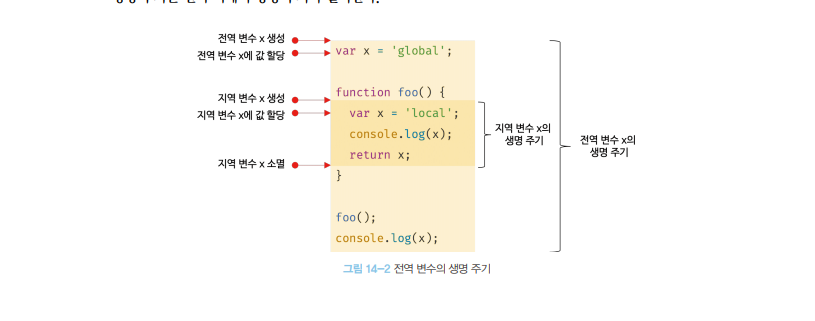

# 전역 변수🎯💡🔥📌✅

```
✅ 전역 변수의 무분별한 사용은 안됨 , 보통 지역 변수를 사용
```

`변수`

- 할당을 통해 값을 갖고, 언젠가 소멸한다. (생명 주기를 갖는다.)
- 변수의 생명주기가 `없다면 영원히 메모리를 차지`
- `변수의 생명 주기` : `메모리 공간 확보` ~~> `메모리 공간 해제` ~~> `가용 메모리 풀 해제`
- 변수는 등록된 스코프가 `소멸`(`메모리 해제`)될 때 까지 유효하다.
- 어무도 메모리 공간을 참조 하고 있지 않을 때 `가비지 콜렉터`에 의해 가용 메모리 풀에 반환 된다.

  <br />
  <br />

> `지역 변수`의 생명주기 = `함수`의 생명주기

```js
function foo() {
  var x = "local";
  console.log(x); // local
  return x;
}

foo();
console.log(x); // ReferenceError: x is not defined  <<
```

  <br />
  <br />

## 지역 변수 호이스팅 스코프

- 지역 변수의 호이스팅은 지역 변수의 선언이 지역 스코프의 선두로 끌어 올려진 것처럼 동작
- 지역 변수는 함수 전체에서 유효하다.
  <br />

```js
var x = "global";

function foo() {
  console.log(x); // undefined << 🔎
  var x = "local";
}

foo();
console.log(x); // "global"

/*
foo 함수 내부에 선언된 x 변수는, foo 함수 호출 시 이미 undefined로 초기화 되어 있음 (변수 선언과정이 이미 끝남, 값 할당과정은 X)
따라서, console 출력문을 만나는 시점에는 아직 x에 값이 할당되기 이전이기 때문에 undefined 를 출력
중요한 것은 최상단에 전역변수 x까지는 스코프가 유효하지 않다는 것, 즉 함수 내부에서 선언된 지역변수는 함수 내에서만 스코프를 가짐
*/
```

  <br />
  <br />

## 전역 변수 문제점

- var 키워드로 선언한 `전역 변수`의 생명주기는 `전역 객체의 생명 주기`와 `일치`한다.
- 📌 전역 window는 `웹페이지`를 `닫기 전까지 메모리`를 `차지` 하고 있어서 `비효율`
- 📌 `암묵적 결합` : 의도치 않게 변수의 상태 변경이 가능
- 📌 `긴 생명 주기` : `메모리 리소스` 오랜 기간 소비
- 📌 `스코프 체인 상 종점` : 변수를 찾을 때 `맨 종점에 위치 `, (= 검색 속도 느림)
- 📌 `네임스페이스 오염` : 다른 파일 내에 동일한 이름으로 명명된 `전역 변수가 같은 스코프 내에 존재할 수 있음`

> 예시 <br />



 <br />
 <br />

---

# 전역 변수 사용을 억제하기(4가지 방법)

```
💡 웬만해선 지역변수를 사용해야한다💡
```

(1)`즉시 실행 함수`

> 모든 코드를 즉시 실행 함수 로 감싸면 모든 변수는 `즉시 실행 함수의 지역 변수가 된다`.

```js
(function () {
  var foo = 100; // 즉시 실행 함수의 지역 변수
  // ...
})();

console.log(foo); // ReferenceError: foo is not defined
```

 <br />
 <br />

(2) `네임스페이스 객체 사용`
`네임스페이스는 객체`

- 네임스페이스 내부에 또 다른 네임스페이스 객체를 프로퍼티로 추가할 수 있다. → `계층적 네임스페이스`
- 네임스페이스 `객체 자체가 전역 변수에 할당`되므로 그다지 유용하진 않음

```js
//1번째 방법
// 전역 네임스페이스 객체
var MYAPP = {};
// 네임스페이스 내부에 또 다른 네임스페이스 계층적 구조 생성
MYAPP.person = {
  name: "lee",
};

console.log(MYAPP.person.name); // 'lee'
```

 <br />
 <br />

(3) `모듈 패턴`

- `class`를 모방해서 관련 있는 `변수` , `함수`를 모아 `즉시실행함수`로 감사 하나의 모듈을 만든다.
- javascript `클로저`의 기반으로 동작
- 모듈화 패턴의 특징인 `전역 변수 억제` , `캡슐화`까지 구현이 가능하다.

```
💡 캡슐화 : 객체의 상태(state) 와 객체의 동작(behavior)를 메서드 하나로 묶는 것을 말한다. 정보의 은닉 가능
```

> 모듈 패턴 예시!

```js
/*
Counter 변수에는 즉시 실행함수로 생성된 클래스 느낌의 객체가 값으로 할당되어 있다.
반환하는 public 한 성질의 메서드들은 외부에서 참조 가능
반환하지 않고 즉시 실행 함수 내부에서 선언되어 있는 변수는 private 한 성질을 가져, 외부에서 참조 불가능
*/
var Counter = (function () {
  // private 변수
  var num = 0;

  // 외부로 공개할 데이터나 메서드 프로퍼티를 추가한 객체를 반환
  return {
    increase() {
      return ++num;
    },
    decrease() {
      return --num;
    },
  };
})();

console.log(Counter.num); // undefined << 🔎 ( private 변수는 외부로 노출되지 X )
console.log(Counter.increase()); // 1
console.log(Counter.increase()); // 2
console.log(Counter.decrease()); // 1
console.log(Counter.decrease()); // 0
```

 <br />
 <br />

 <br />
(3) `ES6 모듈`
 - `ES6 모듈`를 사용하면 더 이상 `전역 변수`를 사용할 수 없다
 - var 선언한 변수는 더이상 `전역 변수`가 아니고 `window 객체의 프로퍼티`도 아니다.

<br />

```
✅ IE를 포함한 구형 브라우저에서는 동작하지 않는다.
✅ 트랜스파일링이나 번들링이 필요하기 때문에, 아직까지는 Webpack 등의 모듈 번들러를 일반적으로 사용
```
