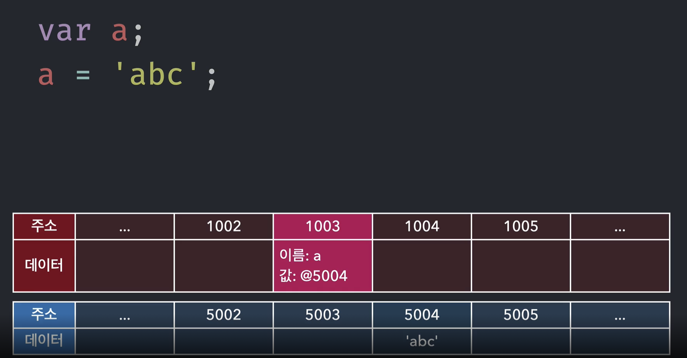
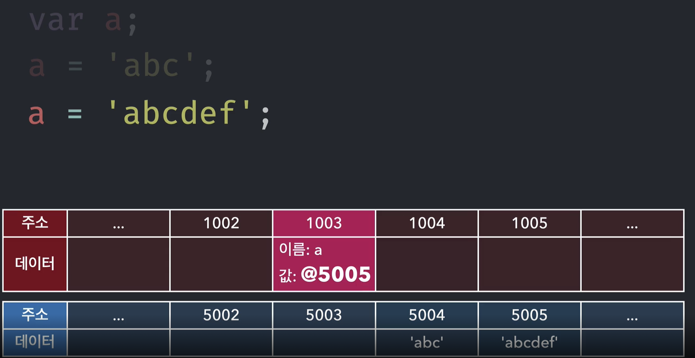
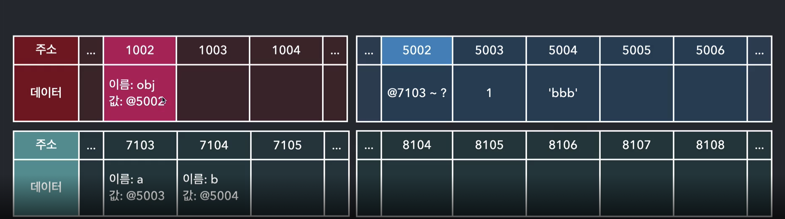
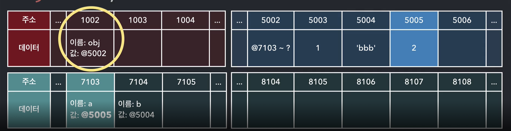
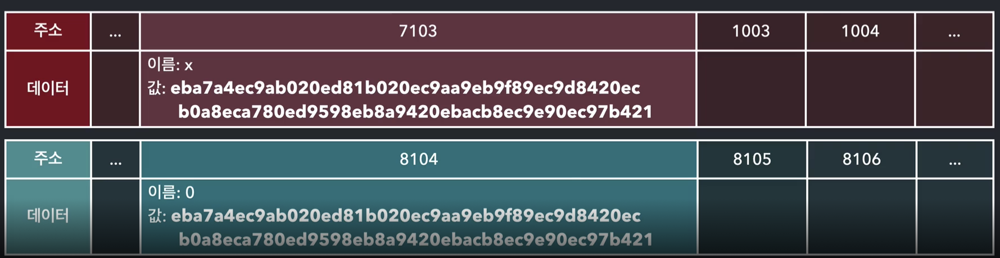
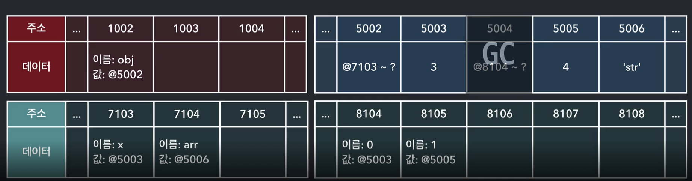
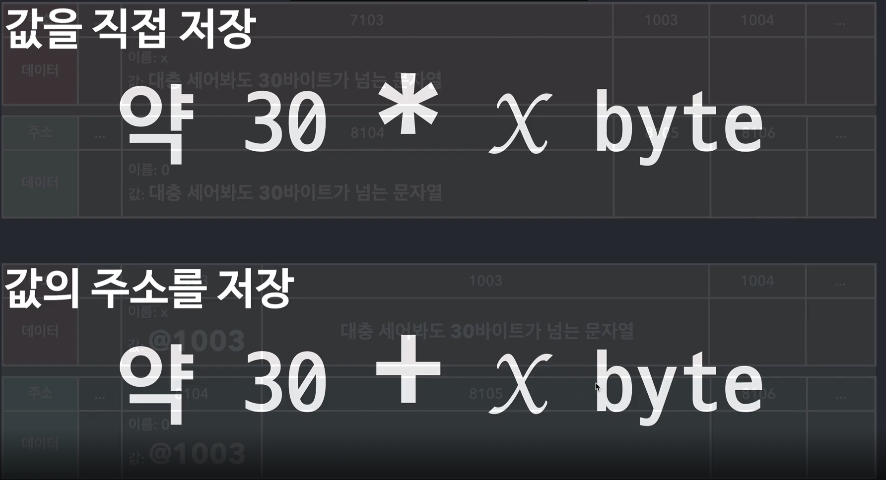
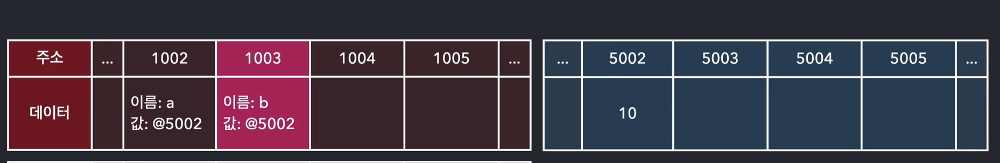
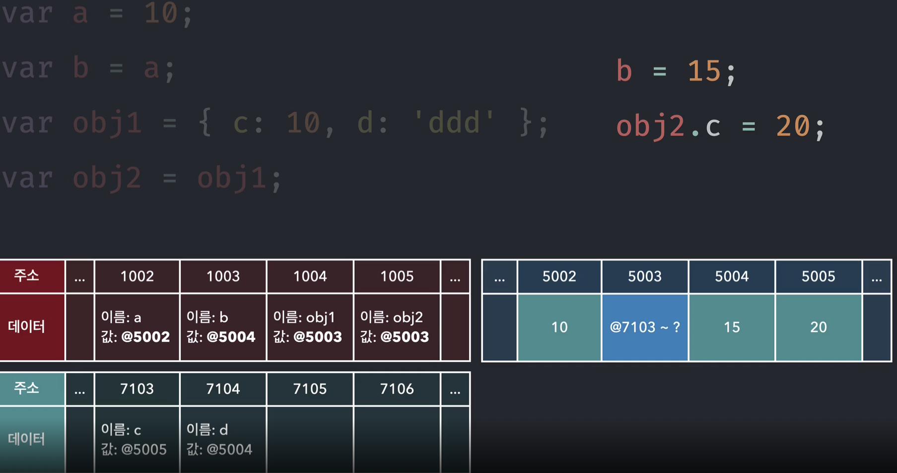

# 자바스크립트의 자료형 🎯💡🔥📌✅

- `Primitive` 타입 : 
  - Number 
  - String
  - Boolean
  - null
  - Symbol
- `Reference` 타입 : 
  - Array
  - function 
  - RegExp
  - Set/WeakSet
  - Map

  <br />

```
✅ 자바스크립트는 stack 메모리, heap 메모리 두가지로 나누어져 있다.

✅ stack영역에는 변수와 함께 기본형 데이터가 저장된다.

✅ heap영역에는 참조형 데이터가 저장된다.
```

  <br />
  <br />

> 기본형에 대한 데이터 할당의 기본적인 순서

```js
//데이터가 선언이 되면, 메모리 안에서 데이터가 담길 공간을 미리 확보한다.
//확보한 공간에 식별자를 부여한다.
let a;

//임의의 주소에 abc의 값을 넣어둔다.
//임의의 주소를 a식별자가 가르키는 공간에 할당한다.
a = "abc"
```


> 그림으로 나타낸다면,
- 
> 다른 값을 다시 할당할 때
- 

  <br />
  <br />

## 참조형 데이터에서 데이터 할당
---

1. 데이터 공간 확보 
2. 확보한 공간에 객체의 프로퍼티들을 하나씩 할당한다.

- 메모리 공간 하나에는 값이 하나씩만 삽입이 가능하다.
- 메모리 할당 과정을 한 단계 더 거치기 때문에 `기본형`은 `값이 바로 변하는 반면에`, `참조형은 값이 변하지 않는다.` 

<br />
<br />

> 참조형 데이터 예시
```js
  let obj = {
    a : 1,
    b : 'bbb',
  }
// 컴퓨터가 이해하는 방식
// 선언 후 -> 값 할당
let obj;
obj = {
    a: 1,
    b: 'bbb'
}

```

> 위 참조형 데이터 값 할당 

- 

> 참조형 데이터에서 프로퍼티 변경 시 값의 주소가 변하지 않는다.

- 


<br />
<br />
<br />
<br />

```
🎯 참조를 하고 있는 대상이 아무것도 없을 때 참조카운드가 0이라고 한다, 가비지 컬렉터의 수집 대상이 되어 삭제된다.
```

<br />
<br />

##  같은 값을 메모리 주소로 참조하는 이유는?

- `값을 비교할 때 성능 저하가 생기기 때문이다.`
- 처음에 저장할 때 비어있는 다른 메모리에 값을 저장하고, 그 메모리를 저장하는 방식을 따르게 되면, 할당하는 데 시간이 걸릴 수 있겠지만(`한번 동일성이 판단되면`), `이후에 비교과정을 많이 수행하더라도 전혀 비용이 발생하지 않는다.`


```js
let obj = {
    x : "매우 큰 용량을 차지하는 문자열",
    arr : ["매우 큰 용량을 차지하는 문자열",4]
}
// x의 값을 메모리 주소로 참조하지 않고 직접 값을 넣는다면, 2진법으로 변환된 문자열을 서로 비교할 때 큰 성능 저하 가 생기게 된다.
obj.x === obj.arr[0];
```

> 값 비교 시 큰 성능 저하
- 

<br />

> 값은 값을 5003이라는 주소로 참조하고 있다.
- 


<br />
<br />
<br />

## 값을 직접 저장하는 방식 vs 값의 주소를 저장하는 방식

---

- 값의 주소를 저장을 되새겨 보면,
  - 같은 값이 메모리 공간상에 오직하나만 존재한다.(`불변값`)

- 
- 


<br />
<br />

# 값 복사의 과정

- 기본형 데이터의 복사

- 기본형의 데이터를 변경했을때는 값이 바로 바뀜
- 참조형의 데이터를 변경했을때는 값의 바뀌지 않는다

```js
//a와 b는 같은 주소를 가르키게 된다.
let a = 10;
let b = a;
```

> 위 예시 

- 

- 