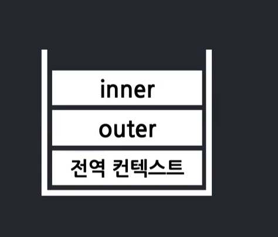
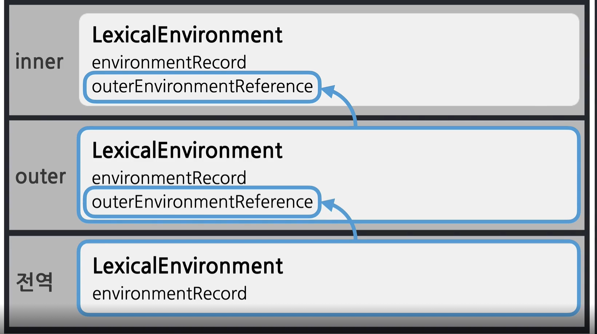
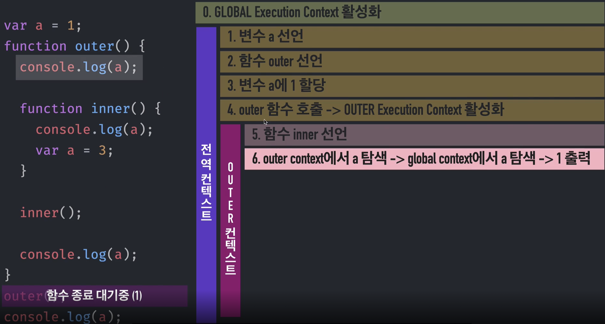
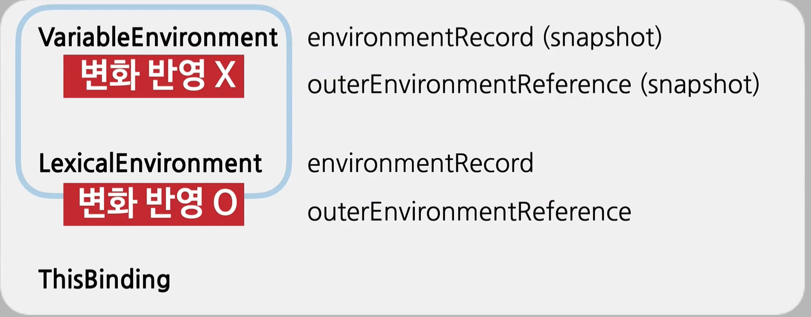

# 실행 컨텍스트 🎯💡🔥📌✅

- `Context` : 해당 코드의 배경이 되는 조건, 환경 정도를 뜻한다.
- `실행 컨텍스트` : 코드를 실행하는 데 필요한 배경이 되는 조건, 환경

  - 동일한 조건/환경 코드 뭉치가 있을 때 그 조건, 환경 조건를 일컬어 실행 컨텍스트라고 한다.

- `함수를 실행 할 때 필요한 조건, 환경 정보를 담은 객체`

- 자바스크립트에서 동일한 조건을 가질 수 있는 경우는 딱 4가지 이다.
  - `전역 공간` : 거대한 함수 공간이라고 할 수 있다.
  - `함수` : 자바스크립트의 독립된 코드 뭉치라고 할 수 있는 것은 `함수`밖에 없다.
  - `eval` : 논외
  - `module` : 거대한 함수 공간이라고 할 수 있다.

```
💡 if / for / switch / while 문
- ES6에서 블록스코프 개념이 추가 되면서 `let` , `const`에 대해서 별개의 독립된 공간으로서의 역할을 하지만,
별개의 실행 컨텍스트를 생성하지는 않는다.

💡 자바스크립트는 오직 함수에 의해서만 컨텍스트를 구분할 수 있다.
```

<br />
<br />

> 실행 컨텍스트 이해하기

```js
//1. 맨처음 전역 실행 컨텍스트가 열린다.
var a = 1;
function outer() {
  console.log(a);
  function inner() {
    console.log(a);
    var a = 3;
  }
  //inner 함수의 실행 컨텍스트가 실행된다.(2)
  inner();
  //inner 실행 컨텍스트가 종료 후에 (3) 콘솔이 실행된다.
  console.log(a);
}
// outer함수의 실행 컨텍스트가 실행된다.(1)
outer();
// outer실행 컨텍스트가 종료된 이후에 마지막으로 콘솔이 실행된다.(4)
console.log(a);
```

> 위의 코드 실행컨텍스트 사진



> 위의 코드 실행컨텍스트 참조



> 위의 코드 실행컨텍스트 참조



<br />

1. 가장 마지막에 들어온게 가장 먼저 빠짐
2. 제일 먼저 들어왔던 게 제일 마지막에 빠짐

<br />

```
✅ CallStack

 - 코드 실행에 관여하는 스택을 콜 스택이라고 한다.
 - 현재 어떤 함수가 동작 중인지, 다음에 어떤 함수가 호출될 예정인지 등을 제어하는 자료구조 이다.
```

<br />
<br />
<br />

# 실행 컨텍스트 세부사항

- 실행컨택스트에서는 세가지 환경 정보가 담긴다.

  - `variableEnvironment` : 현재 환경과 관련된 식별자 정보들
    - `식별자 정보를 수집`
    - `변수에 값에 변화 생길 때` : 변화 반영 X
  - `LexicalEnvironment` : 현재 환경과 관련되 식별자 정보들

    - `각 식별자의 데이터 추적`
    - `변수에 값에 변화 생길 때` : 변화 반영 O

  - `ThisBinding`

<br />
<br />

```
💡 variableEnvironment VS LexicalEnvironment
 - 값의 변화가 실시간으로 반영되느냐 그렇지 않느냐의 차이만 존재한다.
```



<br />
<br />

# LexicalEnvironment

> 어휘적/ 사전적 환경

- 어떤 환경 정보가 담겨있는 사전이다.
  - 실행컨텍스트를 구성하는 환경 정보들을 모아 사전 처럼 구성한 객체를 뜻한다.
- `LexicalEnvironment`는 두가지로 구성되어 있는데
  - `environmentRecord` : 환경 기록
    - 현재 문맥의 식별자 정보가 수집된다.(`호이스팅`)
    - 실행 컨텍스트가 실행될 때 가장 먼저 하는 일이 이것이다.
  - `outerEnvironmentReference` : 외부 환경 참조
    - 외부의 `LexicalEnvironment`에 대한 참조
    - 현재 문맥에 관련 있는 외부 식별자 정보를 뜻한다.
    - 스코프 체인은 `outerEnvironmentReference`의해서 만들어 진다.

```js
// 실행컨텍스트 A환경 사전
내부 식별자 a : 현재값은 undefined
내부 식별자 b : 현재값은 20
외부 정보 : D를 참조한다.
```

<br />
<br />

```
🎯 호이스팅
식별자 정보를 끌어올리는 것 (실행 컨텍스트 맨위로)
호이스팅된 변수 전체가 environmentRecord 이다.
실행컨텍스트가 생성되는 순간에 가장 먼저 실행되는 일이다. (environmentRecord에 정보를 수집하는 것)
```

<br />
<br />

## 스코프 체인을 통해 변수 찾가

> 가장 가까운 자기자신 부터 점점 멀리 있는 스코프를 찾아 나가는 것

1. 현재 속한 실행 컨텍스트 `environmentRecord`에서 변수를 찾는다.
2. 찾는 변수가 없다면, `outerEnvironmentReference`를 통해 참조된 실행 컨텍스트에서 변수를 찾게 된다.
3. 위에도 찾는 변수가 없다면, 전역 컨텍스트에 있는 `environmentRecord`에서 변수를 찾는다.

<br />
<br />
<br />

```
간단 정리
🔥 실행 컨텍스트 : 함수를 실행할 때 필요한 환경 정보 (변수 정보)를 담은 객체

🔥 실행 컨텍스트 :
  📌 variableEnvironment : 변수 값이 바뀌어도 반영이 되지 않는다.

  📌 LexicalEnvironment : 변수 값이 바뀌면 바로 반영이 된다.
       - environmentRecord : 현재 문맥의 식별자 (호이스팅 개념과 일치한다.)
       - outerEnvironmentReference : 외부 식별자 (이 참조에 의해 스코프 체인이라는 개념이 생겼다.)

  📌 this -
```
