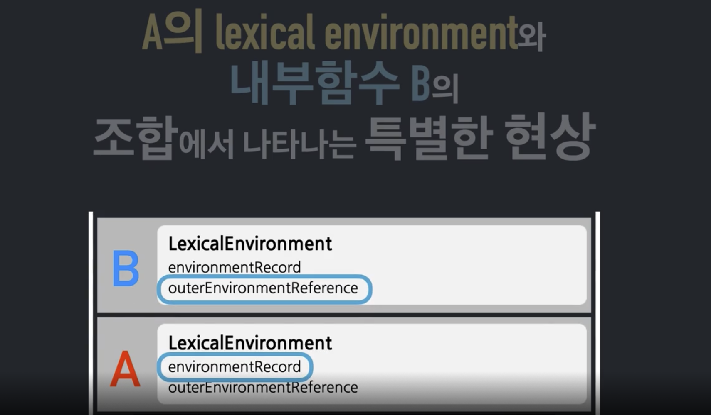
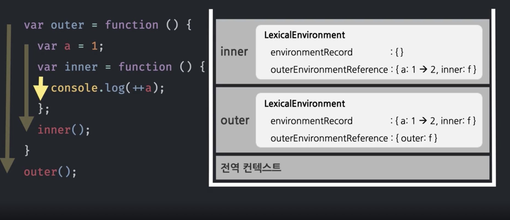
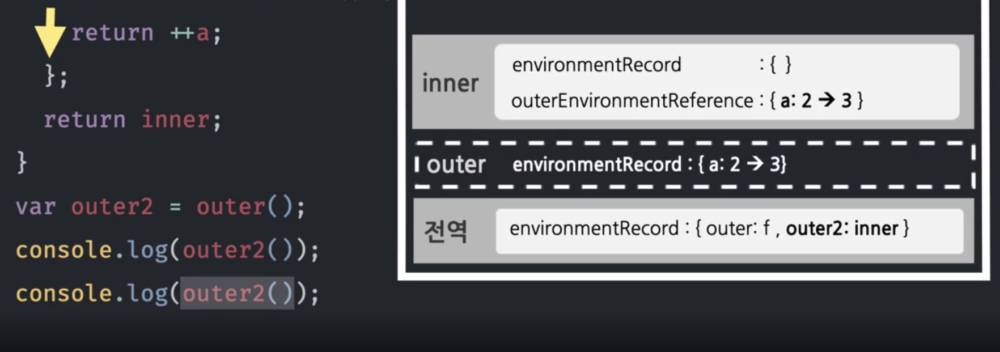
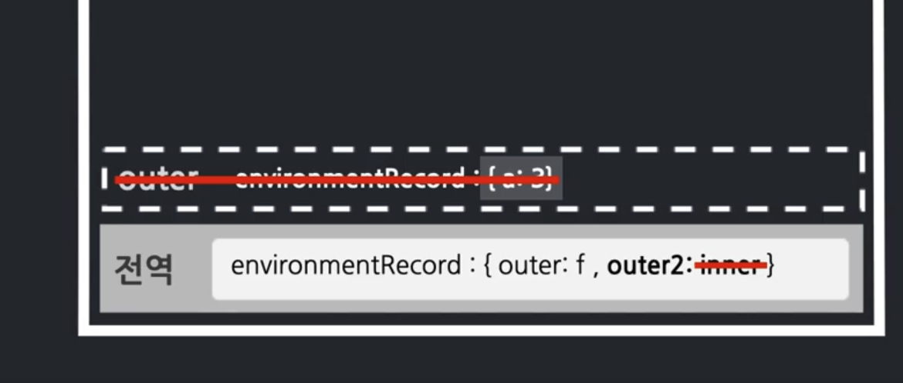
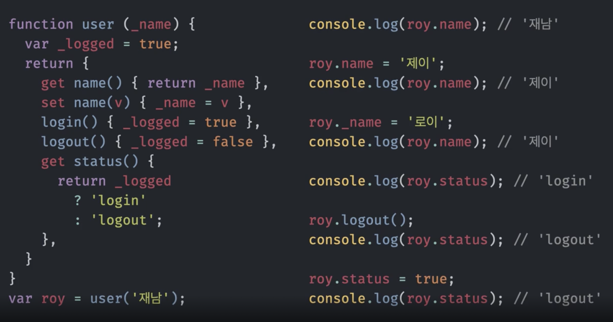

# 클로저 🎯💡🔥📌✅

> 컨텍스트A에서 선언한 변수를 내부함수B에서 참조할 경우에 발생하는 특별한 현상

- 내부함수와 `LexicalEnvironment`의 조합이라고 할 수 있다.
- 함수의 생성과 함께 무조건 생기는 당연한 개념



- `outerEnvironmentReference`
- `environmentRecord`

<br />
<br />

> 클로저 예시 (당연한 예시)

```js
//inner함수에서 outer함수에서 선언한 변수를 변경하는 코드
let outer = function () {
  let a = 1;
  let inner = function () {
    console.log(++a);
  };
  inner();
};
outer();
```

> 위코드 설명



<br />
<br />

> 클로져 예시

```js
let outer = function () {
  //outer에 대한 실행 컨텍스트가 쌓이면서 outer 함수 진행에 따라 변수에 값이 할당 된다.
  let a = 1;
  let inner = function () {
    return ++a;
  };
  return inner;
};
// 전역 실행컨텍스트는 outer라는 변수 수집(1)
// outer 종료 후 return된 inner가 담긴다.
let outer2 = outer();
// 외부 참조에서 ++a 되어 a값이 2가 된다.
console.log(outer2());

console.log(outer2());
```

- `outer` 함수 종료 이후에도 outer2에 의해서 inner 함수가 호출 될 수 있다.
  - 
  - `inner`함수 내부에서 참조하고 있는 outerEnvironmentRecord상의 a변수는 참조카운트가 0이 아닌 상태이다.
    - outer함수가 종료 되었더라도 `a`에 대한 참조가 살아 있기 때문이다.
  - `outer`실행 컨텍스트는 종료되었는데, 이 내부에서 선언된 변수의 참조는 아직 존재하게 된다.
  - 
- 전역 실행 컨텍스트가 종료되어도 끝까지 존재 하게 되고, `inner`함수에 다른 값을 참조하게 되면 `a`변수는 그때야 가비지 컬랙션의 대상이 된다.
  - 

<br />
<br />

```
🔥 클로저의 핵심

컨텍스트A에서 선언한 변수 a를 참조하는 내부함수 B를 A의 외부로 전달할 경우, A가 종료된 이후에도 a가 사라지지 않는 현상을 뜻한다.

🔥 특별한점

- 지역변수가 함수 종료 후에도 사라지지 않게 할 수 있다.
- 함수 종료 후에도 사라지지 않는 지역변수를 만들 수 있다.
```

<br />
<br />

## 클로져에 대한 또 다른 예시

```js
function user(_name) {
  let _logged = true;
  return {
    get name() {
      return _name;
    },
    set name(v) {
      _name = v;
    },
    login() {
      _logged = true;
    },
    logout() {
      _logged = false;
    },
    get status() {
      return _logged ? "login" : logout;
    },
  };
}
```

- 
  - \_name , \_logged는 함수 종료 후에도 사라지지 않는다.
  - 외부로부터 내부 변수 보호
  - `함수 종료 후에도 사라지지 않는 지역변수를 만들 수 있다.`
