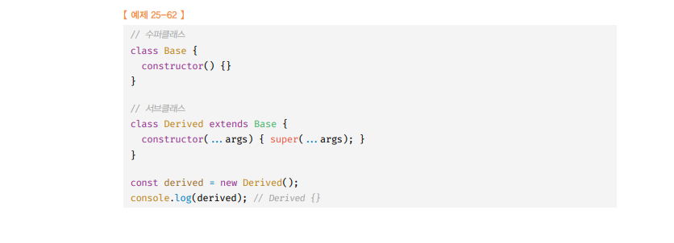

# 클래스 🎯💡🔥📌✅

- ES5 에서 `클래스 없이` `상속`을 구현 하는 방식 예제
  <br />
  

  <br />

- `ES6`에서는 자바나 C#과 같은 클래스 기반 객체 지향 프로그래밍 언어와 흡사한 새로운 `객체 생성 메커니즘`을 `제시`한다.

```
💡 클래스와 생성자 함수의 차이점
✅ 클래스를 NEW없이 호출하면 에러 , 생성자함수를 NEW없이 호출하면 일반 함수로 호출됨
✅ 클래스는 상속을 지원하는 super , extends를 지원한다.
✅ 클래스는 호이스팅 발생X , 함수선언문으로 선언된 생성자 함수는 호이스팅 O
✅ 클래스는 암묵적으로 strict mode가 지정됨
✅ 클래스의 constructor, 프로토타입 메서드 , 정적 메서드는 모두 [[Enumerable]]값이 false이다 따라서 열거 되지 않는다.
```

  <br />

- `클래스`는 생성자 함수 기반의 객체 생성보다 `견고`함
- `클래스`의 extends와 super는 상속 관계 구현을 더 간결하고 명료하게 한다.

---

  <br />
  <br />
  <br />

# 클래스의 정의

- `클래스의 선언문`

```js
//일반적인 클래스 선언문
class Person {
    ...
}

// 익명 클래스 표현식
const Person = class {};

// 기명 클래스 표현식
const Person = class MyClass {}
```

  <br />

- 클래스는 `일급 객체`이다.

```
🔥 클래스가 일급 객체로서의 특징 4가지
1. 무명의 리터럴로 생성 가능
2. 변수나 자료구조에 저장 가능
3. 함수의 매게변수로 전달 가능
4. 함수의 반환값으로 사용 가능
```

  <br />
  <br />

## 클래스 몸체

---

- 클래스 몸체에 정의 가능한 메서드

  - constructor(`생성자`)
  - `프로토타입 메서드`
  - `정적 메서드`

  <br />

> 클래스 몸체 메서드 정의 예제 코드

```js
class Person {
  //생성자
  constructor(name) {
  //인스턴스 생성 및 초기화
    this.name = name;
  }
  //프로토타입 메서드
  sayHi() {
    console.log(`hi hi ${this.name}`);
  }
  //정적 메서드
  static sayHello() {
    console.log("Hello");
  }
  //인스턴스 생성
  const me = new Person("kim")
  //인스턴스 프로퍼티 참조
  console.log(me.name) //kim
  me.sayHi();//hi hi kim
}
```

  <br />
    <br />

- 클래스와 생성자 함수 `정의의 방식 비교`

  <br />

  

  <br />
  <br /> 
  <br />

---

# 클래스의 호이스팅

- `클래스`는 `함수`로 평가된다.
- 클래스는 정의 `이전`에 `참조 할 수 없다`
  - 클래스 선언문 이전에 `일시적 사각지대`에 빠지기 때문

```js
//ReferenceError
console.log(Person);

class Person {}
```

  <br />
  <br /> 
  <br />

---

# 인스턴스 생성

- 클래스는 `생성자 함수`이며, `new연산자와 함께` 인스턴스 생성
- 클래스는 인스턴스를 생성하는 것이 유일한 `존재 이유`이므로 반드시 `new`연산자와 함께 호출되어야 한다.

  <br />

> 인스턴스 생성 시 주의할 점 (2가지) <br />

> (1) new 연산자 없이 인스턴스 생성시

```js
class Person {}
//클래스를 new 연산자 없이 호출하면 타입 에러가 발생한다
//typeError 발생
const me = Person();
```

<br />

> (2) 클래스 이름을 사용해 인스턴스 생성 시

```js
const Person = class Myclass{}
// 함수 표현식과 마찬가지로 클래스를 가리키는 식별자로 인스턴스를 생성 해야한다.
const me = mew Person ();

// ReferenceError
console.log(Myclass);
// ReferenceError
const you = new Myclass();
```

  <br />
  <br /> 
  <br />

---

# 메서드

- 클래스 몸체에서 정의 할 수 있는 메서드

  - `constructor(생성자)`
  - `프로토타입 메서드`
  - `정적 메서드`

  <br /> 
  <br />

  ## `constructor(생성자)` 클래스 몸체에서 정의 할 수 있는 메서드 (3개 中 첫번째)

```
💡 constructor는 인스턴스를 생성하고 초기화 하기 위한 특수한 메서드이다.
💡 클래스도 함수 객체 고유 프로퍼티를 가지며, 프로토타입으로 연결되어 있으며, 자신의 스코프 체인을 구성한다.
💡 모든 함수 객체가 가지고 있는 prototype 프로퍼티가 가리키는 프로토타입 객체의 constructor 프로퍼티는 클래스 자신을 가리키고 있음
```

  <br />

- 클래스는 함수이며 , `함수 객체의 모든 프로퍼티`를 가지고 있음
  <br />


  <br />
  
  <br />

---

```js
const me = new Person("KIM");
console.log(me);
```

  <br />


  <br />

```
💡 `constructor 내부`에서 `this`에 추가한 프로퍼티는 `인스턴스 프로퍼티`가 된다.
💡 constructor 내부의 this는 생성자 함수와 마찬가지로 클래스가 생성한 인스턴스를 가르킨다.
```

- constructor의 `특징`

  - constructor는 클래스 내 `최대 한개`만 존재 가능하다.
  - constructor는 `생략이 가능` 하다.
  - constructor는 생략해도 `암묵적으로 정의` 된다.
  - constructor는 별도의 `반환문`을 가지면 안된다.
    - `constructor 내부`에서는 반드시 `return문`은 `생략`해야한다.
  - 프로퍼티가 추가 되어 `초기화된 인스턴스`를 생성하려면 `constructor`내부에서 `this`에 `인스턴스 프로퍼티`를 추가한다.
    - 인스턴스를 생성할 때 `클래스 외부`에서 `인프턴스 프로퍼티 초기값`을 `전달`하려면
      - 아래 사진과 같이 `constructor에 매개변수`를 선언하고 `인스턴스`를 생성할 때 `초기값`을 전달한다.

  <br />


---

  <br />

  <br /> 
  <br />

## `프로토타입 메서드` 클래스 몸체에서 정의 할 수 있는 메서드 (3개 中 두번째)

  <br />

```
📌 클래스 몸체에서 정의한 메서드는 생성자 함수에 의한 객체 생성 방식과 다리게 클래스의 prototype 프로퍼티에 메서드를 추가하지 않아도 `기본적으로 프로토타입 메서드`가 된다.

📌 클래스가 생성한 인스턴스는 프로토타입 체인의 일원이 된다.

📌 클래스 몸체에서 정의한 메서드는 인스턴스의 프로토타입에 존재하는 프로토타입 메서드가 된다.

📌 인스턴스는 프로토타입 메서드를 상속받아 사용가능 하다.
```

  <br />

```js
class Person {
  constructor(name) {
    //인스턴스 초기화
    this.name = name;
  }
  // 기본적으로 프로토타입 메서드로 됨
  sayHi() {
    console.log("Hi hi");
  }

  const me = new Person('KIM');
  me.sayHi(); //Hi hi
}
```


---

  <br />

  <br /> 
  <br />

## `정적 메서드` 클래스 몸체에서 정의 할 수 있는 메서드 (3개 中 세번째)

- `정적 메서드` : 인스턴스를 생성하지 `않아도` 호출할 수 있는 메서드를 뜻함

  <br />

```
🎯 정적 메서드는 클래스에 바인딩된 메서드가 된다.
🎯 클래스는 함수 객체이므로 `자신만의 프로퍼티,메서드`를 `소유`할 수 있다.
🎯 클래스 정의가 평가되는 시점에 함수객체가 되므로 인스턴스와 달리 별다른 생성 과정이 필요 없다

🎯  정적 메소드는 인스턴스가 호출할 수 없다. [인스턴스의 프로토타입 체인상에 존재하지 않기 때문이다.]
```

  <br />

> 정적 메서드 예제 코드 (생성자 함수에서..)

```js
function Person(name) {
  this.name = name;
}
//정적 메서드
Person.SayHi = function () {
  console.log("Hi");
};

//정적 메서드 호출
Person.sayHi();
```

  <br />

> 정적 메서드 예제 코드 (클래스 에서..) <br />
> 메서드에 static 키워드를 붙이면 정적 메서드가 된다.

```js
const Person {
    constructor(name){
        this.name = name;
    }

    //정적 메서드
    static sayHi(){
        console.log('Hi');
    }
}
```


<br />

- `정적 메소드의 프로토 타입 체인 `

<br />
  <br /> 
  <br />

## 정적 메서드와 프로토타입 메서드의 차이

- 정적 메서드와 프로토타입 메서드는 자신이 속해 있는 `프로토타입 체인이 다르다.`
- 정적 메서드는 `클래스로 호출` , 프로토타입 메서드는 `인스턴스로 호출`
- 정적 메서드는 인스턴스 프로퍼티 참조 X , 프로토타입 메서드는 인스턴스 프로퍼티 참조O

<br /> 
  
- `정적 메서드 예시`
  
<br />


<br /> 
 
- `정적 프로토타입 예시`
 
  <br />


<br />
  <br /> 
  <br />

---

# 인스턴스의 생성 과정

- new 연산자와 함께 클래스를 호출하면 생성자 함수와 마찬가지로 클래스 내부 메서드 `[[Constructor]]`가 호출 된다.

- 아래는 `생성과정`이다.

  <br /> 
  <br />

- 인스턴스 생성과 this 바인딩

  - 클래스가 생성한 `인스턴스의` 프로토타입으로 클래스의 prototype 프로퍼티가 가리키는 객체 설정
  - 암묵적으로 생성된 빈객체, 즉 인스턴스는 this에 바인딩 된다.

- 인스턴스 초기화

  - Constructor의 내부 코드가 실행되어 this에 바인딩 되어 있는 인스턴스를 초기화 한다.

- 인스턴스 반환

  - 클래스의 모든 처리가 끝나면 완선된 인스턴스가 바인딩된 this가 암묵적으로 반환된다.


  <br /> 
  <br />
  <br />
  
---

# 프로퍼티

- 인스턴스 프로퍼티는 `Constructor의 내부`에 `정의`해야한다.
- Constructor 내부에서 `this`에 `추가한 프로퍼티`는 언제나 클래스가 생성한 `인스턴스의 프로퍼티`가 된다.


  <br />
  <br />
  
---

## 접근자 프로퍼티

```
✅ 접근자 프로퍼티 : 자체적으로 `[[value]]` 값을 갖지 않고 `다른 데이터 프로퍼티의 값`을 `읽거나` `저장`할 때 사용하는 `접근자 함수로 구성된 프로퍼티`
```

- 다음은 `클래스`에서 `접근자 프로퍼티`를 사용한 예제이다

  <br />


  <br />

`접근자 프로퍼티`

- `getter 함수` , `setter 함수`로 구성되어 있다.
  - `getter함수` : 인스턴스 프로퍼티에 접근 할때마다 프로퍼티 값을 조작하거나 별도의 행위가 필요할 때 사용
    - `getter함수` 무엇인가 반환 해야 한다.
  - `setter함수` : 인스턴스 프로퍼티에 값을 할당할 때마다 프로퍼티 값을 조작하거나 별도의 행위가 필요할 때 사용
    - `setter함수`프로퍼티에 할당 해야하므로 반드시 매개변수가 있어야 한다.

```
🔥 getter 메서드는 get 키워드 , setter 메서드는 set 키워드로 정의한다.

🔥 setter함수, getter함수는 인스턴스 프로퍼티 처럼 사용된다.

🔥 클래스의 메서드는 기본적으로 프로토타입의 메서드가 되므로, 클래서 접근자 프로퍼티(getter,setter)도 프로토타입의 프포퍼티가 된다.
```

  <br />
  <br />
  <br />
  
---

## private 필드 정의 제안

- `인스턴스 프로퍼티`는 인스턴스를 통해 클래스 `외부`에서 `언제나 참조가 가능`하다.
- `클래스 필드 정의 제안`를 사용해도 클래스 필드는 기본적으로 `public`하다

  <br />

## public필드는 어디서든 참조 가능하지만 , private 필드는 클래스 내부에서만 참조가능 하다.

  <br />

| 접근 가능성                 | public | private |
| --------------------------- | ------ | ------- |
| 클래스 내부                 | O      | O       |
| 자식 클래스 내부            | O      | X       |
| 클래스 인스턴스를 통한 접근 | O      | X       |

  <br />
  <br />

```js
class Person {
  constructor(name) {
    this.name = name;
  }
}

const me = new Person("Lee");
console.log(me.name); //lee


class Person {
  //클래스 필드 사용
  name = "Lee"

  //인스턴스 생성
  const me = new Person();
  console.log(me.name);//Lee
}
```

  <br />

  <br />

```
🔥 private 선두에 #를 붙이고 private 필드를 참조할 때 #를 붙여주면 private 사용가능
```

- 다음은 javascript class에서 `private` 사용 예제(1)

  <br />


  <br />

> javascript class에서 `private` 사용 예제(2)

```js
class Person {
  //private 필드 정의
  //private은 반드시 클래스 몸체에 정의 해야함
  //private을 constructor에 정의하면 에러
  #name = "";
  constructor(name) {
    this.#name = name;
  }

  //접근자 프로퍼티 프로토타입
  get name() {
    return this.#name.trim();
  }
}

//private은 인스턴스에서 접근자 프로퍼티에서 간접적으로 접근하는 것 가능
//

const me = new Person("kim");
console.log(me.name); //kim
```

  <br />
  <br />
  <br />
  
---

## static 필드 정의 제안

- 클래스에서는 static 키워드를 사용해서 `정적 메서드`를 정의할 수 있음

```
✅ 클래스 자신만의 메서드 = 정적 메서드
```

  <br />

- 아래는 static를 이용한 정적 메소드 구현 예시 <br />


  <br />
  <br />
  <br />
  
---

# 상속에 의한 클래스 확장

- 상속에 의한 `클래스 확장`은 기존 클래스를 `상속받아` `새로운 클래스`를 확장하여 `정의`하는 것이다.
- 클래스는 상속을 통해 기존 클래스를 `확장 할 수 있는 문법`이 기본적으로 `제공`

  <br />

  

    <br />

> class 상속 예시

```js
class Animal {
  constructor(age, weight) {
    //인스턴스 프로퍼티
    this.age = age;
    this.weight = weight;
  }
  //프로토타입 메서드
  eat() {
    return eat;
  }
  move() {
    return move;
  }
}

//상속을 통해 클래스 확장
class Bird extends Animal {
  fly() {
    return fly;
  }
}
```

  <br />

- 위 코드 프로토타입 체인
  <br />


<br />

  <br />
  <br />
  <br />
  
---

# extends 키워드 (class 확장)

  <br />


  <br />

- 상속을 통해 클래스를 확장 하려면 extends 키워드를 사용한다.
- extends 키워드의 역할은 수퍼 클래스와 서브 클래스간 상속관계를 설정하는 것
- 클래스도 프로토타입을 통해 상속관계를 구현한다.
- `프로토타입 메서드`, `정적 메서드` 모두 `상속` 가능

  <br />

> 클래스 상속 예제

```js
//부모 클래스 , 수퍼 클래스
class Base {}
//자식 클래스 , 서브 클래스
class child extends Base {}
```

  <br />

> 클래스 상속 예제 (생성자 함수도 상속할 수 있다.)

```js
function Base() {
  this.a = a;
}
//생성자 함수를 상속 받는 서브 클래스
class Derived extends Base() {}

const derived = new Derived(1);
console.log(); // derived {a : 1}
```

  <br />

> 클래스 상속 예제 (조건에 따라 상속 받는 클래스가 달라지는 클래스)<br />


<br />

  <br />
  <br />
  <br />
  
---

# 서브 클래스의 constructor (class 확장) , SUPER

- 서브 클래스에서 constructor를 생략하면 `constructor`가 `암묵적`으로 `정의`
- `super`은 수퍼 클래스의 `constructor`를 호출해서 인스턴스를 생성한다.

## super 이해

  <br />



```
📌 super호출하면 수퍼 클래스의 constructor를 호출한다.
📌 super를 참조하면 수퍼 클래스의 메서드를 호출할 수 있다.
📌 super를 이용해서 수퍼 클래스의 프로퍼티,메소드를 상속 받을 수 있다.
📌 new 연산자와 함께 서브클래스를 호출하면서 전달한 인수 중에서 수퍼클래스의 constructor에 전달할 필요가 있는 인수는 서브클래스의 constructor에서 호출하는 super 통해 전달한다
```

  <br />
  <br />

> super 예제 <br />

```js
//수퍼 클래스
class Base {
  constructor(a, b) {
    this.a = a;
    this.b = b;
  }
}

class Derived extends Base {
  constructor(a, b, c) {
    //수퍼클래스에 전달 super
    //super를 통해 수퍼클래스의 constructor에 전달된다
    super(a, b);
    this.c = c;
  }
}

const derived = new Derived(1, 2, 3);
console.log(derived); //Derived{a:1,b:2,c:3}
```

<br />
<br />

---

## 💡 super 호출 시 주의 할점

```js
✅ 서브클래스에서 constructor를 생략하지 않은 경우 서브클래스의 constructor에서는 반드시 super를 호출해야한다.

class Base{}
class Child extends Base{
  constructor(){
    // RefereceERROR
    console.log("constructor call")
  }
}

-------------------->

✅ 서브클래스의 constructor에서 SUPER를 호출하기 전에 this 참조 불가능
class Base{}
class Child extends Base{
  constructor(){
    // RefereceERROR
    this.a = 1
    super();
  }
}

-------------------->

✅ super는 반드시 서브클래스의 constructor에서만 호출가능, 서브클래스가 아닌 클래스의 constructor나 함수에서 super를 호출하면 에러
class Base{
   constructor(){
    // SyntaxError
    super();
  }
}

function foo(){
    // SyntaxError
  super();
}
```

<br />
<br />
<br />
<br />

---

# super 참조

- 메서드 내에서 `super`를 참조하면 `수퍼클래스의 메서드` `호출 가능`

> 예시 코드 (1)

```js
class Base {
  constructor(name) {
    this.name = name;
  }
  //프로토타입
  sayHI() {
    console.log("hihi");
  }
}
//서브클래스
class Child extends Base {
  sayHI() {
    //super.sayHI()는 수퍼클래스의 프로토타입 메서드를 가르킨다.
    return `${super.sayHI()}`;
  }
}

const child = new Child("kim");
child.sayHI(); // HIHI
```

> 예시 코드 (2) <br />

<br />
<br />
<br />
<br />

---

# 상속 클래스의 인스턴스 생성 과정

> 예시 코드 (1) <br /> <br />
> 프로토타입 체인( <br />

---

<br />
<br />

## `서브 클래스의 super 호출 (1)`

- 클래스를 평가할 때 `base`또는 `derived`를 값으로 갖는 내부 슬롯`[[ConstructorKind]]`를 갖는다.
  - 다른 클래스 상속 X : `Base`
    - `NEW 연산자`와 호출 됐을때 암묵적으로 빈객체(인스턴스) 생성 -> 이를 `this`에 바인딩한다
  - 다른 클래스 상속 O : `derived`
    - `서브 클래스`는 자신이 직접 인스턴스를 생성하지 않고 `수퍼클래스에게 인스턴스 생성을 위임한다`.
    - 위 줄이 서브클래스의 Constructor에 반드시 `super`가 `호출 되어야하는 이유`이다
    - 서브클래스에서 super 호출되면, 수퍼클래스의 Constructor가 호출된다.

<br />
<br /><br />
<br />

## `수퍼클래스의 인스턴스 생성과 this 바인딩 (2)`

- 수퍼클래스의 Constructor 내부의 this는 생성된 `인스턴스`를 가리킨다

<br />

<br />
<br /><br />
<br />

## `수퍼 클래스의 인스턴스 초기화 (3)`

- this에 바인딩되어 있는 인스턴스에 프로퍼티를 추가하고 Constructor가 인수로 전달 받은 초기값으로 인스턴스 프로퍼티를 초기화함

<br />

<br />
<br /><br />
<br />

## `서브 클래스 Constructor로 복귀와 this 바인딩 (4)`

- super의 호출이 종료되고, 제어 흐름이 constructor로 돌아옴
- 이때 반환한 인스턴스가 this에 바인딩 된다.
- 서브 클래스는 별도의 인스턴스를 생성하지 않고 super가 반환한 인스턴스를 this에 바인딩해서 그대로 사용

<br />

<br />
<br /><br />
<br />

## `서브 클래스의 인스턴스 초기화 (4)`

- super 호출이후 서브 클래스 constructor에 기술되어 있는 인스턴스 초기화 실행
- this에 바인딩되어 있는 인스턴에 프로퍼티를 추가하고 constructor가 인수로 전달 받은 초기값으로 인스턴스의 프로퍼티를 초기화한다.

<br /><br />
<br />

## `서브 클래스의 인스턴스 초기화 (5)`

- 클래스의 모든 처리가 끝나면 완성된 인스턴스가 바인딩된 this가 암묵적으로 반환된다.

---
