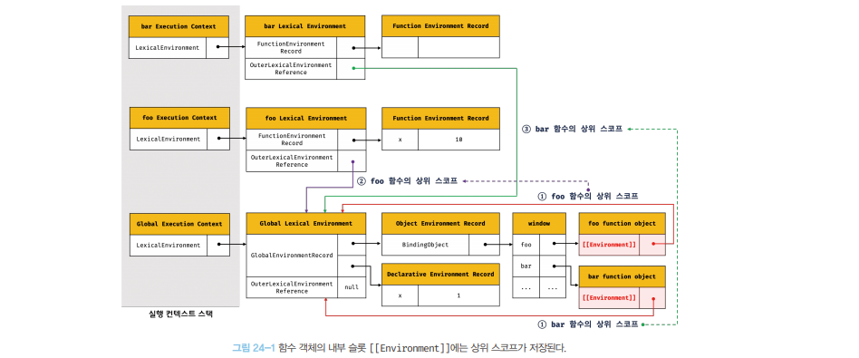
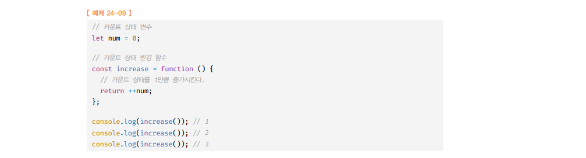
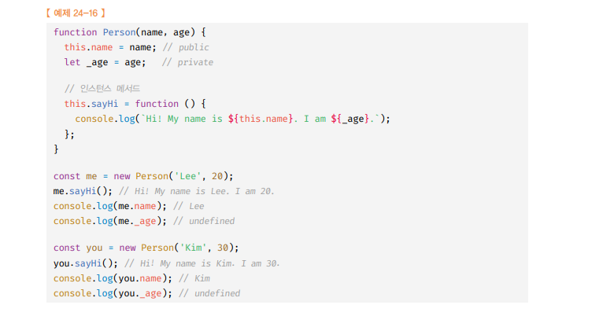
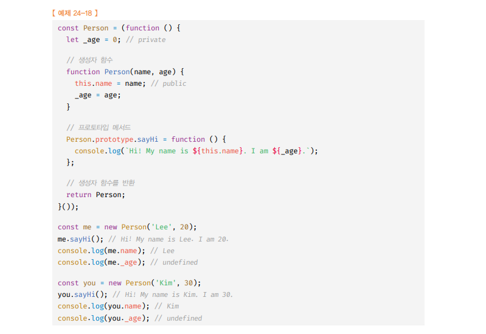

# 클로저 🎯💡🔥📌✅

- 클로저 정의 : `클로저는 함수와 그 함수가 선언된 렉시컬 환경의 조합이다.`
- 렉시컬 스코프 : `함수를 어디에 정의 했는지 에 따라 상위 스코프를 결정한다.`
- 스코프 : `실행 컨텍스트의 렉시컬 환경`

  - 외부 렉시컬 환경에 대한 참조를 통해 상위 렉시컬 환경과 연결된다.
  - 렉시컬 환경의 `외부 렉시컬 환경에 대한 참조`에 저장할 값이 바로 상위 렉시컬 환경에 대한 참조이고, 이것이 `상위 스코프` 이다.

- 렉시컬 스코프 : `외부 렉시컬 환경에 대한 참조`에 저장할 참조값, 즉 상위 스코프에 대한 참조는 함수 정의가 `평가되는 시점`에 함수가 `정의된 환경`에 의해 결정 된다.

> 렉시컬 스코프 예제

```js
const x = 1;
function foo() {
  const x = 10;
  bar();
}

function bar() {
  console.log(x);
}
foo();
bar();
```

- 함수의 상위 스코프는 함수를 정의한 `위치`에 의해 정적으로 결정되고 `변하지 않는다`

<br />
<br />
<br />

---

# 함수 객체의 내부 슬롯 `[[Environment]]`

- `함수가 정의된 위치` , `호출되는 환경`은 다를 수 있음
- 렉시컬 스코프를 위해 함수는 자신의 내부 슬롯 `[[Environment]]`에 자신이 정의된 `환경`, 즉 `상위 스코프의 참조`를 `저장`한다.
  - 함수 객체를 생성할 때 `자신이 정의된 환경을 [[Environment]] 저장
  - `[[Environment]]`에 저장된 상위 스코프의 참조는` 현재 실행 중 인 실행 컨텍스트의 렉시컬 환경`을 가르킨다.
    - 왜냐하면 , `함수 객체를 생성`하는 시점은 `상위 함수(또는 전역 함수)`가 `평가` 또는 실행되는 시점이며, 이때 `현재 실행 중인 실행 컨텍스트는 상위함수(또는 전역 객체)`이다
    - `함수 내부에서 정의된 함수 표현식`은 외부 함수 코드가 실행되는 시점에 평가되어 함수 객체를 생성함.`[[Environment]]` 값은 외부 함수 코드 실행 시점에 실행 중인 실행 컨텍스트의 `렉시컬 환경인 외부 함수 렉시컬 환경이 참조`가 `저장`됨

```
🔥 함수 객체  [[Environment]] 에는 상위 함수 실행 컨텍스트의 렉시컬 환경을 나타낸다는거 길게 쓴거임 🔥
```

<br />
<br />

> 렉시컬 스코프 예제

```js
const x = 1;
function foo() {
  const x = 10;

  //상위 스코프는 함수 정의 위치에 따라 결정
  //함수 호출 위치와 상위 스코프는 아무런 관계가 없다
  bar();
}

//함수 bar는 자신의 상위 스코프, 즉 전역 렉시컬 환경을 [[Environment]]에 저장하여 기억한다.
function bar() {
  console.log(x);
}

foo();
bar();
```

> 위 코드 설명 <br /> 

- 함수 렉시컬 환경인 `외부 렉시컬 환경에 대한 참조`에는 함수 객체의 내부 슬롯`[[Environment]]`에 저장된 렉시컬 환경의 참조가 할당된다.

- 함수객체의 `내부 슬롯` `Environment`에 저장된 렉시컬 환경의 참조는 바로 함`수의 상위 스코프`를 의미함

<br />
<br />

## 클로저와 렉시컬 환경

- 모든 함수는 자신의 `상위 스코프를 기억`한다, 모든 함수가 기억하는 상위 스코프는 함수를 `어디서 호출하든 상관없이 유지` 된다.

- 함수는 언제나 자신이 기억하는` 상위 스코프의 식별자를 참조`할 수 있으며, 식`별자에 바인딩된 값을 변경`할 수 있다.

- 위 예시 처럼 `외부 함수` 보다 `중첩 함수`가 `더 오래 유지되는 경우` 증첩함수는 이미 생명 주기가 종료한 외부 함수의 변수를 참조 할 수 있다. 이러한 `중첩 함수`를 클로저라고 부른다.

> 클로저 설명 예제 코드

```js
const x = 1;

function outer() {
  const x = 10;

  //inner은 평가 될 때 자신이 정의된 의치에 의해 결정된 상위 스코프를 [[ENvironment]] 내부 슬롯에 저장한다.
  const inner = function () {
    console.log(x);
  };

  //outer를 호출하면 중첩함수 inner를 반환한다.
  //outer함수는 inner를 반환하고 생명주기를 마감한다.
  //outer는 실행 컨텍스트에서 POP
  //outer 함수는 스택에서 제거 됐지만, innerFunc의해 참조 되고 있으므로 가비지 컬렉션의 대상이 되지는 않는다.
  const innerFunc = outer();
  innerFunc();
}
```

- 실행 컨텍스트 `스택`에서 `제거`되지만 `렉시컬 환경`까지 `소멸하는 것은 아님`
- 클로저
  - (생명주기) A함수 < A함수 내 중첩 함수

```
💡 가비지 컬렉터는 누군가 참조하고 있는 메모리 공간을 함부로 해제하지 않는다.
```

> 클로저 예시

```JS
function foo(){
    const x = 1;
    const y = 2;

    //클로저
    //중첩 함수 bar는 외부 함수보다 더 오래 유지되며 상위 스코프의 식별자를 참조한다
    function bar(){
        console.log(x)
    }
    return bar;

    const bar = foo();
    bar();
}

```

- 중첩 함수 bar는 `상위 스코프의 식별자`를 `참조`하고 , `외부 함수의 외부`로 `반환`되어 외부 함수 보다 더 `오래 살아 남는다`.

- `외부 함수보다 중첩 함수가 더 오래 유지되는 경우 중첩 함수는 이미 생명주기를 종료한 외부 함수의 변수를 참조 할 수 있다`. 이러한 중첩 함수를 `클로저`라고 한다


<br />
<br />
<br />

---

# 클로저의 활용

- 클로저는 `상태`를 안전하게 `변경`하고 `유지`하기 위해 `사용`한다.

<br />



- 위 코드는 카운트 상태(num 변수의 값)는 increase 함수가 호출되기 전까지 변경되지 않고 유지되어야함
- 카운트 상태(num 변수의 값)는 increase 함수만이 변경할 수 있어야함

<br />
<br />

> 위 코드의 문제점을 극복하기 위해 클로저 함수를 사용

```js
//카운트 상태 변경 함수

const increase = (function () {
  //카운트 상태 변수
  let num = 0;

  return function () {
    ++num;
  };
})();
// 즉시 실행함수가 반환한 클로저는 자신이 정의된 위치에 의해 결정된 상위 스코프인 즉시 실행 함수의 렉시컬 환경을 기억한다.
// 따라서 즉시 실행 함수가 반환한 클로저는 카운트 상태를 유지하기 위한 자유 변수 num를 언제 어디서 호출하든지 참조하고 변경할 수 있다.

console.log(increase()); //1

console.log(increase()); //2

console.log(increase()); //3
```

- 클로저는 상태가 의도치 않게 변경 되지 않도록 안전하게 은닉하고 특정함수에게만 상태 변경을 허용하여 상태를 안전하게 변경하고 유지하기 위해 사용한다.

<br />
<br />

## 클로저의 활용 예시 (2)

```js
const counter = (
  function(){
    //카운터 상대 변수
    let num = 0;

//클로저인 메서드를 갖는 객체를 반환한다.
//객체 리터럴은 스코르픞 만들지 않는다.
//따라서 아래 메서들의 상위 스코프는 즉시 실행 함수의 렉시컬 환경이다.
  return {
    increase(){
      return ++num;
    },
    decrease(){
      return > 0 ? --num : 0;
    }
  }
  }())

console.log(counter.increase()); //1

console.log(counter.decrease()); //0
```

- `increase()` , `decrease()` 메서드의 `상위 스코프`는 `즉시 실행 함수 실행 컨텍스트의 렉시컬 환경`이다.
- 따라서 `increase, decrease 메서드는 언제 어디서 호출되는 상관없이 increase,decrease 함수는 즉시 실행 함수의 스코프의 식별자를 참조할 수 있다`

<br />
<br />

---

## 클로저의 활용 예시 (3) - 생성자 함수 표현

```js
const Counter = (function () {
  // 카운트 상태 변수
  let num = 0;

  function Counter() {}

  Counter.prototype.increase = function () {
    return ++num;
  };
  Counter.prototype.decrease = function () {
    return num > 0 ? --num : 0;
  };
  return Counter;
})();

const counter = new Counter();

console.log(counter.increase()); //1

console.log(counter.decrease()); //0
```

> 위 클로저 설명

```
💡 let num = 0은 즉시 실행 함수 내에서 선언된 num 변수는 인스턴스를 통해 접근할 수 없으며, 즉시 실행 함수 외부에서도 접근할 수 없는 은닉된 변수이다.

💡 increase,decrease 모두 함수 정의가 평가 되어 함수 객체가 될 때 실행 중인 실행 컨텍스트인 즉시 실행 함수 실행 컨텍스트의 렉시컬 환경을 기억하는 클로저이다.

💡 프로토타입을 통해 상속되는 프로토타입 메서드 일지라도 즉시 실행 함수의 자유 변수 num 참조 가능
```

<br />
<br />

---

## 클로저의 활용 예시 (3) - 함수형 프로그래밍에서 클로저 (독립적인 렉시컬 환경)

```js
// 함수를 인수로 전달 받고 함수를 반환하는 고차 함수
// 이 함수는 카운트 상태를 유지 하기 위한 자유 변수 counter를 기억하는 클로저를 반환
function makeCounter(aux) {
  //카운트 상태를 유지하기 위한 자유 변수
  let counter = 0;

  return function () {
    //인수로 전달 받은 보조 함수에 상태 변경을 위임한다.
    counter = aux(counter);
    return counter;
  };
}

//보조 함수
function increase(n) {
  return ++n;
}

function decrease(n) {
  return --n;
}

const increaser = makeCounter(increase);
console.log(increaser()); //1
console.log(increaser()); //2

//makeCounter함수를 호출할 때마다 반환된 함수는 자신만의 독립된 렉시컬 환경을 갖는다.

const decreaser = makeCounter(decrease);
console.log(decreaser()); //-1
console.log(decreaser()); //-2
```

> 위 클로저를 이용한 함수형 프로그래밍 설명

- `makeCounter` : 보조 함수를 인자로 받고 함수를 반환하는 `고차함수`
  - `makeCounter`가 반환하는 함수는 자신이 생성될 때 `렉시컬 환경인 counter 변수를 기억하는 클로저`이다.
  - `makeCounter`는 인자로 전달받은 `보조 함수`를 `합성`하여 자신이 반환하는 함수의 동작을 변경가능
  - `makeCounter함수를` 호출할 때마다 반환된 함수는 `자신만의 독립된 렉시컬 환경`을 갖는다.


<br/>

```
✅ makeCounter 호출할 때 마다 자신만의 독립된 렉시컬 가짐
✅ makeCounter로 만들어진 함수 객체는 [[Environment]] 내부 슬롯이 --> ``makeCounter 함수 실행 컨텍스트의 렉시컬 환경``을 참조하고 있어서
```

<br />
<br />

---

## 클로저의 활용 예시 (4) - 함수형 프로그래밍에서 클로저 (독립적인 렉시컬 환경 아님)

```js
const counter = (function () {
  let counter = 0;

  // 함수를 인수로 전달받는 클로저
  return function (aux) {
    //인수로 전달받은 보조 함수에 상태 변경을 위임한다.
    counter = aux(counter);
    return counter;
  };
}(,));

//보조 함수
//보조 함수
function increase(n) {
  return ++n;
}

function decrease(n) {
  return --n;
}

console.log(counter(increaser)); //1
console.log(counter(decrease)); //0
```

- counter 변수 `렉시컬 환경 공유` 하기 구현

<br />
<br />
<br />
<br />

---

# 캡슐화와 정보 은닉

- `캡슐화` : 객체의 상태를 나타내는 `프로퍼티`와 프로퍼티를 참조하고 조작할 수 있는 동작인 `메서드`를 `하나로 묶는 것이다`.

- `정보의 은닉` : 캡슐화 중 `프로퍼티`나 `메서드`를 감추는 것
  - 객체의 변경 되는 것을 방지
  - 객체 간 결합도를 낮추는 효과가 있다.

<br />
<br />

> 정보의 은닉 예제<br />

- 자바스크립트는 기본적으로 `public`임

> 자바스크립트의 private 예제 <br />

<br />
<br />
