# 프로토타입 🎯💡🔥📌✅

- 자바스크립트의 거의 모든것이 객체이다.
- 원시타입을 제외한 나머지값 (`함수`,`배열`,`정규 표현식`)은 모두 `객체`이다.
- 자바스크립트만의 `프로토타입 기반의 객체지향 프로그래밍` 이 `존재`한다.

<br />
<br />

# 객체지향 프로그래밍

- 여러 개의 독립적 단위, 즉 `객체의 집합`으로 프로그램을 표현하는 `프로그래밍 패러다임`
- 실체는 특징이나 성질을 나타나는 `속성(property)` 을 가진다.
- 이를 통해 실체를 `인식`하거나 `구별` 한다.

<br />
<br />

---

## 추상화 : 객체의 속성 중에서 프로그램에 `필요한 속성`만 `간추려 표현한 것`

```
속성을 통해 여러 개의 값을 하나의 단위로 구성한 복합적인 자료구조를 `객체` 라고 표현할 수 있다.
```

- 객체는 `2가지`로 구성되어 있다.
  1. `상태(state)`를 나타내는 : `property`
  2. 상태를 조작하는 행동 : `method`
- 객체는 다른 말로 `상태 데이터와 동작을 하나의 논리적인 단위로 묶은 복합적인 자료구조`

<br />

> 객체의 상태, 형동 예시

```js
// circle 이라는 객체
const circle = {
  // 원의 반지름 프로퍼티(상태)
  radius: 5,

  // 원의 지름을 구하는 메서드(행위)
  getDiameter() {
    return 2 * this.radius;
  },

  // 원의 둘레를 구하는 메서드(행위)
  getPerimeter() {
    return 2 * Math.PI * this.radius;
  },
};
```

<br />
<br />

---

## 상속과 프로토타입

- `상속` : 어떤 객체의 프로퍼티의 `프로퍼티` , `메서드`를 다른 객체가 상속 받아 `그대로 사용`하는 것
- 자바스크립트는 프로토타입 기반으로 `상속을 구현`해 `불필요한 중복`을 제거한다.

<br />

```
✅prototype 없이(XX) 에 메서드로 등록할 경우 : 동일한 기능을 하는 하나의 메서드를 여러 객체가 각각 소유함 , 메모리 낭비 높음 , prototype으로 구현해야함✅
```

> 생성자 함수를 통해 상속 구현 예시 prototype 없이(XX)

```js
// '원' 생성자 함수
function Circle(radius) {
  // 각각의 원 반지름 데이터(상태)는 독립접
  this.radius = radius;
}
// 메서드 구현
this.getArea = function () {
  return Math.PI * this.radius ** 2;
};

// '원' 객체(인스턴스) 생성
const circle1 = new Circle(1);
const circle2 = new Circle(2);

// 각기 다른 circle1 객체와 circle2 객체의 원의 넓이를 구하는 메서드 getArea는 이 둘의 동일한 Prototype 에 등록된 getArea
console.log(circle1.getArea === circle2.getArea); // true

console.log(circle1.getArea()); // 3.141592653589793
console.log(circle2.getArea()); // 12.566370614359172
```

> 생성자 함수 상속 구현 이미지 <br />

```
🔥 getArea메서드는 모든 인스턴스가 동일한 내용의 메서드를 사용해서 단 하나만 생성해서 모든 인슨턴스가 공유해서 사용하는 것이 바람직하다.

하지만 생성자 함수로 구현하면,,
🔥동일한 생성자 함수에 의해 생성된 모든 인스턴스가 동일한 메서드를 중복 소유해서 메모리를 불필요하게 낭비한다.
```

<br />
<br />
<br />

# 프로토타입(Circle.prototype.getArea)

```
✅prototype 에 메서드로 등록할 경우 : 동일한 기능을 하는 하나의 메서드를 여러 객체가 공유함, 메모리 낭비를 없앨 수 있음, 각각의 객체는 독립된 상대만 관리✅
```

> 프로토타입을 이용한 생성자 함수 상속 구현 이미지 <br />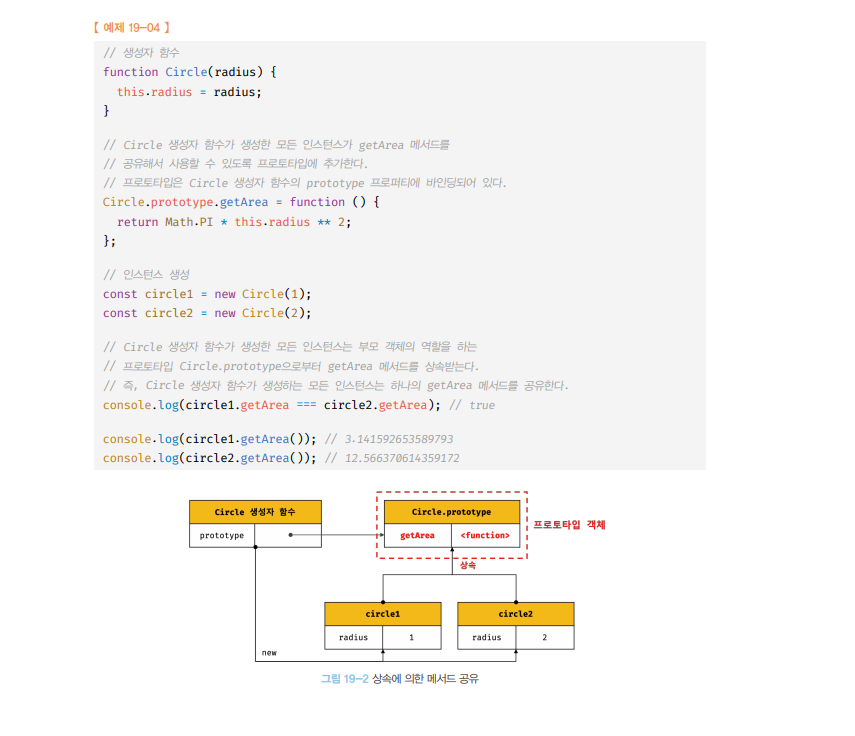

```
모든 객체(인스턴스)는 자신의 프로토타입 , 즉 상위(부모) 객체 역할을 하는 prototype 의 모든 프로퍼티와 메서드를 상속받는다.
```

<br />

- 모든 객체는 `하나의 프로토타입`을 갖는다.
  - 모든 프로토타입은 `생성자 함수`와 `연결` 되어 있다.
  - `객체` - `프로토타입` - `생성자 함수`는 연결되어 있다.

<br />

- 모든 객체는 `[[Prototype]]` 이라는 내부 슬롯을 가진다.

  - 이는 프로토타입의 참조값(null인 경우도 있음)
  - `[[Prototype]]` 에 저장되는 프로토타입은 `객체 생성 방식` 에 의해 결정
    - 예를 들어, 객체 리터럴( { } ) 로 생성된 객체의 프로토타입 → `Object.prototype`
    - 생성자 함수에 의해 생성된 객체의 프로토타입 → 생성자 함수의 `prototype 프로퍼티에 바인딩되어 있는 객체`

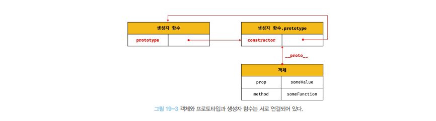

<br />

- 자바스크립트는 `프로토타입(prototype)` 을 기반으로 상속을 구현한다.

<br />
<br />

# 접근자 프로퍼티 `__proto__`

- 모든 객체는 `__proto__` 접근자 프로퍼티 를 통해 자신의 프로토타입, 즉 `[[Prototype]] 내부 슬롯에 간접적`으로 접근 할수 있다.

```js
const person = { name: `Lee` };
```

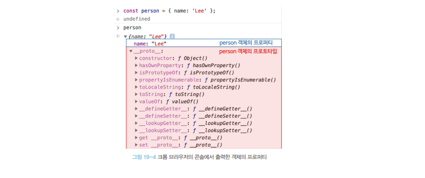

- proto 접근자 프로퍼티를 통해 person 객체 프로토타입`Object.prototype`에 접근한 결과

<br />
<br />
<br />
<br />

## `__proto__` 주의할 점 4가지


## 1. `__proto__` 는 접근자 프로퍼티다.

- 자바스크립트는 `내부 슬롯`과 `내부 메서드`는 `직접 접근 불가`
- `일부 내부 슬롯`과 `내부 메서드에 한하여` ,` 간접적으로 접근` 가능
  - `__proto__`는 접근자 프로퍼티이며, `Prototype`에 접근이 가능하다.
  - `__proto__` 가 접근자 프로퍼티이므로, `getter/setter `접근자 함수 를 통해, `프로토타입을 취득하거나 할당할 수 있다.`

<br />

> 프로토타입 교체 , 취득 가능 예제

```js
const obj = {};
const parent = { x: 1 };

// __proto__ 접근자 프로퍼티의 getter 접근자 함수로 obj 객체의 프로토타입 객체 취득
console.log(obj.__proto__); // [Object: null prototype] {}

// __proto__ 접근자 프로퍼티의 setter 접근자 함수로 obj 객체의 프로토 타입 교체
obj.__proto__ = parent;
console.log(obj.__proto__); // { x: 1 }
```

<br />
<br />

## 2. `__proto__` 접근자 프로퍼티는 상속을 통해 사용된다.

- `__proto__ 접근자 프로퍼티`는 `Object.prototype 의 프로퍼티` 이고 `상속`을 통해 사용됨
- `모든 객체`는 `상속`을 통해 `Object.prototype.__proto__` 접근자 프로퍼티 를 `사용`할 수 있다.

```js
const obj = {};

// obj 객체는 __proto__ 접근자 프로퍼티를 직접 소유하지는 않는다.
// Object.prototype 에 __proto__ 프로퍼티를 상속받아 사용하는 것이다.
console.log(obj.hasOwnProperty("__proto__")); // false

// __proto__ 접근자 프로퍼티는 모든 객체의 프로토타입 객체인 Object.protoype의 접근자 프로퍼티다.
console.log(Object.getOwnPropertyDescriptor(Object.prototype, "__proto__"));
/*
{
  get: [Function: get __proto__],
  set: [Function: set __proto__],
  enumerable: false,
  configurable: true
}
*/

// 모든 객체는 Object.prototype의 접근자 프로퍼티 __proto__를 상속받아 사용하는 것임을 증명
console.log(obj.__proto__ === Object.prototype); // true
```

```
📌프로토타입의 최상위 객체는 `Object.prototype`이고, 이 객체의 모든 프로퍼티와 메서드는 모든 객체에 상속된다.
```

<br />
<br />

## 3. `__proto__ 접근자 프로퍼티` 를 통해 `프로토타입에` `접근`하는 이유

- 아무런 체크 없이 무조건적으로 프로토타입을 교체할 수 없도록 `__proto__` 접근자 프로퍼티를 통해 `접근` 하고 `교체`하도록 `구현`
- 프로토타입 체인은 `단방향`으로 구현 되어야 한다.
- `서로가 자신의 프로토 타입이 되는` 비정상적인 프로토타입 체인(`순환 참조`)가 만들어지면, `프로토타입에 종점이 존재하지 않게 된다`.
  

```js
const parent = {};
const child = {};

child.__proto__ = parent;
parent.__proto__ = child; // 순환 참조 에러
```

## 4. `__proto__ 접근자 프로퍼티` 를 코드 내에 직접 사용하는 것은 권장X

- 모든 객체가 `__proto__`를 사용할 수 있는 건 아님 : `직접 상속`의 경우
- `__proto__` 대신 다른 `메서드를 사용을 권장`
  - `Object.getPrototypeOf` : 메서드 `참조를 취득 시`
  - `Object.setPrototypeOf` : 메서드 `교체를 원할 때`

```
const obj = {};
const parent = { x: 1 };

// Object.getPropertyOf 메서드로 obj 객체의 프로토타입 취득
console.log(Object.getPrototypeOf(obj)); // [Object: null prototype] {}

// Object.setPrototypeOf 메서드롤 obj 객체의 프로토타입을 교체
Object.setPrototypeOf(obj, parent);

// obj 객체의 __proto__ 접근자 프로퍼티로 obj 객체의 프로토타입 변경사항을 조회
console.log(obj.__proto__); // { x: 1 }
```

<br />
<br />
<br />

---

# 함수 객체의 prototype 프로퍼티

> 함수 객체만이 소유하는 prototype 프로퍼티는 생성자 함수가 생성할 인스턴스(객체)의 프로토타입을 가리킨다.

## 생성자 함수로서 호출할 수 없는 non-constructor 인 `화살표 함수`, `ES6 메서드 축약 표현`으로 정의한 메서드 는` prototype 프로퍼티를 소유하지 않고, 프로토타입도 생성하지 않는다.`

```js
function Person(name) {
  this.name = name;
}

const me = new Person("kim");

// Person 생성자 함수의 prototype 프로퍼티와 me 객체(인스턴스)의 __proto__ 접근자 프로퍼티가 가리키는 것은 동일한 프로토타입이다.
console.log(me.__proto__ === Person.prototype); // true
```

- 모든 객체가 가지고 있는 `__proto__` 접근자 프로퍼티 와 함수 객체만이 가지고 있는 prototype 프로퍼티 는 동일한 프로토타입을 가리킨다.

`__proto__`와 `prototype` 구분
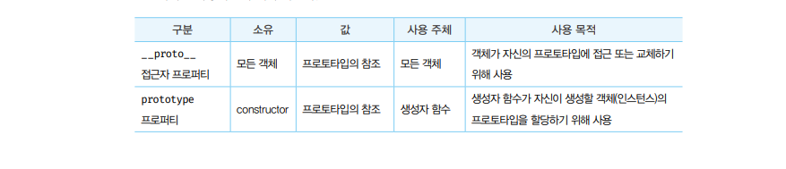
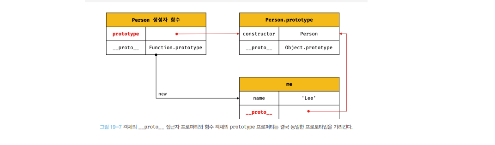


<br />
<br />
<br />
<br />

---

# 터럴 표기법으로 생성된 객체의 생성자 함수와 프로토타입

- 리터럴 표기법( `{ }` ) 으로 생성된 객체의 `프로토타입의 경우`,` constructor 프로퍼티` 가 가리키는 생성자 함수가 반드시 `객체를 생성한 생성자 함수가 아닐 수 있다.`

```js
// 객체 리터럴로 obj 객체 생성
const obj = {};

// obj 객체의 생성자 함수는 Object 생성자 함수다.
console.log(obj.constructor === Object); // true
```

<br />

## ECMAScript의 OrdinaryObjectCreate 추상연산 호출에 의한 객체 생성

> 추상연산 : ECMAScript 내부 동작의 구현 알고리즘을 의미

- `OrdinaryObjectCreate` 를 호출하면, 기본적으로 `Object.prototype` 을 프로토타입으로 갖는 `빈 객체를 생성`
- Object 생성자 함수 호출과 객체 리터럴의 평가는 `OrdinaryObjectCreate`를 호출 해서 빈 객체를 생성하는다는 점은 동일

  - `new.target` 의 확인, 프로퍼티 추가하는 처리 등 세부 처리에서 차이가 있다.
  - 객체 리터럴에 의해 생성된 객체 `!= Object` 생성자 함수가 생성한 객체

- `프로토타입`과 `생성자 함수` 는 언제나 `쌍(pair)`으로 존재

| 리터럴 표기법      | 생성자 함수 | 프로토 타입        |
| ------------------ | ----------- | ------------------ |
| 객체 리터럴        | Object      | Object.prototype   |
| 함수 리터럴        | Function    | Function.prototype |
| 배열 리터럴        | Array       | Array.prototype    |
| 정규 표현식 리터럴 | RegExp      | RegExp.prototype   |

- 리터럴 표기법에 의해 생성된 객체의 생성자 함수와 프로토타입

<br />
<br />
<br />

---

# 프로토 타입의 생성 시점

- `프로토타입`은 `생성자 함수가 생성`되는 시점에 생성된다.
- `프로토타입` , `생성자` 함수는 항상 쌍으로 존재

<br />

> 생성자 함수로써 호출할 수 있는 함수, 즉 constructor는 함수 정의가 평가 되어 객체를 생성하는 시점에 프로토타입도 더불어 생성된다.

- `일반 함수`

```js
// 함수 정의가 평가되어 함수 객체를 생성하는 시점에 프로토타입 더불어 생성
// 함수 호이스팅 적용
console.log(Person.prototype); // { constructor: f }

// 생성자 함수
function Person(name) {
  this.name = name;
}
```

<br />

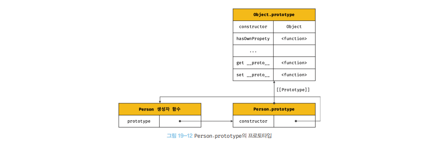

- 생성된 프로토타입은 오직 `constructor 프로퍼티` 만을 갖는 객체이다.
- 프로토타입도 객체이며, `모든 객체는 프로토타입을 가진다`.
- 프로토타입도 `자신의 프로토타입`을 가진다.
  - 생성된 프로토타입의 프로토타입은 `Object.prototype`

<br />
<br />
<br />
<br />

---

# 빌트인 생성자 함수와 프로토타입 생성 시점

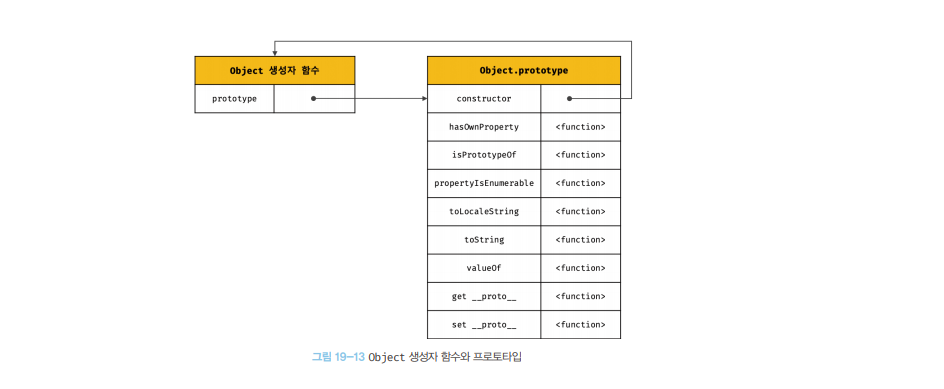

- 빌트인 생성자 함수
  - Object
  - String
  - Number
  - Function
  - Array
  - RegExp
  - Date
  - Promise

```
✅ 빌트인 생성자 함수가 생성되는 시점에 프로토 타입이 생성됨
✅ 생성된 프로토타입은 빌트인 생성자 함수의 prototype 프로퍼티에 바인딩
✅ 객체가 생성되기 이전에 생성자 함수와 프로토타입은 이미 객체화되어 존재한다.
```

- 생성자 함수 또는 리터럴 표기법으로 객체를 생성하면 `프로토타입`은 생성된 객체의 `[[Prototype]]` 내부 슬롯에 할당된다.

<br />
<br />
<br />

---

# 객체 생성 방식과 프로토타입 결정

객체 생성 방식(`6가지`)

1. `객체 리터럴`
2. `Object 생성자 함수`
3. `생성자 함수`
4. `Object.create 메서드`
5. `Class`

```
🔥 객체 생성 방식은6 가지지만, `추상 연산 OrdinaryObjectCreate`에 의해 생성된다는 공통점이 있다.

🔥 프로토타입은 추상 연산에 전달되는 인수에 의해 결정된다
```

- 추상 연산 `OrdinaryObjectCreate` 객체 생성 메서드
  1. OrdinaryObjectCreate -> `빈 객체 생성`
  2. 객체에 추가할 프로퍼티 목록이 `인수`로 `전달`될 경우 프로퍼티를 `빈객체에 추가`
  3. 인수로 전달받은 프로토타입을 자신이 생성한 객체의` [[Prototype]] ``내부 슬롯`
     에 할당한 다음, `생성한 객체`를 반환

<br />
<br />

## (1) 객체 리터럴에 의해 생성된 객체의 프로토타입

> `객체 리터럴`로 객체 생성 `객체의 프로토타입`은 `Object.prototype`

```js
// 객체 리터럴로 생성된 obj 객체
const obj = { x: 1 };

// obj 객체에는 constructor 프로퍼티와 hasOwnProperty 메서드를 소유하지 않는다.
// 사용가능한 것은 Object.prototype 에 있는 프로퍼티를 상속받았기 때문이다.
console.log(obj.constructor === Object); // true
console.log(obj.hasOwnProperty("x")); // true
```

<br />
<br />

## (2) 생성자함수 의해 생성된 객체의 프로토타입

- `Object 생성자` 함수에 의해 생성되는 `객체의 프로토타입`은 `Object.prototype`

```js
// Object 생성자 함수로 생성된 obj 객체
const obj = new Object();
obj.x = 1;

console.log(obj.constructor === Object); // true
console.log(obj.hasOwnProperty("x")); // true
```

<br />
<br />

## (3) 생성자함수 의해 생성된 객체의 프로토타입

- 생성자 함수에 의해 생성되는 객체의 프로토타입은 `생성자 함수의 prototype 프로퍼티`에 `바인딩되어 있는 객체`
- 앞선 Object 생성자 함수와 객체 리터럴로 생성된 객체의 프로토타입인 Object.prototype 과 달리, `오로지 constructor 프로퍼티만 존재한다.
`

```js
// 사용자 정의 생성자 함수
function Person(name) {
  this.name = name;
}

// Person.prototype 에 프로퍼티를 동적으로 추가/삭제 가능
Person.prototype.sayHello = function () {
  console.log(`Hi! My name is ${this.name}`);
};

// 사용자 정의 생성자 함수로 생성된 인스턴스
const me = new Person("Lee");
const you = new Person("KIM");

me.sayHello(); // Hi! My name is Lee
you.sayHello(); // Hi! My name is KIM

console.log(me.constructor === Person); // true
console.log(you.constructor === Person); // true
//Person 생성자 함수를 통해 생성된 모든 객체는 프로토타입에 추가된 sayHello 메서드를 상속 받아 자신의 메서드 처럼 사용이 가능하다.
```

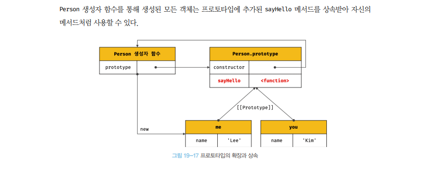

```
🎯 Object생성자로 생성된 객체 : 메서드 (hasOwnProperty , propertyIsEnmerable...)을 가짐
🎯 사용자 정의 생성자 함수로 생성된 객체 : constructor만 가짐
```

<br />
<br />

---

# 프로토 타입 체인

```
🎯 프로토 타입 체인이란..?
자바스크립트는 객체의 프로퍼티(메서드 포함)에 접근하려고 할 때, 해당 객체에 접근하려는 프로퍼티가 있는지 확인한다.
없다면 `[[Prototype]]` `내부 슬롯의 참조값` 을 따라, 자신의 부모 역할을 하는 프로토타입의 프로퍼티 를 `순차적으로 검색`
```

- `프로토타입`의 `프로토타입은` 언제나 `Object.prototype` 이다.
- 자바스크립트가 객체지향 프로그래밍의 상속 을 구현하는 메커니즘이 됨

## 프로토 타입 체인 예시

```js
// 생성자 함수
function Person(name) {
  this.name = name;
}

// 프로토타입 메서드
Person.prototype.sayHello = function () {
  console.log(`Hi! My name is ${this.name}`);
};

//인스턴스
const you = new Person("KIM");
```

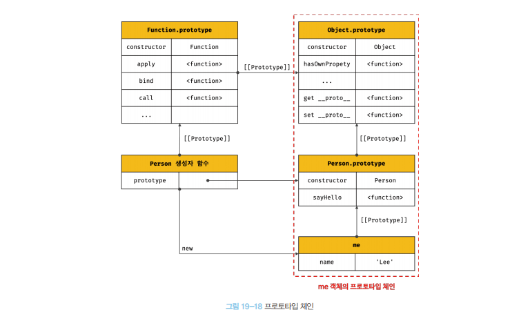

- `Object.prototype` >(상속) `Person 생성자 함수` >(상속) `me 인스턴스`
- `Object.prototype` : `프로토 타입 체인의 종점`
- 모든 객체는 `Object.prototype` 상속 받는다.
- Object.prototype 의 프로토타입은 `null`이다.

<br />
<br />

```
💡 프로토타입 체인 : 프로퍼티 검색을 위한 매커니즘
💡 스코프 체인 : 식별자 검색을 위한 매커니즘

자바스크립트는 프로토타입 체인을 따라 프로퍼티/메서드를 검색한다.
객체 간의 상속 관계로 이루어진 프로토타입의 계층적인 구조에서 프로퍼티를 검색한다.
```

<br />
<br />

<br />
<br />

---

# 오버라이딩과 프로퍼티 섀도잉

```js
오버라이딩(overriding)
+ 쉽게 말해서 상속 받는 메서드를 인스턴스에서 재정의해서 사용!
+ 상위 클래스가 가지고 있는 메서드를 하위 클래스가 재정의하여 사용하는 방식
```

<br />

- 프로토타입이 소유한 프로퍼티 → `프로토타입 프로퍼티`
- 인스턴스가 소유한 프로퍼티 → `인스턴스 프로퍼티`

```js
const Person = (function () {
  // 생성자 함수
  function Person(name) {
    this.name = name;
  }

  // 프로토타입 메서드
  Person.prototype.sayHello = function () {
    console.log(`Hi, My name is ${this.name}`);
  };

  // 생성자 함수를 반환
  return Person;
})();

const me = new Person("kim");
// Person.prototype 에 정의한 sayHello 메서드 호출
console.log(me.sayHello()); // Hi, My name is kim

// me 객체(인스턴스)에 메서드 정의
me.sayHello = function () {
  console.log(`Hey! My name is ${this.name}`);
};
// 인스턴스 메서드 정의 이후에는 Person.prototype 에 sayHello가 아닌, 인스턴스에 정의한 sayHello를 호출
console.log(me.sayHello()); // Hey! My name is kim
```

<br />
<br />

## 하위 객체를 통해 프로토타입의 프로퍼티를 `변경`, `삭제`는 `불가능`하다. 읽기만 가능

- 하위 객체에서 `get 엑서스는 허용` , `set 엑서스는 허용되지 않는다`.
- 프로토타입 프로퍼티 변경을 위해선 `하위객체를 통해 프로토타입 체인 으로 접근해서 변경할 수 없다.`

```js
const Person = (function () {
  // 생성자 함수
  function Person(name) {
    this.name = name;
  }

  // 프로토타입 메서드
  Person.prototype.sayHello = function () {
    console.log(`Hi, My name is ${this.name}`);
  };

  // 생성자 함수를 반환
  return Person;
})();

const me = new Person("KIM");

// me 객체(인스턴스)에 메서드 정의(추가)
me.sayHello = function () {
  console.log(`Hey! My name is ${this.name}`);
};

// 프로토타입에 직접 접근하여 sayHello 메서드 삭제
delete Person.prototype.sayHello;
me.sayHello(); // Hey! My name is KIM
me.prototype.sayHello(); // TypeError: Cannot read property 'sayHello' of undefined
```

<br />
<br />
<br />

# 프로토타입의 교체 (`직접 상속` , `ES6+ 의 클래스`사용 or 프로토타입은 적접 교체 안하는 것이 좋음)

- 프로토타입은 임의의 `다른 객체`로 `변경`이 `가능`하다.
- `객체 간`의 `상속 관계`를 `동적`으로 변경할 수 있다.

  - `생성자 함수` , `인스턴스`에 의해 교체 가능

<br />

- 프로토타입 교체를 통해 객체 간의 상속 관계를 동적으로 변경하는 것은 `번거로우며`, `직접 프로토타입을 교체하는 것은 바람직하지 않다`

## 생성자 함수에 의한 프로토타입 교체

```JS
const Person = (function () {
  function Person(name) {
    this.name = name;
  }

  Person.prototype = {
    // constructor 프로퍼티와 생성자 함수 간의 연결을 재설정하면 파괴를 매꿀 수 있다.
    // constructor: Person,
    sayHello() {
      console.log(`Hi, My name is ${this.name}`);
    },
  };

  return Person;
})();

const me = new Person("KIM");
// 생성자 함수에 프로퍼티로 프로토타입을 교체하면 constructor 프로퍼티와 생성자 함수 간의 연결이 파괴
console.log(me.constructor === Person); // false
// 프로토타입 체인을 따라 Object.prototype 의 constructor 프로퍼티가 검색
console.log(me.constructor === Object); // true << 🔍

```

## 인스턴스에 의한 프로토타입 교체

```js
function Person(name) {
  this.name = name;
}

const me = new Person("WI");

const parent = {
  // 생성자 함수에 의한 프로토타입 재정의 때와 같이 constructor가 파괴되는 것을 constructor 를 해당 생성자 함수로 재설정하면 매꿀 수 있다.
  // constructor: Person,
  sayHello() {
    console.log(`Hi, My name is ${this.name}`);
  },
};

Object.setPrototypeOf(me, parent);
console.log(me.constructor === Person); // false
console.log(me.constructor === Object); // true
```

<br />
<br />
<br />
<br />

---

# instanceof 연산자

```js
객체 instanceof 생성자 함수
```

- 우변의 생성자 함수의 `prototype에 바인딩된 객체`가 좌변의 객체의 포로토타입 체인 상에 존재하면, `true`로 평가되고, 그렇지 않은 경우에는 `false`로 평가 된다.
- 프로토타입의 constructor 프로퍼티가 가리키는 `생성자 함수`를 `찾는 것이 아니다`

> instanceof 연산자 예제

```js
// 생성자 함수
function Person(name) {
  this.name = name;
}

const me = new Person("kim");

// 프로토타입으로 교체할 객체
const parent = {};

Object.setPrototypeOf(me, parent);

// Person 생성자 함수와 parent 객체는 연결되어 있지 않다.
console.log(Person.prototype === parent); // false
console.log(parent.constructor === Person); // false

// parent 객체를 Person 생성자 함수의 prototype 프로퍼티에 바인딩
Person.prototype = parent;

// Person.prototype 이 me 객체의 프로토타입 체인 상에 존재함
console.log(me instanceof Person); // true
// Object.prototype 이 me 객체의 프로토타입 체인 상에 존재함
console.log(me instanceof Object); // true
```

<br />
<br />
<br />

---

# 직접 상속 2가지 방법

<br />
<br />

## (1) `Object.create 에 의한 직접 상속`

- `명시적`으로 `프로토타입`을 `지정`하여 새로운 객체를 생성
- 다른 객체 생성 방식과 마찬가지로 `OrdinaryObjectCreate`를 `호출하는 것은 동일`
- `객체`를 `생성`하면서 직접적으로 `상속`을 `구현한다`
  - `new 연산자 없이도 객체를 생성 가능`
  - `프로토타입을 지정하면서 객체를 생성할 수 있다.`
  - `객체 리터럴에 의해 생성된 객체도 상속받을 수 있다.`

```js
// obj -> null
let obj = Object.create(null);
console.log(Object.getPrototypeOf(obj) === null); // true

// obj -> Object.prototype -> null
obj = Object.create(Object.prototype);
console.log(Object.getPrototypeOf(obj) === Object.prototype); // true

// obj -> Objrct.prototype -> null
obj = Object.create(Object.prototype, {
  x: { value: 1, writable: true, enumerable: true, configurable: true },
});
console.log(Object.getPrototypeOf(obj) === Object.prototype); // true

const myProto = { x: 10 };
// obj -> myProto -> Object.prototype -> null
obj = Object.create(myProto);
console.log(Object.getPrototypeOf(obj) === myProto); // true

function Person(name) {
  this.name = name;
}
// obj -> Perosn.prototype -> Object.prototype -> null
obj = Object.create(Person.prototype);
console.log(Object.getPrototypeOf(obj) === Person.prototype); // true
```

- ESLint 에서는 `Object.create`의 빌트인 메서드를 객체가 직접 호출하는 것을 권장하지 않는다.
  - `Object.create` 메서드를 통해 `프로토타입 체인의 종점`에 위치하는 객체를 생성할 수 있기 때문
  - 모든 객체에 종점에는 언제나 `Object.prototype` 이 존재한다는 점을 고려했을 때, 직접 `프로토타입 체인의 종점에 위치하는 객체`를 `생성`하는 것은 바람직하지 않다.
  - 그러므로, Object.prototype 의 빌트인 메서드는 간접적으로 호출하는 것이 바람직하다.

```js
// 프로토타입이 null 인 객체를 생성
const obj = Object.create(null);
obj.a = 1;

// console.log(obj.hasOwnProperty("a"));   // TypeError: obj.hasOwnProperty is not a function
console.log(Object.prototype.hasOwnProperty.call(obj, "a")); // true
```

<br />
<br />

## (2) `객체 리터럴 내부에서 proto 에 의한 직접 상속` (두 번째 파라미터로 프로퍼티를 정의하는 것에 번거로움을 해소하는 방법)

- 객체 리터럴 내부에서 `__proto__` 접근자 프로퍼티를 사용해서 직접 상속을 구현 할 수 있다.

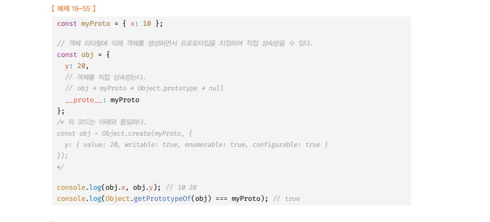

<br />
<br />

---

# 정적 프로퍼티, 메서드

- 생성자 함수는 `객체`이므로 `자신의 프로퍼티/메서드`를 가질 수 있다.
- 생성자 함수 객체가 `소유한 프로퍼티/메서드` ==> `정적 프로퍼티/메서드` 라고 한다.
- 인스턴스는 생성자 함수의 정적 프로퍼티/메서드를 사용할 수 없다.

```js
// 생성자 함수
function Person(name) {
  this.name = name;
}

// 프로토타입 메서드
Person.prototype.sayHello = function () {
  console.log(`HI, My name is ${this.name}`);
};

// 정적 프로퍼티
Person.staticProp = "Person 생성자 함수의 정적 프로퍼티";

// 정적 메서드
Person.staticMethod = function () {
  console.log("Person 생성자 함수의 정적 메서드 호출");
};

const me = new Person("kim");

Person.staticMethod(); // 인간 생성자 함수의 정적 메서드 호출 !
// 인스턴스는 생성자 함수의 정적 메서드를 사용할 수 없다.
me.staticMethod(); // TypeError: me.staticMethod is not a function
```

> 정적 메서드, 프로퍼티 상속 관계이미지<br />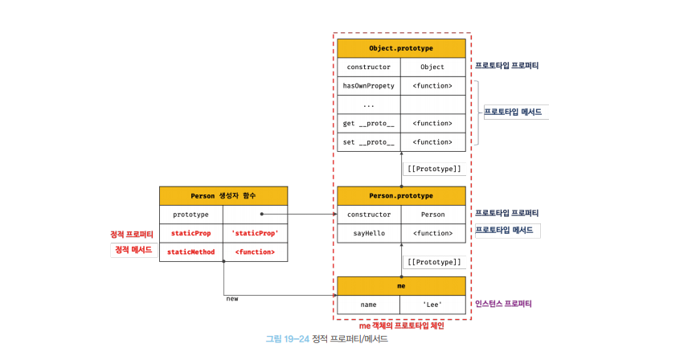

<br />
<br />
<br />

---

# 프로퍼티 열거 (상속된 모든 프로토타입 프로퍼티 열거)

<br />

```
🔥for in문은 객체의 프로토타입 체인상에 존재하는 모든 프로토타입의 프로퍼티 중에서 프로퍼티 어트리뷰트 [[Eumerable]] 이 true 인 프로 퍼티를 순회해서 열거 한다.🔥
```

> for in 문 예제 <br />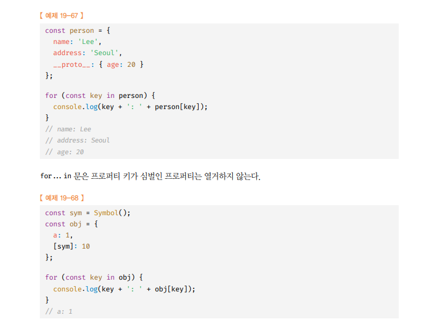

<br />

- 객체의 모든 `프로퍼티를 순회`하려면 `for .. in` 문을 사용한다.
- `for .. in`문은 in 연산자 처럼 순회 대상` 객체의 프로퍼티값 뿐만` 아니라 `상속받은 프로토타입의 프로퍼티까지 열거`한다.
- `Object.prototype`의 `toString메서드`가 `for ..in`에서 열거 되지 않는 이유 : `toString`은 `열거 할 수 없도록 정의된 프로퍼티` 이기 때문 `[[Eumerable]]` : `false`

<br />

```js
for (변수 선언문 in 객체){...}
```

> for in문 예시

```js
const person = {
  name: "kim",
  age: 100,
};

console.log("name" in person); // true
console.log("age" in person); // true
console.log("address" in person); // false

// toString 메서드는 person 객체의 프로퍼티에는 존재하지 않는다.
// 하지만, person 객체의 프로토타입인 Object.prototype 에 toString 메서드가 존재하기 때문에 true
// 이처럼, in 연산자는 조사할 객체의 상속받은 프로토타입의 프로퍼티까지 조사를 한다.
console.log("toString" in person); // true 🔍
```

<br /><br />

# 프로퍼티 열거 (객체 자신의 프로퍼티만 열거!)

- 오로지 해당 객체의 프로퍼티 키들로만 for - in 문을 순회하고 싶을 때는 Object.prototype.hasOwnProperty 메서드를 호출하며 검사한다.

```js
Object.prototype.hasOwnProperty 메서드 활용
```

```js
const person = {
  name: "kim",
  age: 100,

  __proto__: {
    address: "seoul",
  },
};

for (const key in person) {
  // person 객체의 고유 프로퍼티일 경우에만 정보를 출력
  if (person.hasOwnProperty(key)) {
    console.log(`${key} : ${person[key]}`);
  }
}
/*
name : kim
age : 100
*/
```

<br /><br />

# 객체 고유 프로퍼티만으로 구성된 열거하고 싶을 경우

- `Object.keys()`: 객체 자신의 열거 가능한 `프로퍼티 키`를 배열로 반환
- `Object.values()` : 객체 자신의 열거 가능한 `프로퍼티 값`을 배열로 반환
- `Object.entries()` : 객체 자신의 열거 가능한 `프로퍼티 키,값`을 배열로 반환

```js
const person = {
  name: "kim",
  age: 100,

  __proto__: {
    address: "seoul",
  },
};

console.log(Object.keys(person)); // [ 'name', 'age' ]
console.log(Object.values(person)); // [ 'kim', 100 ]
console.log(Object.entries(person)); // [ [ 'name', 'kim' ], [ 'age', 100 ] ]
```
