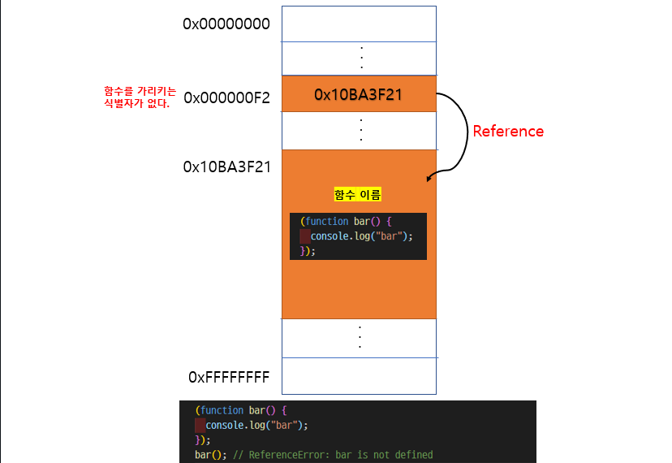
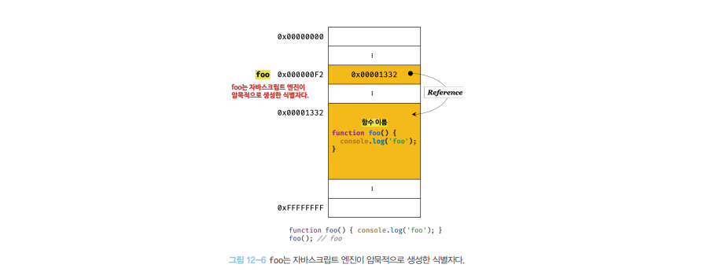
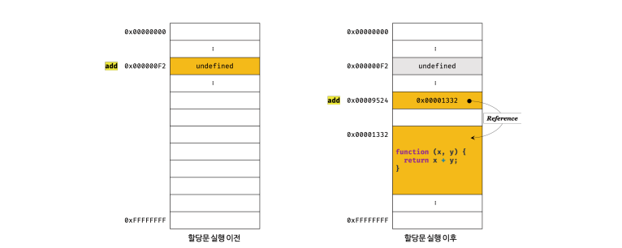
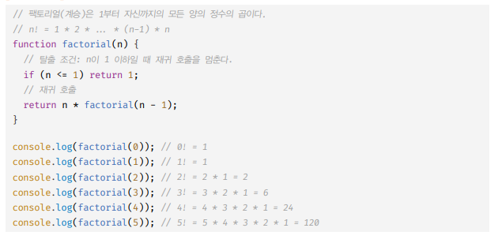

# 함수(객체) 사용 이유

- `코드 재사용` , `유지보수의 편의성` , `코드의 가독성`

<br />
<br />

## 코드의 문맥에 따른 자바스크립트 엔진의 함수 해석

> 자바스크립트 엔진은 `코드의 문맥 에 따라 `동일한 함수 리터럴을 함수 표현식 or 함수 선언문으로 해석하는 경우가 있다.

- `{ }` 은` 코드 블록` 일 수도 있고, `객체 리터럴` 일 수도 있다. => { }은 중의적 표현

  - `{ }`이 `단독`으로 존재 → 자바스크립트 엔진은` { } 을 블록문으로 해석`

  - `{ }` 이 `값으로 평가`되어야 할 문맥에서 `피연산자` 로 사용될 경우 => 자바스크립트 엔진은 `{ }을 객체 리터럴로 해석`

- ## `함수`도 마찬가지!!
  - 함수 리터럴 이 `단독`으로 사용된다. → `함수 선언문`으로 해석
  - `함수 리터럴` 이 값으로 평가되어야 하는(변수에 할당 or 피연산자로..) 문맥 → `함수 리터럴 표현식` 으로 해석

<br />
<br />

---

# 함수 선언문과 함수 리터럴 표현식

이 둘은 함수가 생성되는 것은 동일, 다만 `호출에서 차이`가 있다.

```js
// 1.함수 선언문으로 함수 호출
function foo() {
  console.log("foo"); // foo
}
foo();

// 2️. 함수 리터럴 표현식으로 함수 호출
(function bar() {
  console.log("bar"); // ReferenceError: bar is not defined
});
bar();
```

> 💡 함수 리터럴 표현식 예제<br />
> 함수를 가르키는 `식별자가 없다` , 함수 몸체 외부에서는 `함수 이름으로 함수를 호출할 수 없다`.<br /> 

<br />
<br />

> 💡 함수 표현식 예제<br />
> 자바스크립트엔진은 함수를 호출하기 위해 함수 이름과 동일한 이름의 식별자를 암묵적으로 생성한다.<br /> > 

```js
function add(x, y) {
  return x + y;
}
// 자바스크립트 엔진에 의해 식별자가 선언됨
var add = function add(x, y) {
  return x + y;
};
```

```
💡 자바스크립트 엔진은 "함수 선언문"을 "함수 표현식으로 변환" → "함수 객체를 생성"
```

<br />
<br />
<br />
<br />

# 함수의 표현식

- 함수 : `값` , `프로퍼티 값` , `배열의 요소` 가 될 수 있다. (== `일급객체`)

```js
console.log(add1); // 정상
console.log(add2); // undefined

//함수 선언문
function add1(x, y) {
  return x + y;
}
//함수 표현식 add2 에 undefined값이 들어가며 호이스팅됨
var add2 = function (x, y) {
  return x + y;
};
```

```
💡 함수 선언문 : 런타임 이전에 함수 `객체 먼저 생성` (호이스팅)
💡 함수 표현식 : 변수 호이스팅이 발생해 변수에 `undefined` 값이 들어감
```

> 🎯함수 선언문은 호이스팅 , 함수 선언문은 변수 호이스팅<br /> 

<br />
<br />

<br />
<br />

# 함수 호출

- 함수의 매개변수(parameter) 는 함수` 몸체 내부에서만 참조`할 수 있다. 즉, `매개변수`의 스코프(유효 범위)는 `함수 내부`다.
- 함수의 `parameter`와 `인수`는 개수가 달라도 오류가 `나지 않는다`.
  - 인수가 `<` 파라미터 보다 작으면 나머지 파라미터는 `암묵적으로 undefined`
  - 인수가 `>` 파라미터 보다 많으면 `argument` 객체에 저장된다.

> 예제

```js
// 🎯 매개변수의 개수 > 인수의 개수 = 나머지 매개변수 undefined
function mul(x, y) {
  console.log(x, y); // 1 undefined
}
mul(1);

// 🎯 매개변수의 개수 < 인수의 개수 = arguments 에 보관
function sub(x, y) {
  console.log(arguments); // [Arguments] { '0': 3, '1': 2, '2': 1 }
  return x - y;
}
sub(3, 2, 1); // 1
```

## 자바스크립트 문법상의 문제

```
💡자바스크립트 함수는 매개변수와 인수의 개수가 일치하는지 확인하지 않는다.
💡자바스크립트는 "동적 타입 언어"다. 따라서 자바스크립트 함수는 매개변수의 "타입을 사전에 지정할 수 없다."
```

- 함수를 정의할 때, `인수가 전달되었는지 확인`할 필요가 있다. (파라미터와 (!=) 인자가 달라도 오류가 나지 않기 때문에)
  1. `typeof` 연산자 를 사용하는 방법
  2. 인수가 전달되지 않은 경우 단축 평가 를 사용하는 방법
  3. 매개변수에 기본값을 할당하는 방법

```js
// 1️⃣ typeof 연산자로 arguments 문제 방지
function add(x, y) {
  if (typeof x !== "number" || typeof y !== "number") {
    throw new TypeError("인수는 모두 숫자(number)값 이어야 합니다.");
  }

  return x + y;
}

// 2️⃣ "단축 평가"로 arguments 문제 방지
function mul(a, b, c) {
  a = a || 1;
  b = b || 1;
  c = c || 1;

  return a * b * c;
}

// 3️⃣ parameter default value 설정으로 argument 문제 방지
function sub(a = 0, b = 0) {
  return a - b;
}
```

<br />
<br />

# 함수 값에 의한 호출 , 참조에 의한 호출

- `값에 의한 호출` : `원시값`을 전달

  - `변경 불가능한 값`
  - 원시 타입의argument는 값자체가 `복사` 되어 `매게 변수`로 전달
  - `X 원본의 훼손 X`

  <br />

- `참조에 의한 호출` : `객체`를 전달
  - `변경이 가능한 값`
  - 객체 argument 는 참조 값이 매게변수에 전달
  - `O 원본의 훼손 O`

```
💡 함수의 파라미터로 원시값을 주면 원본이 훼손되지 않지만, 객체를 주면 원복 객체가 훼손된다.
```

```JS
function changeVal(primitive, obj) {
  primitive += 100;
  obj.name = "WIEEE";
}

// 외부 상태
var num = 100; // 원시 값
var person = { name: "WI" }; // 객체

//person 객체의 값도 변함
changeVal(num, person);
```

> 위 코드 예제<br />

```js
[ 💡 순수 함수 ]

+ 외부 상태를 변경하지 않고 외부 상태에 의존하지도 않는 함수를 "순수 함수"
+ 순수 함수를 통해 부수효과(side effect)를 최대한 억제하고 오류를 피해 프로그램 안정성을 높인다. = "함수형 프로그래밍"
```

<br />
<br />

# 다양한 함수

- `즉시 실행 함수` : 반드시 `()`로 감싸야 한다

```js
(function () {
  console.log("즉시 실행 함수");
})();
```

<br />

- `재귀 함수 ` : 자기 자신을 호출하는 함수

> 팩토리얼 예제<br />

<br />

- `중첩 함수` : 중첩 함수는 외부 함수 내부에서만 호출할 수 있다.
  > 중첩 함수 예제!

```js
function outer() {
  var x = 1;

  // 중첩 함수 == 내부 함수
  function inner() {
    var y = 2;

    // 외부 함수의 변수 참조
    console.log(x + y); // 3
  }

  inner();
}

outer();
```

- `콜백 함수` : 함수의 `파라미터`를 통해 `다른함수 내부`에 전달되는 `함수`
  - `파리미터로` `함수를 전달` 받은 함수 : `고차 함수`
  - 콜백함수는 고차 함수에 의해 호출됨
  - 함수는 `일급 객체` 이므로 함수의 매개변수를 통해 함수를 전달 가능
  - 함수는 더 이상 내부로직에 강력히 의존하지 않고 외부에서 로직의 일부분을 함수로 전달받아 수행하므로 유연한 구조를 갖는다.

> 콜백 함수 예제

```js
// 외부에서 전달받은 func 를 n 만큼 반복 호출 - 고차 함수 repeat
function repeat(n, f) {
  for (var i = 0; i < n; i++) {
    f(i);
  }
}

// 콜백 함수 정의 - logAll
var logAll = function (i) {
  console.log(i);
};

// 반복 호출할 함수를 인수로 전달
repeat(5, logAll); // 0 1 2 3 4

// 콜백 함수 정의 - logOdd
var logOdd = function (i) {
  if (i % 2) console.log(i);
};

// 반복 호출할 함수를 인수로 전달
repeat(5, logOdd); // 1 3
```
