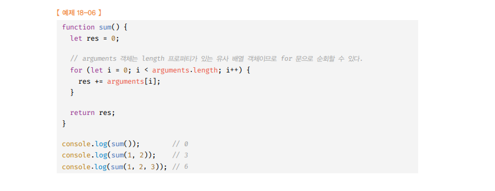
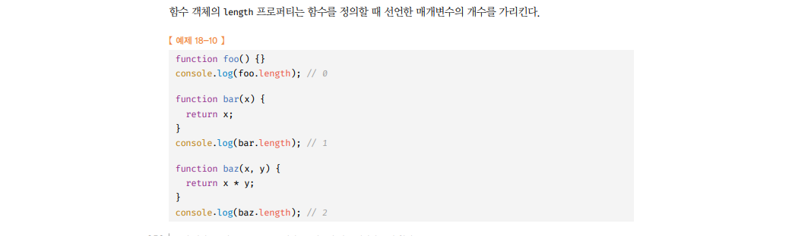

# 함수와 일급 객체 🎯💡🔥📌✅

4가지 조건을 만족하는 것을 일급 객체(자바스크립트의 함수)라고 한다.

- 무명의 리터럴로 생성할 수 있다. 즉, `런타임`에 `생성`이 가능하다.
- 변수나 `자료구조`(객체, 배열 등)에 `저장`할 수 있다.

```js
// 함수는 무명 리터럴로 생성가능
// 함수는 변수에 저장 가능
// 런타임 시점에 함수 리터럴이 평가되어 함수 객체가 생성되고 변수에 할당 된다.(정확히는 함수 객체의 참조값이 할당 된다.)
const increase = function (num) {
  return ++num;
};

const decrease = function (num) {
  return --num;
};
```

- 함수의 `매객변수`에 전달할 수 있다.
- 함수의 `반환값`으로 사용할 수 있다.

```js
// 함수는 객체에 저장할 수 있다.
const predicate = { increase, decrease };

// 함수는 매개변수(= 파라미터, parameter)에 전달할 수 있다.
// 함수는 함수의 반환 값으로 사용할 수 있다.
function makeCounter(predicate) {
  let num = 0;

  return function () {
    num = predicate(num);
    return num;
  };
}

// 함수는 인수로 함수를 전달할 수 있다.
const increaser = makeCounter(predicate.increase);
console.log(increaser()); // 1
console.log(increaser()); // 2

const decreaser = makeCounter(predicate.decrease);
console.log(decreaser()); // -1
console.log(decreaser()); // -2
```

<br />
<br />

## `일급 객체(함수)`가 가지는 특징!

```
📌 함수가 일급 객체라는 것은 함수를 객체와 동일하게 사용할 수 있다는 의미이다.
📌 일반 객체와 같이 함수를 함수의 매개변수에 전달할 수 있다.
📌 함수의 반환값으로 함수를 사용할 수 있다.
📌 다음 2가지가 자바스크립트의 함수형 프로그래밍을 가능케하는 장점 중 하나
```

<br />
<br /><br />
<br />

# 함수의 프로퍼티(4가지)

> 함수도 객체이기 때문에 프로퍼티를 갖는다.(4가지)<br />

## 아래는 함수 객체의 데이터 프로퍼티이다.

- `argument` : `함수인자로 전달`
- `caller` : `비표준`
- `length` : `파라미터의 갯수`
- `name` : 함수의 `이름`

<br />
<br />

---

## 1. `argument`

```
🔥 함수 객체의 arguments 프로퍼티값은 함수 호출 시 `전달된 인수`들의 정보를 담고 있는 순회 가능한 유사 배열 객체이다. 함수 내부에서 `지역 변수`로 사용된다.
```

- 자바스크립트에서는 함수의 `매개변수`와 `인수`의 개수가 일치하는지 `확인하지 않는다`
  1. 매개변수 수만큼 인수를 전달하지 않아도 `에러가 발생하지 않는다.`
  2. 함수를 정의할 때 선언한 매개변수는 함수가 호출되면 함수 몸체 내에서 암`묵적으로 선언되고 undefined 로 초기화`된 후, 인수가 할당되기 때문
- 매개변수보다 인수를 많이 전달했을 경우
  1. 초과된 인수는 `arguments 객체에서 보관` 한다.
  2. length는 인수의 개수이다.
- length 프로퍼티 를 사용할 수 있는 이유는 arguments 객체 가 `유사 배열 객체` 이기 때문이다.

```
📌 유사 배열 객체란 length 프로퍼티 를 가지는 객체로, for 문 같은 반복문으로 순회가능하다.
📌 유사 배열은 배열이 아니므로 배열 메서드 사용하려면 call,apply를 사용해 간접 메서드를 호출 해야 한다.
```

- arguments 객체 는 `매개변수 개수를 확정할 수 없는 가변 인자 함수` 를 `구현`할 때 유용하다.
  > arguments 가변 인자 함수 활용 예시<br />

<br />
<br />

> arguments 객체 활용 예시

```js
function multiply(x, y) {
  console.log(arguments);
  console.log(`length : ${arguments.length}`);
  return x + y;
}

console.log(multiply());
/*
[Arguments] {}
length : 0
NaN
*/

console.log(multiply(1));
/*
[Arguments] { '0': 1 }
length : 1
NaN
*/

console.log(multiply(1, 2));
/*
[Arguments] { '0': 1, '1': 2 }
length : 2
3
*/

console.log(multiply(1, 2, 3, 4, 5));
/*
[Arguments] { '0': 1, '1': 2, '2': 3, '3': 4, '4': 5 }
length : 5
3 
*/
```

<br />
<br />

---

## 2. `Caller`

- ECMAScript 사양에 포함X `비표준 프로퍼티`
- 함수 자산을 호출한 함수를 가르킨다.
- `중요하지 않음`

<br />
<br />

---

## 3. `length 프로퍼티`

### `함수`를 `정의`할 때 선언한 `매개 변수의 갯수`를 가르킨다.

> length 프로퍼티 예시 <br />

!주의!

```
✅ arguments 객체의 length != 함수 객체의 length


✅ arguments 객체의 length   --> 인자의(argument) 갯수!
✅ 함수객체의 length 프로퍼티 --> 매개변수(parameter) 갯수!

자바스크립트는 함수의 매개변수와 인자 갯수가 달라도 되기 때문
```

<br />
<br />

---

## 4. `name 프로퍼티`

- 함수객체의 `name 프로퍼티`는 `함수이름`을 나타낸다.

> 예제

```js
//기명 함수 표현식
var namedFunc = function foo() {
  console.log(namedFun.name); // foo
};

//익명함수 표현식
var anonymousFunc = function () {
  //함수 객체를 가리키는 변수 이름을 값으로 갖는다.
  console.log(anonymousFunc.name);
};

//함수 선언 문
function bar() {
  console.log(bar.name); //bar
}
```

<br />
<br />

<br />
<br />

---

# `proto 접근자 프로퍼티`

## `__proto__ 프로퍼티`는 `[[ Prototype ]] 내부 슬롯`이 가리키는 프로토타입 `객체에 접근`하기 위해 사용하는 접근자 프로퍼티

- 모든 객체는 `[[Prototype]]` 이라는 `내부 슬롯`을 갖는다.
- `[[Prototype]]` 내부 슬롯은 `Prototype 객체`를 가리킨다.
- 이 프로퍼티에 직접 `접근할 수는 없고`, `간접적인 방법으로 프로토타입에 접근할 수 있다`.

<br />

```
`hasOwnProperty` : 인수로 전달 받은 프로퍼티 카가 객체 고유의 프로퍼티 키인 경우에만 true , 상속받은 프로토타입의 프로퍼티 키인 경우 false을 반환한다.
```

<br />

```js
const obj = { a: 1 };

// true  (객체 리터럴 형태로 생성한 객체의 프로토타입 객체는 Object.prototype)
console.log(obj.__proto__ === Object.prototype);

// true  (obj 객체에는 a 프로퍼티가 있으니깐 true)
console.log(obj.hasOwnProperty("a"));

// false (__proto__ 접근자 프로퍼티는 직접 접근할 수 있는 프로퍼티가 아니므로 false)
console.log(obj.hasOwnProperty("__proto__"));
```
