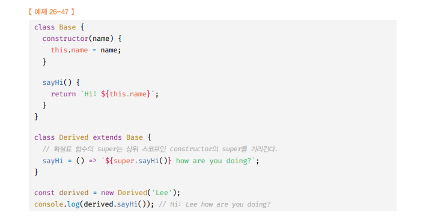

# 함수의 구분(화살표 함수에 대해) 🎯💡🔥📌✅

- `ES6 이전` 에는 `모든 함수`는 `일반 함수`로써 호출 할 수 이쓴 것은 물론 `생성자 함수`로서 호출 할 수도 있었다. 즉, `callable` & `constructor` 였다.

> 위 예시

```js
var foo = function () {
  return 1;
};
//일반적인 함수로 호출
foo();
//생성자 함수로 호출
new foo();
//메서드로서 호출
var obj = { foo: foo };
obj.foo();
```

---

<br />

- `ES6` 이후로 함수는 목적에 의해 3가지로 분류할 수 있다.

| ES6 함수의 구분 | constructor | prototype | super | arguments |
| --------------- | ----------- | --------- | ----- | --------- |
| 일반 함수       | O           | O         | X     | O         |
| 메서드          | X           | X         | O     | O         |
| 화살표 함수     | X           | X         | X     | X         |

<br />
<br />
<br />
<br />

---

# 메서드

- `ES6` 메서드는 메서드 푹약 표현으로 정의된 함수만을 의미한다.
- `ES6` 메서드는 인스턴스를 생성할 수 없는 `non-contructor`이다.
- `메서드는 생성자 함수로 호출할 수 없다.`

```js
const obj = {
  x: 1,
  // foo는 ES6 기준, 메서드
  foo() {
    return this.x;
  },
  // bar는 ES6 기준, 메서드가 아님
  bar: function () {
    return this.x;
  },
};

console.log(obj.foo()); // 1
console.log(obj.bar()); // 1
```

<br />
<br />
<br />

```
🔥 메서드는 prototype 프로퍼티가 없고, 프로토타입을 생성하지도 않는다.
🔥 메서드는 생성자 함수로 호출 불가능 , 인스턴스 생성 불가능
🔥 메서드는 자신을 바인딩한 객체를 가리키는 `[[ HomeObject ]]`를 갖는다.
  - super 참조 는 [[ HomeObject ]] 를 참조하여 수퍼클래스의 메서드를 참조하므로,
    ES6 메서드는 `super 키워드`를 사용할 수 있다.

🔥 본연의 기능(super)을 추가하고 의미적으로 맞지 않는 기능(constructor)은 제거할
   수 있게 되었다.
🔥 메서드를 정의할 때 프로퍼티 값으로 익명 함수 표현식을 할당하는 ES6 이전방식은
   안 사용하는 것이 좋다.
```

> 위 설명에 대한 예제 코드

```js
const base = {
  name: "kim",
  sayHi() {
    return `HI ${this.name}`;
  },
};

const derived = {
  __proto__: base,
  //sayHi()는 ES6 메서드임, ES6 메서드는 [[ HomeObject ]]를 가짐
  //sayHI의 [[ HomeObject ]]는 sayHI가 바인딩된 객체인 derived를 가리킴,
  // super는 sayHI의 [[ HomeObject ]]의 프로토타입은 base를 가르킨다.
  sayHi() {
    return `HI ${super.name}`;
  },
};

//SyntaxError!
//SyntaxError!!
//SyntaxError!!!
const derived2 = {
  __proto__: base,
  sayHi: function () {
    //sayHI는 es6의 메서드아님
    //sayHI는 [[ HomeObject ]]를 가지지 않으므로 super를 사용할 수 없다.
    return `HI ${super.name}`;
  },
};
```

<br />
<br />
<br />
<br />

---

# 화살표 함수

- `ES6 의 화살표 함수`는 function 키워드 대신, 화살표(`=>`) 를 사용하여 기존의 함수 정의 방식보다 `간략하게` 함수를 정의하는 방식이다.
- `콜백 함수 내부`에서 `this`가 `전역 객체`를 가리키는 문제를 해결하기 위한 `대안`으로 사용된다.

<br />

> 화살표 함수의 정의 (매개 변수)

```JS
//화살표 함수의 정의(1)
const multiply = (x,y) => x+y;
//매개 변수가 여러개인 경우
const arrow = (x,y) => {...}
//매개 변수가 한개인 경우 `()` 생략 가능
const arrow2 = x => {...}
//매개 변수가 없는 경우는 `()`를 생략할 수 없다
const arrow3 = () => {...}
```

---

<br />
<br />

## 함수 몸체 정의

> 화살표 함수의 정의 (함수 몸체 정의)

```js
// 함수 몸체가 하나의 문으로 구성된다면 `{}` 생략이 가능하다.
const arrow4 = () => ....
```

<br />

> 화살표 함수 객체 리터럴 return 시 `()`로 묶어 주어야한다.

```js
const create = (id, content) => ({ id, content });

// 위 표현과 동일하다
const create = (id, content) => {
  return { id, content };
};
```

<br />

> 함수 몸체가 여러 줄이면, 중괄호 명시 해야한다.

```js
const sum = (a, b) => {
  const result = a + b;
  return result;
};
```

<br />

> 화살표 함수 즉시 실행 함수로 사용 가능

```js
const person = ((name) => ({
  sayHi() {
    return `My name is ${name}.`;
  },
}))("kim");

console.log(person.sayHi()); // My name is kim
```

<br />

> 화살표 함수는 `일급 객체`로 사용 가능 -> `고참함수`(map,filter,reduce...)의 `콜백함수`로 사용하기 적절<br /> 일반함수 표현식 보다 표현이 간결하다

```js
console.log([1, 2, 3].map((v) => v * 2)); // [ 2, 4, 6 ]
```

<br />
<br />
<br />
<br />

---

# 화살표 함수와 일반 함수의 차이

<br />

- (1) 화살표 함수는 인스턴스를 생성할 수 없는 `non-constructor`다.

```js
// 화살표 함수는 인스턴스 생성이 불가
const Foo = () => {};
new Foo(); // TypeError: Foo is not a constructor
```

- (2) 중복된 `매개변수 이름`을 선언할 수 없다. ( 단, strict mode 에서 )

```js
// 화살표 함수는 매개변수 중복을 허용하지 않음
"use strict";
function normal(a, a) {
  return a + a;
}

// SyntaxError: Duplicate parameter name not allowed in this context
```

- (3) 화살표 함수는 함수 자체의 `this`, `arguments`, `super` 바인딩을 갖지 않는다.
  - 따라서, 스코프 체인을 통해 상위 스코프의 `this`, `arguments`, `super` 를 참조한다
  - 화살표 함수가 중첩되어 있어도, 화살표 함수들은 자체적으로 바인딩하지 않으므로, `외부에 가장 가까운 상위 스코프 함수의 바인딩`

```js
// 💡 화살표 함수는 this, arguments, super, new.target 바인딩을 갖지 않는다.
class Prefixer {
  constructor(prefix) {
    this.prefix = prefix;
  }

  add(arr) {
    // 1️⃣ 이 시점에서 this는 Prefixer 객체를 바인딩한다.

    return arr.map(function (item) {
      return this.prefix + item; // 2️⃣ 일반함수로 전달한 콜백함수 내에서 this는 undefined 를 바인딩 ( class 에선 암묵적으로 strict mode 적용 )
      // TypeError: Cannot read property 'prefix' of undefined
    });
  }
}

const prefixer = new Prefixer("pre-");
console.log(prefixer.add(["AAA", "BBB"]));
```

<br />
<br />
<br />
<br />

---

# 화살표 함수의 this (상위 스코프 this를 참조)

- 화살표 함수는 다른 함수의 인수로 전달 되어 `콜백 함수로 많이 이용`
- 화살표 함수는 콜백함수 `내부의 this`가 `외부함수의 this`와 다르기 때문에 발생하는 문제를 해결하기 위해 고안됨

  - 콜백 함수의 this 와 외부 함수의 this가 서로 다른 값을 가리키고 있기 때문에 `TypeError`가 발생함
  - `this`는 함수가 `어떻게 호출되었는지에` 따라 `동적`으로 결정된다.

- 고차함수의 인수로 전달된 콜백함수가 일반 함수인 경우 → 내부에서 this를 참조시 undefined
  - 일반 함수로 정의된 콜백 함수의 경우, 기본적으로는 전역 객체에 바인딩되머, strict mode 에서는 undefined에 바인딩되기 때문
  - 이것이, 일반 함수로 콜백 함수를 전달할 경우의 콜백 함수 내부의 this 문제 이다.
  - 콜백 함수의 this 와 외부 함수의 this가 서로 다른 값을 가리키고 있기 때문에 TypeError가 발생하는 것

<br />
<br />

---

## - 화살표 함수 THIS 정리 -

```
🔥 화살표 함수는 함수 자체의 this 바인딩을 갖지 않는다.
🔥 화살표 함수는 함수 내부에서 this를 참조하면 `상위 스코프의 this`를 참조한다.(Lexical this)
🔥 화살표 함수는 함수 자체의 this 바인딩을 갖지 않기 때문에 Function.prototype 에 apply, call, bind 메서드를 사용해도 화살표 함수 내부의 this를 교체할 수 없다.
🔥 객체 리터럴에서 메서드를 화살표 함수로 표현하는 것은 피하는 것이 좋다.
   (this가 `전역 객체`를 가리키기 때문에)
   메서드를 정의 할때 ES6 메서드 축약 표현으로 정의한 ES6 메서드를 사용하는 것이 좋다
```

<br />

> 위 설명 예제 (1)

```js
// 💡 화살표 함수는 this, arguments, super, new.target 바인딩을 갖지 않는다.
class Prefixer {
  constructor(prefix) {
    this.prefix = prefix;
  }

  // 화살표 함수는 함수 자체의 this 바인딩을 갖지 않는다.
  // 화살표 함수 내부에서 this를 참조하면 상위 스코프(현 시점에는 Prefixer 객체)의 this를 그대로 참조
  // = 렉시컬 this
  add(arr) {
    return arr.map((item) => this.prefix + item);
  }
}

const prefixer = new Prefixer("pre-");
console.log(prefixer.add(["AAA", "BBB"])); // [ 'pre-AAA', 'pre-BBB' ]
```

<br />

> 위 설명 예제 (2)

```js
// 전역 함수 foo의 상위 스코프는 전역이므로 화살표 함수 foo의this는 전역 객체를 가리킨다.
const foo = () => console.log(this);
foo(); //window
```

<br />

> 위 설명 예제 (3)

```js
//increase 프로퍼티에 할당한 화살표 함수의 스코프는 전역이다.
//따라서 increase 프로퍼티에 할당한 화살표 함수의this는 전역 객체를 가리킨다.

const counter = {
  num: 1,
  increase: () => ++this.num,
};
console.log(counter.increase()); // NaN
```

<br />

> 위 설명 예제 (4) ES6 메서드 축약 표현으로 정의한 ES6메서드 사용 vs 화살표 함수

```js
//Bad!!!
const person = {
  name: "kim",
  sayHI: () => console.log(`HI ${this.name}`),
};
// sayHI 프로퍼티에 할당된 화살표 함수 내부의 this는 상위 스코프인 전역의 this가 가리키는 전역 객체를 가리키므로 이예제를 브라우저에서 실행하면 this.name은 빈 문자열을 갖는 window.name과 같다.
//전역 객체 window에는 빌트인 프로퍼티 name이 존재한다.
person.sayHI(); //HI

//Good!!!
const person = {
  name: "kim",
  //ES6 메서드 축약 표현으로 정의한 ES6메서드 사용
  sayHI() {
    console.log(`Hi ${this.name}`);
  },
};
persone.sayHI(); // HI KIM
```

<br />
<br />
<br />
<br />

---

# 화살표 함수의 super (상위 스코프인 super 참조)

- 화살표 함수 자체의 `super` `바인딩을 갖지 않는다`.
- 화살표 함수 내부에서 super를 참조하면 this와 마찬가지로 `상위 스코프인 super`를 `참조`한다.
- `super`는 내부 슬롯 `[[HomeObject]]`를 갖는 ES6 메서드 내에서만 사용 가능하다.
  - 화살표 함수는 ES6 메서드는 아니지만 `함수 자체의 SUPER바인딩`을 갖지 않으므로 super를 참조해도 에러가 발생하지 않고 constructor 내부의 `super바인딩` 참조한다.
  - 
  - Derived 클래스의 constructor는 생략 되었지만 `암묵적으로` `constructor`가 생성된다.

<br />
<br />
<br />
<br />

---

# arguments (상위 스코프인 arguements 참조)

- 화살표 함수는 함수자체의 `arguments 바인딩을 갖지 않는다`.
- 화살표 함수 내부에서 arguments 참조를 하면 this와 마찬가지로
  `상위 스코프의 arguments를 참조`한다.
- `arguments 객체`의 경우,매개변수의 개수를 확정할 수 없는 `가변 인자 함수` 를 구현할 때 유용하다
  - 하지만, 화살표 함수는 arguments 객체를 사용할 수 없기 때문에, 자신에게 전달된 인수 목록을 확인할 수 없고, 상위 함수의 인수 목록만 참조하므로 쓸모가 없다.
  - 딸서, 화살표 함수로 가변 인자 함수를 구현해야 할 때는 반드시 `Rest 파라미터` 를 사용해야 한다.

```js
// 1  상위 스코프 arguments 참조
(function () {
  const foo = () => console.log(arguments); // {`0` : 1 , `1` : 2}
  foo(3, 4);
})(1, 2);

// 2 화살표 함수는 자체적으로 arguments 객체를 생성하지 않는다.
const foo = () => console.log(arguments);
foo(1, 2); // ReferenceError: arguments is not defined
```

<br />
<br />
<br />
<br />

---

# Rest 파라미터

```
✅ Rest 파라미터는 매개변수 이름 앞에 세개의 점 ... 을 붙여서 정의한 매개변수를 의미한다.
✅ Rest 파라미터는 함수에 ㅈ너달된 인수들의 목록을 배열로 전달 받는다.
✅ Rest 파라미터는 선언된 매개변수에 할당된 인수를 제외한 나머지 인수들로 구성된 배열이 할당 된다.
✅ Rest 파라미터는 마지막 파라미터이어야 하며, 단 하나만 선언 가능
✅ Rest 파라미터는 함수 정의 시 선언한 매개변수 개수를 나타내는 함수 객체의 length 프로퍼티에 영향을 주지 않는다.
```

<br />

> Rest 파마미터 예시

```js
// Rest 파라미터 (1)
function foo(a, b, ...rest) {
  console.log(a, b, rest, `함수 객체의 length 프로퍼티 : ${foo.length}`);
}

foo(1, 2, 3, 4, 5); // 1 2 [ 3, 4, 5 ] 함수 객체의 length 프로퍼티 : 2

function foo(...rest) {
  console.log(rest); // [1,2,3,4,5]
}
console.log(1, 2, 3, 4, 5);
```

<br />

> Rest 파라미터는 함수 정의 시 선언한 매개변수 개수를 나타내는 함수 객체의 length 프로퍼티에 영향을 주지 않는다.

```js
function foo(...rest) {}
console.log(foo.length); // 0
function foo(x, ...rest) {}
console.log(foo.length); // 1
function foo(x, y, ...rest) {}
console.log(foo.length); // 2
```
